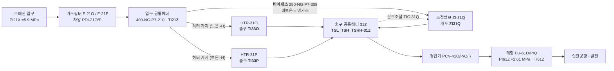
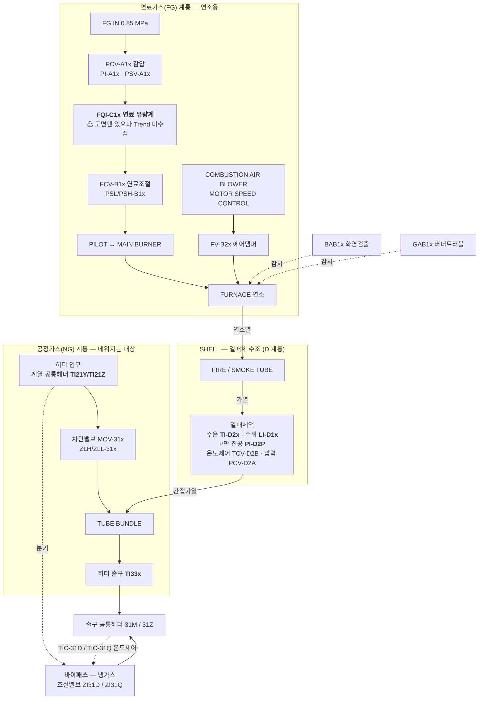

# 01. 설비 구조

> 근거: P&ID 도면 6장(`09-15-R-32-001`~`006`) 레이어 판독 + 15년 실측 데이터 교차확인.
> 뒤집힌 판단은 [06_정정이력.md](06_정정이력.md) 참고.

---

## 1. 계통 흐름

지역번호가 공정 순서다: **11(입구) → 21(필터) → 31(히터) → 41·43(정압기) → 61(계량)**.
그 위에 **알파벳이 계열**을 가른다.



**A/B 계열도 같은 구조**다(도면 004): 입구 `TI21Y` → HTR-31A/31B + 바이패스(밸브 `ZI31D`)
→ 출구 헤더 **31M** → 정압기 41A/B/C/D → 계량 61M → 인천도시가스.

### 1-1. 두 계열은 완전히 분리돼 있다

| | **M 계열** | **Z 계열** |
|---|---|---|
| 도면 | 004(히터), 005(정압기) | 001(히터), 002(정압기) |
| 배관 | 350 mm (`350-NG-P7-2xx`) | 400 mm (`400-NG-P7-2xx`) |
| 히터 | HTR-31A, 31B | HTR-31O, 31P |
| 입구헤더 | `TI21Y` | `TI21Z` |
| 출구헤더 | **31M** (`TAH-31M`, `TAHH-31M`) | **31Z** (`TAHH-31Z`, `YAH-31Z`) |
| 온도조절 | **TIC-31D** → 개도 `ZI31D` | **TIC-31Q** → 개도 `ZI31Q` |
| 정압 설정 | `RSF41A/B/C` ≈ **0.72~0.84 MPa** | `RSF41O/P/Q` ≈ **2.5~2.7 MPa** |
| 계량 | `TI61M`, `PI61M`(≈0.81) | `TI61Z`, `PI61Z`(≈2.61) |
| 수요처 | 인천도시가스 | 인천공항·발전 |

정압 설정값과 계량 출구압이 계열별로 정확히 짝을 이룬다(`PI43A`≈`PI61M`≈0.81 / `PI43O`≈`PI61Z`≈2.61)
— 두 계열이 섞이지 않는다는 **데이터 측 독립 증거**.

### 1-2. HTR-31C 는 미설치(계획설비)다

도면 004 에 `31C` 버블이 있고 배관 `250-NG-P7-304-H`/`307-H` 도 깔려 있다. 그러나
**`31C` 버블은 `INST-FU`(FUTURE) 레이어**에 있다(도면 006 주기: "(1) : FUTURE ITEMS & LINES").
배관만 선시공된 상태다. 데이터도 일치한다:
- `TI33C` 는 15년 7,384,352행 중 0 아닌 값이 **1,032건**(전부 0.20) — 사실상 미계측.
- A·B 가 둘 다 `isolated` 인 42,953행에서 헤더−입구가 중앙 **2.49℃**, 최대 10.19℃.
  C 가 통가스 중이었다면 이 값이 훨씬 커야 한다.

---

## 2. 🔴 바이패스 — 가스의 41%(M)·60%(Z)는 히터를 지나지 않는다

이 구조를 놓쳐서 초기 분석이 전부 어긋났다. 증거 두 줄기.

### 2-1. 도면 증거 — 조절밸브가 히터와 **다른 라인**에 있다

도면 004(A/B 계열) 좌표:

| 요소 | x | y | 비고 |
|---|---|---|---|
| 히터 가지배관 | — | 229~429 | `250-NG-P7-302-H` ~ `307-H` — 전부 **`-H` 접미사** |
| `ZLH/ZLL-31A`, `TI-33A` | 349 / 470 | 458~478 | A호기 |
| `ZLH/ZLL-31B`, `TI-33B` | 349 / 471 | 358~378 | B호기 |
| **`TIC-31D` + `ZI-31D` + `ZAF-31D`** | **368~395** | **162~172** | 히터들보다 **아래 별도 행** |
| `250-NG-P7-308` | 262 | 127 | 그 밸브가 달린 배관 — **`-H` 없음** |
| 출구 헤더 `31M` | 665~680 | 296~336 | 합류점 |

`-H` 는 보온 대상 표기다(도면 주기 (2)). 히터 가지는 전부 `-H`, `308` 라인만 없다
→ **냉가스가 지나는 배관** = 히터를 건너뛰는 바이패스.
`ZAF-31D`/`ZAF-31Q` 는 있는데 DI 에 `MOV31D`/`MOV31Q` 개폐쌍이 **없다** — 개폐식이 아니라
**변조식(modulating)** 밸브라는 뜻이고 위 해석과 맞는다.

### 2-2. 데이터 증거 — 독립인 세 경로가 일치한다

합류점 열수지: `T_header = (1−β)·T_히터출구 + β·T_입구` → **`β = (T_out − T_header)/(T_out − T_in)`**

| 계열 | 헤더가 [입구, 최고히터출구] 사이 | **β 중앙** | β p10~p90 | **β vs 밸브개도 Spearman** |
|---|---|---|---|---|
| M (A+B) | **98.8%** | **0.413** | 0.153~0.837 | **+0.871** |
| Z (O+P) | **99.5%** | **0.602** | 0.283~0.937 | **+0.842** |

밸브개도 구간별 β 중앙 (단조 증가, 40~50%에서 포화 — 밸브 특성곡선과 일관):

| 밸브개도[%] | 0~10 | 10~20 | 20~30 | 30~40 | 40~50 | 50~70 | 70~100 |
|---|---|---|---|---|---|---|---|
| β (M) | 0.190 | 0.337 | 0.609 | 0.812 | 0.905 | 0.900 | 0.917 |
| β (Z) | 0.086 | 0.238 | 0.485 | 0.646 | 0.786 | 0.951 | 0.949 |

### 2-3. 헤더 온도 태그가 합류점 **하류**임을 직접 확인했다

`TSL_TSH_TSHH-31M`/`-31Z` 가 정말 혼합 후 헤더온도인지가 위 전체의 전제다.
수조 열수지를 거치지 않는 직접 검정을 했다 — 합류점 하류라면 히터 출구온도를 고정한 채
밸브를 열수록 헤더온도가 내려가야 한다.

**편상관(두 히터 출구 Δ·`T_in` 통제): M −0.524, Z −0.527** (각 n=500,000)

| 밸브개도[%] | 20~30 | 30~40 | 40~50 |
|---|---|---|---|
| Z 계열 `maxΔ` 중앙 | **32.0** | **32.9** | **30.4** |
| Z 계열 `ΔH` 중앙 | **16.5** | **12.1** | **6.0** |

히터 출구온도가 30~33℃로 사실상 고정인데 헤더만 16.5→6.0 으로 떨어진다. **확인됨.**
(β 는 ΔH 로 만든 값이라 순환이지만, 이 검정은 ΔH **원값**과 밸브개도의 관계라 순환이 아니다.)

### 2-4. 이것이 뜻하는 것

**히터 출구온도는 자유변수가 아니라 피제어 변수다.**
```
U·A ↓  →  ε ↓  →  T_out ↓  →  T_hdr ↓  →  TIC 가 바이패스를 조임(β ↓)  →  T_hdr 복귀
```
→ **열화 신호는 출구온도가 아니라 `β` 와 `U·A` 에 남는다.**

---

## 3. 히터 내부 구조

> 도면 003(HTR-31O 상세)·006(HTR-31A/B 상세). 패키지 내부 **문자코드**:
> **A = 연료가스 감압, B = 버너·블로워, C = 연료가스 계량, D = 수조·용기**.



- **연료가스 계통은 연속 계측이 없다.** `PAHA1x`/`PAHHA1x` 는 압력 고/고고 **알람(이진)**이다.
  → `Q_burner(t)` 실시간 값 없음. ⚠️ 단 도면에 **`FQI-C1A`/`C1B`/`C2A`·`FQ-C1O` 연료 유량계**가 있다
  (Trend export 에만 빠짐).
- **버너는 블로워 회전수로 화력을 연속 변조한다**(`MOTOR SPEED CONTROL`). `H31xOH` 는 점화 ON/OFF 일 뿐
  화력 비율이 아니다 — [04 문서](04_물리모델과식별.md)의 유효 화력률 논의의 근거.
- `TI33x` 는 **히터 자신의 출구**에 있다(합류 전). 도면 001 좌표로 확인:
  `TI-21Z`(x=501) → `HS-31P`(532) → `ZLH/ZLL-31P`(564) → **[HTR-31P]** → `TI-33P`(607)
  → 출구헤더 `400-NG-P7-358`(698).

---

## 4. P&ID 도면 읽는 법 (재작업 방지)

이 도면으로 **한 세션에 두 번 틀렸다.** 반드시 지킬 것:

1. **레이어(`l` 필드)로 먼저 거른다.** `INST`/`VALVE` = 실설비, **`-FU` 접미사 = FUTURE(미설치)**.
   실설비와 계획설비가 **같은 좌표에 겹쳐** 그려져 있다.
2. **ATTRIB 정의 텍스트를 조심한다.** 블록을 복사하면 갱신 안 된 속성 문자열이 남는다
   (실제로는 `31C` 자리인데 `INST` 레이어에 `ZLH-31B` 가 남아 있었다).
3. **문자 군집화 허용오차를 좁힌다.** 계기 버블은 함수문자(위) + 태그번호(아래) 2행 구조라
   y 허용오차를 0.6 이하로 두지 않으면 옆 행과 붙어 **없는 태그를 만들어낸다**.

FUTURE 레이어 전수 (실설비가 아님):

| 도면 | `-FU` 레이어 태그 |
|---|---|
| 001 | `IV-11F`, `PGR-11A`, `PI-11A`, `PV-11A/11G/12A/12G/16A/17A` |
| 004 | **`31C`** |
| 002/003/005/006 | 없음 |

도구: `pid/` (ODA File Converter → DXF → ezdxf). 산출물 `data/영종GS 현장 세부데이터/260410 영종GS 도면/_converted/`.
