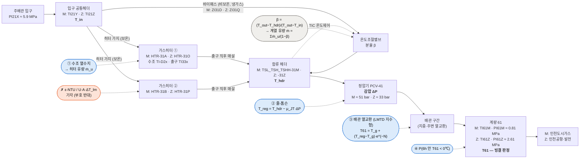
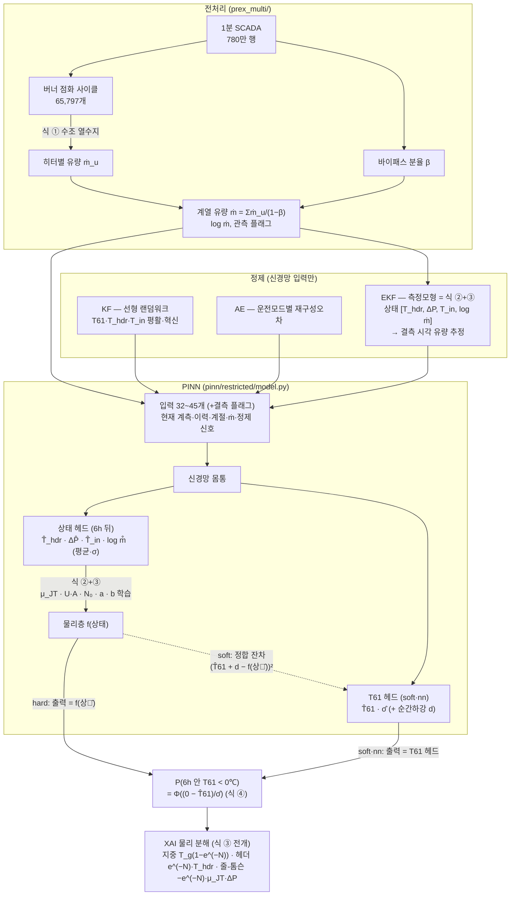

# 20. 학회 포스터 구성안 — 한국에너지기후변화학회 형식

> 참고 양식: `data/이성권_에너지기후변화학회 포스터 V5.pdf` (A0 세로, PowerPoint 제작, **내용은 본 과제와 무관**).
> 형식·배치·설명 방식만 참고했다. 텍스트층 추출(`pdftotext`)과 이미지 OCR(`tesseract kor+eng`)로 판독.
>
> ✅ 결과 수치는 구조 비교 실험 60작업(hard·soft·nn × 타깃 2종 × 정제 5종 × 계열 2, 시드 5) **최종값**으로 갱신했다(2026-09-14).
> 상세 표·짝비교·한계는 [문서 19](19_구조비교_hard_soft_nn.md).
>
> 🔄 **2026-09-15 포스터 구성 변경**: 방법론 = 박스 2개(1. Kalman filter · 2. KF–soft PINN, 2-3),
> 연구 내용 = 가스 시스템 개략도 → PINN 식 2가지 → KF 필터링 결과 → PINN 학습 곡선(2-5). 최종 모델 = 가중 확장 soft PINN + KF, 계열 M.
> 포스터 그림은 **영어만** — 다이어그램 투명 배경, 그래프 흰 배경 (`ttttt/`, 스크립트 `poster/`).

---

## 0. 한 장 요약 (포스터에 들어갈 이야기 줄기)

**문제** — 천연가스 공급관리소는 고압 가스를 감압해 내보낸다. 감압하면 줄-톰슨 효과로 가스가 식어
(ΔP 50 bar 에 약 28℃), 가스히터로 미리 데워도 **공급배관 온도(T61)가 0℃ 아래로 떨어지면 배관·밸브가 빙결**한다.

**하고 싶었던 것** — 히터 열전달식(m·c_p·ΔT = U·A·ΔT_lm)을 넣은 PINN 으로 고장·열화를 예측.

**데이터가 알려준 것** — 유량계가 없고(134개 태그 중 81개 0행), 히터 출구온도로 푼 ε-NTU 식은
**유량과 부호가 반대**로 나와 기각. 대신 ① 수조 열수지로 유량을 역산하는 길, ② 줄-톰슨 + 매설배관
열교환식(LMTD 의 지수형)은 **데이터로 성립**함을 확인.

**그래서 만든 것** — 성립하는 식만 쓰는 **제한 PINN** 으로 "6시간 안에 T61 < 0℃" 확률을 예측.
입력은 KF·AE·EKF 로 정제, 하이퍼파라미터는 Optuna(시간순 8:2, 개발구간 5-fold), 결과는 SHAP·물리 분해로 설명.

**발견** — 물리식을 **출력에 강제(hard)** 하면 M 계열에서 식의 오차가 병목이 된다. **손실 제약(soft)** 으로 바꾸면
M 시험 AUC 가 +0.032(시드 23/25 개선) 올라 GBM 을 넘는다(0.915~0.926 vs 0.902~0.916). 단 물리 없는 같은 신경망(nn)도
같은 수준이라(soft − nn ΔAUC −0.007), **이 데이터에서 물리의 기여는 정확도보다 해석(물리 모수·원인 분해)** 에 있다.
Z 계열은 GBM 이 AUC 로 앞서지만, **상위 1% 경보가 잡은 빙결 시간은 신경망이 더 많다**(93 vs 77).
센서 하한(−30℃) 1분 급락을 걸러내는 것만으로 AUC 가 +0.03~0.07 올랐다.

---

## 1. 참고 포스터 형식 분석

### 1-1. 배치 (A0 세로, 2단)

```
┌──────────────────────────────────────────────────────────────┐
│ 제목(국문, 굵게) / 영문 제목 / 저자(발표자 밑줄, 교신 *) / 소속·주소  [학회 로고][대학 로고] │
├──────────────────────────────┬───────────────────────────────┤
│ 초록 (Abstract)  ~10줄        │ [계산 패널] 수식 3칸 → 화살표 → 결과 표 │
│                              │  + 그래프 2개 + 요점 박스            │
│ 연구 방법 (Methodology)       ├───────────────────────────────┤
│  1.□  2.□  3.□ (색 박스)      │ 연구 결과 (Research Results)        │
│  흐름도(타원·화살표)           │  요점 3개(굵은 머리말) + 추이 그래프   │
│  핵심 수식 박스(기호 정의 포함) │  지도 2장 + 막대그래프 2장(노란 캡션)  │
├──────────────────────────────┤                               │
│ 연구 내용 (Experimental details)│ 결론 (Conclusion)  · 5개 불릿      │
│  요점 불릿 + SHAP 그림 2장     ├───────────────────────────────┤
│  Training 결과 그래프·지도      │ 사사 (Acknowledgement)            │
│  성능 표 (n, RMSE, MAPE, R²…)  │ 참고문헌 (Reference)              │
│  Loss curve · 예측 그래프      │                               │
│  보조 그림 3장                 │                               │
└──────────────────────────────┴───────────────────────────────┘
```

### 1-2. 설명 방식의 특징 (그대로 따를 것)

| 요소 | 참고 포스터에서 | 우리 포스터 적용 |
|---|---|---|
| 섹션 머리 | 초록색 둥근 띠 + "국문 (English)" | 동일 |
| 방법 박스 | **번호 + 짧은 명사구 + 기호** ("1. 인구 예측 ρ(k)") | "1. Kalman filter", "2. KF–soft PINN" (2026-09-15 확정) |
| 불릿 | **굵은 머리말 + 콜론 + 한 문장** ("자기회귀 지배성: …") | 모든 해석 불릿에 적용 |
| 수식 | 박스 안 수식 + **기호 정의 + 실제 값** (η: 0.1, Q: 120,000 kJ/kg) | 식별된 μ_JT·U·A·N₀ 값을 같이 적는다 |
| 계산 흐름 | 수식 박스 3개를 **화살표**로 연결 | 열수지 → 유량 → NTU → T61 |
| 표 | 모델별 n·오차지표 여러 개 | 구조별 AUC·리프트·Brier·시드 표준편차 |
| 그림 캡션 | **노란 형광 짧은 명사구** ("2026년 10월 예측 MAP") | 동일 |
| 결론 | 숫자가 들어간 불릿 5개 | 동일 (숫자 없는 결론 금지) |
| 학습 전략 | "과적합 방지: 1. EarlyStopping 2. ReduceLROnPlateau" | 조기종료·시간순 분할·퍼지·시드 반복 |

---

## 2. 우리 포스터 구성 — 섹션별 초안

### 2-1. 제목

> ⚠ 2026-09-15 정정: 설비를 흐르는 가스는 **액화천연가스(LNG, −162℃)가 아니라 기화된 기체 천연가스(NG)** 다(배관 코드 `NG`, 입구 약 5.9 MPa, 온도 −10~30℃, 밀도 0.807 kg/Nm³). 제목·본문의 "LNG 공급관리소" 는 "천연가스 공급관리소" 로 쓴다.
> ⚠ 2026-09-15 정정: 예측 지점 `TI61M/Z` 는 **정압기(PCV-41) 하류의 계량설비(61)** 다(문서 01 계통도: 헤더 31 → 정압기 41 → 계량 61).
> 가스히터 설치 목적도 "정압기 후단 결빙 방지"(KOGAS 교육자료)이므로 "가스히터 후단"이 아니라 **"정압기 하류"** 로 쓴다.

- 국문(안 1, 추천): **물리정보신경망과 칼만필터 정제를 이용한 천연가스 공급관리소 정압기 하류 가스 빙결 위험 예측**
- 영문(안 1): *Freeze-Risk Prediction of Natural Gas Downstream of Pressure Regulators at a Natural-Gas Supply Station Using Physics-Informed Neural Networks with Kalman-Filter Data Refinement*
- 국문(안 2): **데이터로 검증된 열전달식만을 적용한 제한 PINN 기반 정압기 하류 가스 빙결 예측**
- 영문(안 2): *Freeze Prediction of Natural Gas Downstream of Pressure Regulators Using a Restricted Physics-Informed Neural Network Built Only on Data-Validated Heat-Transfer Equations*
- 국문(안 3, 짧게): **물리정보신경망 기반 정압기 하류 가스 빙결 예측**
- 영문(안 3): *Physics-Informed Neural Network for Freeze Prediction Downstream of Natural-Gas Pressure Regulators*
- 저자·소속·주소·로고: (기입)

### 2-2. 초록 · Abstract (포스터용 짧은 판) — 최종 모델 기준

> ✅ **최종 모델 (2026-09-15 확정): 가중 확장 soft PINN + KF 정제, 계열 M, 타깃 "6h 내 분 단위 최저 T61 < 0℃ (센서 이상값 제거)"**.
> 정제 방법은 KF · AE · EKF · 3종 조합을 비교했고, **개발구간 시간순 교차검증 AUC 가 가장 높은 KF(0.946)** 를 채택했다
> (없음 0.945 · 3종 0.942 · EKF 0.940 · AE 0.939 — 시험구간을 보고 고른 것이 아님).
> 시험 결과: AUC 0.926 ± 0.005 (GBM 0.916) · 상위 1% 경보 적중 74 vs 53 시간 (+40%) · AP 0.265 vs 0.242 · Brier 개선 34.8% vs 31.5% · 공급온도 RMSE 1.05℃.
> 작성 조건: 계열 구분·설비 위치·데이터 출처·괄호 설명 없음.

**국문 초록**

천연가스 공급관리소의 정압기 감압 과정에서 줄-톰슨 효과로 가스 온도가 떨어지면, 가스히터로 예열하더라도 정압기 하류 배관과
계량설비가 빙결할 수 있다. 본 연구는 13년간의 운전 데이터로 성립이 검증된 열전달식만을 물리 제약으로 쓰는 물리정보신경망을
제안하여 6시간 이내 빙결 확률을 예측하였다. 입력 정제 방법으로 칼만필터, 오토인코더, 확장칼만필터와 이들의 조합을 비교하여
시간순 교차검증 성능이 가장 높은 칼만필터를 최종 채택하였고, 하이퍼파라미터는 Optuna로 최적화하였다. 물리식을 손실 제약으로
결합한 모델은 시험 AUC 0.926을 보였으며, 상위 1% 경보가 포착한 빙결 시간이 경사부스팅 모델보다 40% 많았다. 또한 빙결의 주요
원인이 히터 성능 저하가 아니라 낮은 입구 가스 온도와 큰 감압 폭의 결합임을 확인하였다.

**English Abstract**

At natural-gas supply stations, Joule–Thomson cooling across pressure regulators can freeze downstream pipelines and metering
equipment even when the gas is preheated. This study proposes a physics-informed neural network that predicts the probability of
freezing within six hours, using only heat-transfer relations verified against 13 years of operating data. A Kalman filter, an
autoencoder, an extended Kalman filter, and their combination were compared for input refinement, and the Kalman filter, which gave
the highest chronological cross-validation score, was adopted; hyperparameters were tuned with Optuna. Coupling the physics through
the loss function achieved a test AUC of 0.926, and its top-1% alarms captured 40% more freezing hours than a gradient-boosting
baseline. The analysis further showed that freezing is driven by cold inlet gas combined with large pressure drops rather than by
degraded heater performance.

**근거 수치 (초록 밖, 확인용)**
- 물리 분해(최종 모델): 빙결 시각 − 평시 = 지중 항 −4.25℃ · 줄-톰슨 항 −1.22℃ · 헤더 항 +0.98℃ → 공급온도 −4.48℃. 빙결 때 헤더는 오히려 따뜻하다.
- 최적 물리 가중치: 정합 잔차 w_cons 9.2 · 동시점 물리 잔차 w_phys 2.4 (기존 soft 의 상한 3 을 넘는 값 → 가중 확장이 필요했던 이유).

### 2-3. 연구 방법 (Methodology) — 번호 박스 2개 (2026-09-15 확정 구성)

> 포스터 흐름: **1. Kalman filter → 2. KF–soft PINN** 두 박스만 쓴다. 설비 개략도·물리식·학습 그림은 2-5 연구 내용으로 옮겼다.
> 그림은 전부 **영어**. **다이어그램 = 투명 배경**, **그래프 = 흰 배경**. 태그 이름(T61 등)은 그림·키워드에 쓰지 않는다.

**1. Kalman filter**
- 그림: `ttttt/Kalman_filter_diagram.png` (`poster/diagram_kalman.py`) — Initial state → ① Predict → ② Update → Estimate,
  측정 z_k 입력, k → k+1 루프. 제목·변수 설명 없이 식만.
- 박스 키워드 (영어):
  - Real-time, recursive estimation
  - Low computational cost
  - Sensor noise suppression
  - Innovation detects sudden changes
  - (선택) No need to store past data · Robust to missing measurements
- ⚠ "Optimal under Gaussian noise" 는 쓰지 않는다 — 본 연구 KF 는 **고정 이득 0.05** 라 최적 조정이 아니다.
- 본 연구에서의 역할: 은닉 상태 추정이 아니라 **센서 잡음 제거 필터**(제어 분야 방식). 평활값 + 혁신 신호를 신경망 입력으로 쓴다.
  대상은 공급온도·헤더온도·입구온도. (은닉 유량 추정은 EKF 가 했고, EKF 는 비교 대상으로만 남았다.)

**2. KF–soft PINN**
- 그림: `ttttt/KF_softPINN_diagram.png` (`poster/diagram_kf_softpinn_en.py`) — **박스 제목 + 화살표만**, 박스 안은 비워 두고
  아래 키워드를 포스터에서 직접 입력한다. 수식이 들어간 한글 상세판 `ttttt/KF_softPINN_구조도.png` 는 내부 참고용.
- 박스별 키워드 (영어):

| 박스 | 키워드 |
|---|---|
| ① Operating data | Supply gas temperature · Header temperature · Inlet gas temperature · Pressure drop across regulator · Gas flow rate (from bath heat balance) · Season & time of day |
| ② Kalman filter | Sensor noise removal · Smoothed signal · Innovation (sudden change) |
| ③ Neural network | 3 hidden layers × 128 neurons (SiLU) · Current and past measurements · Filtered signals |
| Temperature head | Minimum supply temperature within 6 h · Mean & uncertainty |
| State head | Operating state at the coldest hour · Temperatures, pressure drop, flow |
| ④ Physics layer | Joule–Thomson cooling · Pipe heat exchange · Learnable physical coefficients |
| ⑤ Loss function (training) | Data error · Physics residual · Consistency with physics · Weights tuned by Optuna |
| ⑥ Output | Freezing probability within 6 h · Top-1% alarm |
| Attribution | Ground heat exchange · Header temperature · Joule–Thomson cooling |
| 주황 점선 (선택) | Observed states → physics check |

- 방식 요약 키워드 (4줄판):
  - Direct prediction + physics-based state prediction
  - Consistency loss between network and equation
  - Learnable physical coefficients
  - Physics as a soft constraint
  - 한 줄판: **Neural prediction guided by a physics consistency loss**
- 신경망 크기 (Optuna 선택, `softw_min/v_KF/best_M.json`): 은닉층 **3개 × 128 뉴런**, SiLU, dropout 0.10, lr 1.3×10⁻³, batch 1024,
  w_phys 2.4 · w_cons 9.2 (탐색: 층 2~3 · 뉴런 32/64/128 · w_phys 0.03~30 · w_cons 0.3~30).
  두 헤드는 은닉층을 공유하고 각각 선형층 1개(온도 헤드 출력 3 = 평균·불확실성·순간하강, 상태 헤드 출력 8 = 상태 4 × 평균·표준편차).
  물리층은 신경망 층이 아니라 열전달식이며 학습되는 것은 계수 5개뿐.

**발표용 메모 — hard 와 soft 의 차이** (코드: `pinn/restricted/model.py` · `train.py`)

| | 답은 누가 내나 | 손실(채점) |
|---|---|---|
| nn | 신경망 | 신경망 답 ↔ 실제 |
| hard PINN | **물리식** (신경망 → 상태 헤드 → 물리식 → 출력) | 물리식 답 ↔ 실제 + 상태 오차 + 물리 잔차 |
| soft PINN (최종) | 신경망 (온도 헤드) | 신경망 답 ↔ 실제 + 상태 오차 + 물리 잔차 + **신경망 답 ↔ 물리식 답(정합 잔차)** |

- 두 방식 모두 신경망을 먼저 거친다. 물리층이 신경망 앞에 오는 구조는 없다.
- hard 는 답이 반드시 식을 통과하므로 식 자체의 한계(미래 상태를 완벽히 알아도 AUC 0.79)에 묶인다. soft 는 식을 가이드로만 쓴다.
- 물리 잔차(두 방식 공통): 현재 관측 상태를 식에 넣은 값 ↔ 실제 온도, 유량 관측 시각만. 이것으로 식의 계수 5개를 데이터에 맞춘다.
- 정합 잔차는 온도 헤드(분 단위 최저)에 순간하강 d 를 더해 1시간 평균으로 맞춘 뒤 물리식 값과 비교한다.

**손실 함수 (본문에 수식을 넣을 경우)**
```
L = NLL(T61) + w_s·Σ NLL(상태) + w_m·NLL(log ṁ) + w_phys·‖f(관측상태) − T61_obs‖² + w_cons·‖T̂61 + d − f(상태̂)‖²
물리 가중치 탐색 범위: w_phys 0.03~30 · w_cons 0.3~30 (Optuna) → 최적 w_phys 2.4 · w_cons 9.2
```

### 2-4. 계산 패널 (참고 포스터의 "수소 전지 폭발력 TNT 환산" 자리) — **"어떤 열전달식이 성립하나"**

> (선택) 공간이 남을 때만 쓴다. PINN 에 쓴 식 소개는 2-5 (2) 로 옮겼다.

좌: 식 3칸을 화살표로 → 우: 판정 표

| 식 | 검정 방법 | 판정 | 근거 |
|---|---|---|---|
| 수조 열수지 (유량 역산) | 계절성·혼합비 상관 독립검증 | ✅ 성립 | 문서 12 |
| 히터 번들 ε-NTU (U·A·ΔT_lm) | 홀드아웃 합류점 예측 R² | ❌ 기각 | ε 이 유량과 **부호 반대** (R² −2.71) |
| 합류점 혼합 | 홀드아웃 R² | △ 경험식 | 가중치 물리 아님 |
| 줄-톰슨 감압 | 물리 모수 식별 | ✅ | μ_JT 0.54~0.60 ℃/bar (문헌 0.56) |
| 매설배관 NTU | 물리 모수 식별 | ✅ | U·A 5~8 kW/K |

요점 박스(초록): "**물리식이 설명하는 범위를 데이터로 먼저 검정**하고, 성립한 식만 신경망에 넣었다."

그래프 2개(참고 포스터의 곡선·원 그림 자리):
- `optuna/v_AE/diag_M.png` ② **μ_JT 수렴 곡선** (문헌값 0.56 기준선) — 캡션 "물리 모수 학습 수렴"
- `optuna/v_AE/xai_M.png` ④ **물리 분해 막대** — 캡션 "빙결을 만든 세 항(지중·헤더·줄-톰슨)"

### 2-5. 연구 내용 (Experimental details) — 설비 → 식 2개 → KF 결과 → 학습 곡선 → 설정 표

**(1) 예측 대상 가스 시스템**
- 그림: `ttttt/Gas_system_diagram.png` (`poster/diagram_gas_system.py`, 투명 배경, 설비 이름만)
  - Natural gas inlet → Inlet header → Gas heater A / Gas heater B / Bypass valve → Mixing header → Pressure regulator → Downstream pipe → Metering point
  - 파란 점선 박스 = **Freeze-risk zone** (정압기 ~ 계량점)
- 태그·식 위치가 들어간 상세 구조는 2-9 (내부 참고용).

**(2) PINN 에 쓴 식 2가지** — 학부 수준 출발식 → 모델에 들어간 결과식

① 열전달 균형 → 배관 온도식
- 출발식: ṁ·c_p·ΔT = U·A·ΔT_lm
- 배관 주변(지중) 온도 T_g 일정 → ΔT_lm = [(T_in − T_g) − (T_out − T_g)] / ln[(T_in − T_g)/(T_out − T_g)]
- 대입·정리: **T_out = T_g + (T_in − T_g)·exp(−U·A/(ṁ·c_p))**
- ⚠ 적용 구간은 **정압기 출구 → 계량점 배관만**. 같은 식을 히터 번들에 적용한 검정은 기각됐다(2-4). 포스터에 "downstream pipe" 를 명시.

② 교축(감압) → 줄-톰슨 식
- 출발식: 정상유동 에너지식 q − w = Δh + ΔKE + ΔPE
- 정압기 = 열·일 없음, 운동·위치에너지 변화 무시 → **h₁ = h₂ (등엔탈피)**
- 이상기체는 온도 변화 없음, 실제 기체는 온도 강하 → μ_JT = (∂T/∂P)_h
- 작은 압력 변화 선형 근사: **T_out = T_in − μ_JT·ΔP** (천연가스 약 0.56 ℃/bar, ΔP 50 bar 에 약 −28℃)
- ⚠ **엔탈피는 계산하지 않는다.** h₁ = h₂ 는 유도 배경이고, 모델은 ΔT = μ_JT·ΔP 한 줄만 쓴다. μ_JT 는 0.25~0.60 ℃/bar 범위의
  학습 스칼라(문헌값 0.56 은 기준). 엔탈피 표·상태방정식·가스 조성은 쓰지 않는다.

결합 (PINN 물리층):
```
T_supply = T_g + (T_hdr − μ_JT·ΔP − T_g)·exp(−N),   N = U·A/(ṁ·c_p) + N₀,   T_g = a + b·T_in
```
- 고정: c_p = 2,739.8 J/kg·K (제작도서) · 학습: μ_JT, U·A, N₀, a, b · 유량 ṁ: 수조 열수지 역산 값
- 한계(질문 대비): μ_JT 는 실제로 압력·온도에 따라 변하지만 상수 하나로 둠 — 가스 조성 데이터 없음, 운전 압력 범위가 좁음.
- 포스터 표기 제안: "① ṁc_pΔT = UA·ΔT_lm → exponential form (downstream pipe)" · "② h₁ = h₂ → ΔT = μ_JT·ΔP (μ_JT learnable)" · 마지막 줄에 결합식.

**(3) KF 필터링 결과**
- 그림: `ttttt/KF_filtering_M.png` (`PYTHONPATH=. .venv/bin/python poster/kf_real_plot.py`, 흰 배경)
- 공급온도 측정값(회색 점) vs KF 추정(청록 선), 시험구간에서 영하 시간이 가장 많은 48시간(2024-12-06 07:00 → 12-08 07:00, 영하 269분)
- KF 는 고정 이득이라 **학습 곡선이 없다** → 캡션은 "Filtering result".

**(4) PINN 학습 곡선**
- 그림: `ttttt/PINN_loss_curve_M.png` (`poster/pinn_loss_plot.py`, 흰 배경)
- 최종 모델(가중 확장 soft PINN + KF, M) 학습/검증 손실(시드 42) + 나머지 시드 4개 검증 손실(연하게), 로그축
- 최적 epoch **108** (검증 손실 3.43) — 조기종료로 이 시점 모델 사용. epoch 0(무작위 초기값, 손실 약 430)은 축을 눌러서 제외.
- 시드 5개 검증 곡선이 거의 겹침 → 학습 안정.
- 검증 < 학습인 이유(질문 대비): 손실식은 같다. 학습 손실은 dropout 0.10 이 켜진 채 가중치가 바뀌는 도중의 배치 평균,
  검증 손실은 epoch 끝에 dropout 을 끄고 계산 → 정상이며 과적합 신호가 아니다.
- 원본: 한글 다패널 `ttttt/2_loss/soft_PINN_가중확장/soft_PINN_가중확장_KF_M_loss.png` ① · 데이터 `pinn/restricted/output/optuna/softw_min/v_KF/history_M.csv`

**(5) 데이터·설정 표** (내부 정리용 — 포스터 본문에는 위치·계열명·태그명을 쓰지 않는다)

| 항목 | 내용 |
|---|---|
| 대상 | 한 계열(내부 표기 M, HTR-31A/B) |
| 기간 | 2013-10 ~ 2026-06 (헤더온도 태그 유효 구간) |
| 원자료 | 1분 SCADA 트렌드 780만 행 → 1시간 10.5만 행 |
| 핵심 변수 | 공급온도 · 헤더온도 · 입구온도 · 입구/공급 압력 · 수조온도·버너 점화(유량 역산) |
| 타깃 | 6시간 안 분 단위 최저 공급온도 < 0℃ (센서 이상값 제거, 사건률 약 1%) |
| 분할 | 시간순 개발 80% / 시험 20%(2023-08~), 경계 퍼지 30h, 개발구간 TimeSeriesSplit 5-fold |
| 탐색 | Optuna TPE 25 trial · MedianPruner · 목적 = fold 검증 AUC 평균 |
| 최종 | 가중 확장 soft PINN + KF · 은닉 3층 × 128 · 시드 5회 반복 · 등장성 확률 보정 · 같은 입력 GBM 기준선 |

**요점 불릿** (굵은 머리말 형식)
- **센서 하한 이상값**: 분 단위 최저가 정확히 −30℃ 로 찍힌 1분 급락은 결측 처리. 이것만으로 AUC 약 +0.03.
- **2016년 운전체제 변경**: 2014년 이전 빙결률 25~37% → 이후 0.2~1%. 설비가 아닌 운전 방식 변화(문서 15).
- **학습 안정화**: 표본 log ṁ 의 exp 넘침으로 생긴 NaN 을 로그공간 계산으로 해결(시드 붕괴 3/5 → 0/5).
- **과적합 방지**: 조기종료 · 시간순 분할 + 퍼지 · fold 경계마다 정제기 재적합(미래 정보 누수 차단).

### 2-6. 연구 결과 (Research Results)

**표 1 — 모델 비교** (계열 M · 타깃 분 단위 최저·이상값 제거 · 정제 KF · 시험 20% · AUC 는 시드 5 평균 ± 표준편차, 나머지는 시드 42 모델)

| 모델 | 시험 AUC | AP | 리프트 1% | Brier 개선 % | 상위 1% 경보 적중 (/172h) | 비고 |
|---|---|---|---|---|---|---|
| hard PINN (출력 = 물리식) | 0.884 ± 0.019 | 0.099 | 22.1 | 24.4 | 35 | 식 오차가 병목 |
| soft PINN (물리 = 손실, 가중치 0.3~3) | 0.920 ± 0.010 | 0.240 | 37.5 | 32.8 | 71 | |
| **가중 확장 soft PINN (가중치 0.3~30) — 최종** | **0.926 ± 0.005** | **0.265** | **39.6** | **34.8** | **74** | GBM 대비 경보 +40% |
| nn (물리 없음, 대조군) | 0.927 ± 0.004 | 0.263 | 39.0 | 34.0 | 74 | 최종 모델과 대등 |
| LSTM (시계열, 물리 없음) | 0.942 ± 0.004 | 0.273 | 42.3 | 37.0 | 68 | AUC 최고, 경보는 낮음 |
| GBM (같은 입력) | 0.916 | 0.242 | 31.5 | 31.5 | 53 | 기준선 |

**표 1-a — 정제 방법 비교** (최종 모델 구조 고정, 채택 기준 = 개발구간 교차검증 AUC)

| 정제 | CV AUC | 시험 AUC | 리프트 1% | 경보 적중 (/172h) | 같은 정제 GBM 경보 |
|---|---|---|---|---|---|
| 없음 | 0.945 | 0.923 ± 0.023 | 35.6 | 66 | 49 |
| **KF — 채택** | **0.946** | 0.926 ± 0.005 | **39.6** | **74** | 53 |
| AE | 0.939 | 0.927 ± 0.013 | 34.1 | 67 | 50 |
| EKF | 0.940 | 0.922 ± 0.004 | 35.4 | 64 | 57 |
| KF+AE+EKF | 0.942 | **0.935 ± 0.005** | 34.9 | 69 | 62 |

KF 는 교차검증 1위이면서 시드 간 흩어짐이 가장 작고(±0.005) 경보 적중이 가장 많다. 3종 조합은 시험 AUC 가 가장 높지만 CV 로는 3위라 채택하지 않았다.

**표 1-b — 짝비교** (계열 M · 정제 5종 × 시드 5 = 25쌍, 괄호 = 개선 쌍)

| 비교 | Δ시험 AUC | Δ리프트 1% | 뜻 |
|---|---|---|---|
| 가중 확장 soft − hard | **+0.038 (25/25)** | +10.6 (22/25) | 출력 강제를 풀면 크게 좋아진다 |
| 가중 확장 soft − soft | +0.006 (18/25) | 0.0 (11/25) | 가중치 범위 확장이 조금 도움 |
| 가중 확장 soft − nn | −0.002 (11/25) | +0.5 (10/25) | 물리 없는 동일 신경망과 대등 |
| LSTM − nn | +0.012 (20/25) | +1.5 (14/25) | 시계열 구조가 AUC 를 올림 |

**요점 불릿 3개** (참고 포스터 "전체 추세 / 구별 집중 / 동별 집중" 형식)
- **물리 결합 방식**: 출력 강제(hard) → 손실 제약(soft)으로 바꾸면 시험 AUC +0.038(25쌍 전부 개선), 리프트 1% +10.6.
- **최종 모델**: 가중 확장 soft PINN + KF 는 시험 AUC 0.926 으로 GBM(0.916)을 넘고, 상위 1% 경보가 잡은 빙결이 74 대 53 시간(+40%).
- **빙결 원인**: 빙결 시각의 공급온도 저하 −4.48℃ 중 지중 항 −4.25℃ · 줄-톰슨 항 −1.22℃, 헤더 항은 오히려 +0.98℃ → 히터 부족이 아니라 **저온 입구가스 × 큰 감압폭**.

**그림** (노란 캡션)
- `arch_compare_auc.png` — "구조별 시험 AUC (hard·soft·nn·GBM)" · `arch_compare_lift1.png` — "구조별 리프트 1%"
- `v_<조합>/timeline_M.png` ① ② — "시험구간 공급온도·빙결 확률 시계열" (포스터용으로 ①② 두 패널만 잘라 쓸 것)
- `v_<조합>/timeline_M.png` ③ — "월별 빙결 시간과 경보 적중"
- `variants_compare.png` — "정제 조합별 성능 (KF·AE·EKF)"

**표 2 — 경보 운용 관점** (계열 M · 상위 1% = 211시간 경보 · 시험구간 · 타깃 분 단위 최저 · 시드 42 모델 · 빙결 172시간)

| 정제 | hard | soft | **가중 확장 soft** | nn | LSTM | GBM |
|---|---|---|---|---|---|---|
| 없음 | 46 | 60 | 66 | 62 | 66 | 49 |
| **KF** | 35 | 71 | **74** | 74 | 68 | 53 |
| AE | 58 | 70 | 67 | 71 | 74 | 50 |
| EKF | 41 | 66 | 64 | 57 | 69 | 57 |
| KF+AE+EKF | 61 | 70 | 69 | 66 | 67 | 62 |

### 2-7. 결론 (Conclusion) — 숫자 들어간 불릿 5개 (최종 모델 기준)

- 13년간 1분 운전 데이터에서 **열전달식의 성립 여부를 먼저 검정**하여, 히터 ε-NTU 식은 기각하고 수조 열수지·줄-톰슨·매설배관식만 물리 제약으로 채택하였다.
- 물리식을 출력에 강제한 hard PINN 은 식의 오차가 병목이 되었으나, 손실 제약으로 결합하고 물리 가중치 범위를 넓힌 soft PINN 은
  **시험 AUC 0.926** 으로 경사부스팅(0.916)을 넘었고 **상위 1% 경보가 잡은 빙결 시간이 40% 많았다**(74 vs 53).
- 입력 정제로 **KF · AE · EKF · 3종 조합을 비교**하여 교차검증 AUC 가 가장 높은 **KF 를 채택**하였다(CV 0.946, 시드 간 표준편차 ±0.005).
- 센서 측정 하한에 기록된 이상값을 제거하는 것만으로 **AUC 가 약 0.03 향상**되어, 데이터 품질 관리가 모델 선택만큼 중요함을 확인하였다.
- 물리 분해 결과 빙결은 **낮은 입구 가스 온도(지중 항 −4.25℃)와 큰 감압 폭(줄-톰슨 항 −1.22℃)** 이 겹칠 때 발생하며, 히터 성능 저하와는 무관하였다.

> 발표 대비 메모: 최종 모델은 물리 없는 동일 신경망(nn)과 정확도가 대등하고(ΔAUC −0.002), 시계열 LSTM 은 AUC 가 더 높다(0.942).
> 물리 결합의 이득은 정확도보다 **원인 분해·물리 일관성**에 있다고 답한다.

### 2-8. 사사 · 참고문헌

- 사사: (과제명·번호 기입. 데이터 제공: 한국가스공사 영종 공급관리소 — 공개 가능 여부 확인)
- 참고문헌(후보):
  1. M. Raissi, P. Perdikaris, G. E. Karniadakis, "Physics-informed neural networks", *J. Comput. Phys.* 378, 686–707, 2019.
  2. R. E. Kalman, "A new approach to linear filtering and prediction problems", *J. Basic Eng.* 82(1), 35–45, 1960.
  3. S. M. Lundberg, S.-I. Lee, "A unified approach to interpreting model predictions", *NeurIPS*, 2017.
  4. T. Akiba et al., "Optuna: A next-generation hyperparameter optimization framework", *KDD*, 2019.
  5. F. P. Incropera et al., *Fundamentals of Heat and Mass Transfer* (LMTD·ε-NTU).
  6. 한국가스공사 공급관리소 관련 기술자료(줄-톰슨 계수 0.56 ℃/bar 출처) — 정확한 서지 확인 필요

### 2-9. 설비 구조 다이어그램과 식 적용 위치

> 근거: P&ID 6장 판독(문서 01)·도면 대조(문서 11)·열수지 유량(문서 12)·제한 PINN 코드(`pinn/restricted/`).
> 포스터에는 설비 이름만 남긴 영문 단순판 `ttttt/Gas_system_diagram.png` 를 연구 내용(2-5) 첫 그림으로 쓴다. 아래 그림 A·B 는 내부 참고용.

#### 그림 A — 예측 대상 설비 구조 (한 계열, M·Z 공통 구조)



포스터에 직접 그릴 때의 단순화 버전(ASCII):

```
                         ┌─[가스히터 ①  수조 TI-D2x]─ 출구 TI33x ─ 매설 ─┐
 PI21X    입구헤더        │      ▲ ① 수조 열수지 → ṁ_u                     │
 ≈5.9MPa ─ T_in(TI21) ───┼─[가스히터 ②]──────────────────── 매설 ─────────┼─ 합류헤더 ─ 정압기 ─ 배관 ─ 계량 61 ─▶ 수요처
                         │      ✗ ε-NTU(U·A·ΔT_lm) 기각                    │   T_hdr     ΔP       ③      T61, P61
                         └─[바이패스 밸브 ZI31]── 냉가스 (분율 β) ───────────┘            ②              ④ P(T61<0)
                                  ▲ β → ṁ = Σṁ_u/(1−β)                         ◀── TIC 온도제어 ──┘
```

| 번호 | 설비 위치 | 식 | 판정 |
|---|---|---|---|
| ① | 가스히터 수조 | C_eff·[(dT/dt)_ON − (dT/dt)_OFF] = Q_burner → ṁ_u = Q_gas/(c_p·ΔT) | ✅ 유량 생산용 |
| ✗ | 가스히터 번들 | ṁ·c_p·(T_out−T_in) = U·A·ΔT_lm ⇔ ε-NTU | ❌ 기각 |
| β | 바이패스·합류점 | β = (T_out − T_hdr)/(T_out − T_in) | △ 보정·특징 |
| ② | 정압기 | T_reg = T_hdr − μ_JT·ΔP,  ΔP = PI21X − PI61 | ✅ 물리층 |
| ③ | 헤더~계량 배관 | T61 = T_g + (T_reg − T_g)·exp(−N), N = U·A/(ṁ·c_p) + N₀, T_g = a + b·T_in | ✅ 물리층 |
| ④ | 계량 지점 | P = Φ((0 − T̂61)/σ̂) | 출력 |

> ⚠ 구조상 주의(문서 11): 두 계열 합류헤더 사이에 **교차연결 `319`(수동밸브 V-31M, 상태 미기록)** 이 있다.
> 모델은 두 계열을 독립으로 다룬다 — 포스터 한계 항목에 한 줄 적는다.

#### 그림 B — 각 식이 데이터·모델의 어디에 들어가나



#### 식 적용 표 — 어디에, 어떻게

| 식 | 적용 위치(코드) | 입력 데이터(태그) | 어떻게 쓰나 | hard | soft | nn |
|---|---|---|---|---|---|---|
| ① 수조 열수지 | `prex_multi/heatflow.py` → `data._heat_flow` | 수조 `TI-D2x`, 점화 `H31xOH`, 출구 `TI33x`, 입구 `TI21Y/Z` | 사이클 ON/OFF 승온율 차로 화력 → 히터 유량. 1시간 평균, 최대 6h 앞으로만 채움 | 입력·지도·N 항 | 동일 | 입력·지도 |
| β 합류 보정 | `data._heat_flow` | `TI33x`, 헤더, 입구 | ṁ = Σṁ_u/(1−β), β ≤ 0.8 로 제한, 설계유량×2 상한 | 동일 | 동일 | 동일 |
| ✗ ε-NTU | 쓰지 않음 | — | 검정에서 기각(문서 10) | — | — | — |
| ② 줄-톰슨 | `model.supply_log` | 헤더 `TSL_TSH_TSHH-31M/Z`, `PI21X`, `PI61M/Z` | T_reg = T_hdr − μ_JT·ΔP. μ_JT 는 0.25~0.60 범위의 학습 스칼라 | **출력 경로** | 손실(정합·동시점) | 없음 |
| ③ 배관 열교환 | `model.n_pipe_log`·`supply_log` | ② + ṁ + 입구온도 | N = exp(log U·A − log ṁ)/c_p + N₀ (로그공간, 넘침 방지), T_g = a + b·T_in (b ∈ 0~2) | **출력 경로** | 손실 | 없음 |
| ②+③ 동시점 잔차 | `train.loss_fn` / `_loss_soft` | 현재 시각 관측값, 공급온도 `TI61M/Z` | ‖f(관측 상태) − T61 관측‖² / Var. **유량 관측 시각에만**(M 64%·Z 31%) | w_phys | w_phys | — |
| ②+③ 정합 잔차 | `train._loss_soft` | 신경망 예측값 | ‖T̂61 + d − f(상태̂)‖² / Var — T61 헤드를 식에 묶음 | — | w_cons | — |
| 순간 하강 d | `model.SoftPINN` | 1시간 평균 T61 | 분 단위 최저 = 1시간 평균 − d, d ≥ 0 을 실제 평균으로 지도 | — | 분 단위 타깃만 | — |
| ②+③ EKF 측정모형 | `pinn/restricted/ekf.py` | 헤더·ΔP·입구·ṁ·T61 | 모수를 학습구간(fold 경계 이전)에서 최소제곱 적합 → 유량 상태 추정 → **입력으로만** 사용 | 입력 | 입력 | 입력 |
| ④ 빙결 확률 | `model.prob_freeze` | — | hard: 상태 표본 64~256개를 식 ②③ 에 통과 → T61 < 0 비율 / soft·nn: Φ((0−μ)/σ) → 등장성 보정 | ✅ | ✅ | ✅ |
| ③ 전개 (물리 분해) | `xai.py` | 6h 뒤 상태 예측 평균 | T61 = 지중 + 헤더 + 줄-톰슨 세 항을 사건/평시로 비교 | ✅ | ✅ | 해석 불가 |

#### 식별된 물리 모수 (포스터 수식 박스에 적을 값)

| 모수 | 의미 | M | Z | 비고 |
|---|---|---|---|---|
| μ_JT [℃/bar] | 줄-톰슨 계수 | 0.598 (상한 0.60 근접) | 0.54~0.58 | 문헌 0.56 — M 은 식 밖 요인 흡수 신호 |
| U·A [kW/K] | 배관 열통과 | 4.6~5.3 | 5.0~8.0 | 정제 조합에 따라 변동 |
| N₀ [-] | 유량 무관 손실 | 0.21~0.44 | 0.07~0.33 | 식별 약함 |
| b [-] | 지중온도 = a + b·T_in | 0.96~0.99 | 0.96~0.99 | 주변온도가 입구가스 온도를 따라감 |

(hard 구조·기존 타깃·정제 5종의 시드 5회 중앙값. soft 결과로 갱신할 것.)

### 2-10. 유체 · 물성치 · 데이터 종류 · 배관

> 출처 등급: **T1** = 1차 원본(제작도서·P&ID·교육자료), **실측** = 데이터에서 식별, **추정** = 확인 필요.
> 출처 문서: `prex/config.py`(제작도서 OCR 상수), `data/docs/05·06`, 문서 01·11·12.

#### (1) 설비 안의 유체 4종

| 유체 | 무엇인가 | 어디를 흐르나 | 조건 | 이번 연구에서의 역할 |
|---|---|---|---|---|
| **공정가스 (NG, 천연가스)** | 수요처로 보내는 주 가스 | 입구 → 필터 → 히터 번들 / 바이패스 → 헤더 → 정압기 → 계량 61 | 입구 ≈ 5.9 MPa → M ≈ 0.81 · Z ≈ 2.61 MPa | **예측 대상 온도(T61)의 주인공.** 감압 시 줄-톰슨 냉각 |
| **연료가스 (FG)** | 히터 버너가 태우는 가스 | 버너 연료배관 (감압 PCV-A1x → 조절 FCV-B1x → 버너) | 공급 0.85 MPa (도면) | 식 ① 의 버너 발열 `Q_burner` |
| **열매체 (GH-110)** | 수조에 채운 전열 액체(가스 아님) | 히터 동체(쉘) 안. 연소관이 데우고, 열매체가 NG 튜브 번들을 간접 가열 | 설계 80℃ | 식 ① 의 "열량계" 역할 (수조 승온율) |
| 연소공기 | 버너 연소용 공기 | 블로워 → 에어댐퍼 → 노 | 블로워 회전수로 화력 변조 | 계측 없음 (화력은 식 ① 로 간접 식별) |

> 태그 이름은 `BATH WATER TEMPERATURE` 지만 교육자료는 일관되게 **열매체액 GH-110** 이라 쓴다(문서 11 §2-4).
> 줄-톰슨 계수는 KOGAS 교육자료 "0.1 MPa 감압당 0.56℃ 강하" → 5.9 → 0.85 MPa 에서 약 35℃ 강하.

#### (2) 물성치·설계 상수 — 문헌·제작도서에서 가져온 것

| 기호 | 값 | 단위 | 대상 | 출처(등급) | 어디에 썼나 |
|---|---|---|---|---|---|
| ρ_N (가스 밀도) | **0.80683** (비중 0.624) | kg/Nm³ | NG | HTR-31P 제작도서 열계산서 (T1) | 설계유량 Nm³/h → kg/s 환산, 유량 상한 |
| c_p (정압비열) | **2,739.8** (= 0.654 kcal/kg·℃) | J/kg·K | NG | 제작도서 (T1). ※ 정압기 승인도서에는 ≈ 2.5 kJ/kg·℃ (T2) | 식 ① ṁ = Q_gas/(c_p·ΔT), 식 ③ N = U·A/(ṁ·c_p) |
| μ_JT (줄-톰슨 계수) | **0.56** | ℃/bar | NG | KOGAS 교육자료 (T1) | 식 ② 의 기준값. 모델은 0.25~0.60 범위에서 **학습** |
| H_ℓ (저위발열량) | **9,510** | kcal/Nm³ | FG | 제작도서 버너 계산서 p278 (T1) | 설계 버너 발열 계산 |
| 설계 연료 소비 | **90** | Nm³/h | FG | 제작도서 p278 (T1) | Q_burner = 90 × 9,510 kcal/h ≈ **0.996 MW** (0.86 Gcal/h) |
| 연소효율 | 0.85 | – | FG | 2015 시험 (T1) | 참고값 |
| 열매체 충전량 | **14,512** (체적 14.527 m³) | kg | GH-110 | 제작도서 중량표 p31·p40 (T1) | 설계 열용량 참고 |
| 열매체 비열 | 1.0 (계산서가 **물로 가정**) | kcal/kg·℃ | GH-110 | 제작도서 (T1, 단 물 가정) | 설계 열용량 60.76 MJ/K — **실제 계산엔 아래 실측 C_eff 사용** |
| U (히터 총괄전열계수) | 513.6 (내막 2,048 / 외막 863.1) | kcal/m²·h·℃ | 번들 | 제작도서 (T1) | ε-NTU 검정에만 사용 → **기각**, 최종 PINN 미사용 |
| A (히터 전열면적) | 27.1 (106본 × Ø25.4 mm × 3.2 m) | m² | 번들 | 제작도서 (T1) | 동상 (U·A = 16.2 kW/K) |
| 설계 승온 · 수조온도 · LMTD | 0 → 22.4 · 80 · 68.19 | ℃ | HTR-31P | 제작도서 (T1) | 설계점 교차검증 (흡수열 0.86 Gcal/h ≈ 1.0 MW) |
| 히터 설계유량 | A·B **17,600** · O **123,400** · P **65,000** | Nm³/h | 히터별 | 설비현황·제작도서 (T1) | 계열 설계 총유량 M **7.89** · Z **42.2** kg/s → 유량 상한(×2)·초기값 |

> ⚠ GH-110 물성표(비열·점도)는 **미확보**다. 식 ① 은 설계 열용량 대신 **데이터로 식별한 C_eff** 를 쓰므로 결과에는 영향이 없다.
> ⚠ A·B·O 히터의 U·A·열용량은 P 설계값을 **설계유량비로 스케일**한 값이다(제작도서가 P 만 있음).

#### (3) 데이터에서 식별·학습한 물성·모수 (실측)

| 기호 | 값 | 어떻게 얻었나 | 어디에 썼나 |
|---|---|---|---|
| **C_eff** (수조 유효 열용량) | A 38.0 · B 33.8 · O 300.9 · P 82.3 MJ/K | 버너 OFF 구간 냉각률·손실 적합 (문서 12). **O 는 과대 추정 의심**(미해결) | 식 ① 화력 식별 |
| Q_loss (수조 손실, 기준 ΔT) | A 5.3 · B 3.6 · O 35.0 · P 22.3 kW | 동상 | 식 ① 손실 보정 |
| **ṁ_u** (히터별 가스 유량) | 사이클 중앙 A 1.09 · B 1.08 · O 4.62 · P 5.17 kg/s (65,797 사이클) | 식 ① | PINN 입력·지도·식 ③ 의 N |
| fire (유효 화력률) | A 0.54 · B 0.49 · O 1.08 · P 1.17 | 식 ① (O·P 는 1 초과 — C_eff 과대 의심) | 품질 필터 |
| **β** (바이패스 분율) | 중앙 M **0.413** · Z **0.602** (밸브 개도와 Spearman +0.87 / +0.84) | 합류점 열수지 β = (T_out−T_hdr)/(T_out−T_in) (문서 01) | 계열 유량 ṁ = Σṁ_u/(1−β), 입력 |
| **μ_JT** | M 0.598 (상한 근접) · Z 0.54~0.58 ℃/bar | PINN 학습 스칼라 | 식 ② |
| **U·A_배관** | M 4.6~5.3 · Z 5.0~8.0 kW/K | PINN 학습 스칼라 | 식 ③ |
| **N₀** | M 0.21~0.44 · Z 0.07~0.33 | PINN 학습 스칼라 (식별 약함) | 식 ③ |
| **T_g = a + b·T_in** | b ≈ 0.96~0.99 | PINN 학습 스칼라 | 식 ③ 주변(지중)온도 |
| KF·EKF 잡음 Q·R, AR(1) φ | EKF R_T61 강건분산 M 5.4~7.5 · Z 2.6~3.0 ℃², φ(log ṁ) 0.82~0.86 (1시간, fold 경계 6곳) | 학습구간 적률법·MAD | 정제 신호 |

#### (4) 데이터 종류

| 원천 | 규모 | 내용 | 사용 |
|---|---|---|---|
| **Trend CSV** (SCADA 1분) | 7,388,075 행 × 134 열 (2011~2026) — 81 열은 0행 | 아날로그 온도·압력·개도 | 주 데이터 → 1분 격자 7,804,924 행 → 1시간 집계 |
| **DI 로그** (디지털 이벤트) | 16,032,756 건 · 873 태그 | 버너 점화 `H31xOH`, 차단밸브 `ZLH/ZLL`, 알람 | 버너 사이클(식 ①), 운전상태 |
| Report 데이터 | 일·월 보고 | 계량값 등 | 참고 |
| **P&ID 도면** 6장 (`09-15-R-32-001~006`) | DWG → DXF | 배관 위상·태그 위치 | 구조 확정(문서 01·11) |
| **제작도서** (HTR-31P) | PDF OCR | 열계산서·중량표·버너 계산서 | (2) 의 설계 상수 |
| 교육자료·규격표준 | PDF·PPT OCR | 줄-톰슨 계수, 열매체, 버너 변조 제어 | (1)·(2) |

**시계열 태그 분류** (한 계열 기준, 사용한 것만)

| 종류 | 태그 | 의미 | 쓰임 |
|---|---|---|---|
| 온도 | `TI21Y`(M) / `TI21Z`(Z) | 입구 가스 T_in | 식 ①·③·β, 입력 |
| 온도 | `TI33A/B/O/P` | 히터 출구 T_out | 식 ①·β (ε-NTU 에서는 기각) |
| 온도 | `TI-D2A/B/O/P` | 수조(열매체) 온도 | 식 ① |
| 온도 | `TSL_TSH_TSHH-31M/Z` | 합류헤더 T_hdr (이름은 스위치, 값은 TE 아날로그 — 확인 완료) | 식 ②, 상태 타깃 |
| 온도 | **`TI61M/Z`** | 공급(계량) 온도 T61 | **빙결 타깃**, 동시점 잔차 |
| 압력 | `PI21X` | 입구 압력 (두 계열 공통) | ΔP |
| 압력 | `PI61M/Z` | 공급 압력 | ΔP = (PI21X − PI61)×10 bar |
| 개도 | `ZI31D`(M) / `ZI31Q`(Z) | 바이패스 조절밸브 개도 [%] | 입력, β 검증 |
| 디지털 | `H31AOH` 등 | 버너 점화 ON/OFF (화력률 아님) | 사이클 분할 |
| 파생 | β · 운전상태 · ṁ · KF/AE/EKF 신호 | — | 입력 |

#### (5) 배관 — 라인번호 읽는 법과 주요 라인

P&ID 라인번호 형식: **`크기(mm) - 유체 - 배관등급 - 라인번호 [-H]`**

| 부분 | 예 | 뜻 |
|---|---|---|
| 크기 | `250` · `350` · `400` · `600` | 공칭 관경 [mm] |
| 유체 | `NG` | 천연가스 공정배관 |
| 배관등급 | `P7` · `P3` | 배관 사양(재질·압력등급) 코드 — 고압 구간은 `P7`, 정압기 하류 합류관은 `P3` (**추정**, 도면 범례로 확인 필요) |
| 라인번호 | `211` · `308` · `358` | 2xx 입구·필터, 3xx 히터지역, 4xx 정압기지역으로 보임 (지역번호 21·31·41 과 일치, **추정**) |
| `-H` | `302-H` | **보온** 대상 (도면 주기 (2)). 바이패스 `308` 에는 없음 → 냉가스 라인 |

| 라인 | 계열 | 역할 | 비고 |
|---|---|---|---|
| `350-NG-P7-211` | M | 입구 공통헤더 탭 (`TI21Y`) | M 배관 350 mm |
| `350-NG-P7-301` | M | 히터 분배헤더 | → 히터 가지로 분기 |
| `250-NG-P7-302-H ~ 307-H` | M | 히터 가지(입·출구) | 전부 보온. `304-H`/`307-H` 는 미설치 HTR-31C 용 선시공 |
| `250-NG-P7-305-H` · `306-H` | M | A·B 출구선 (`TI33A/B`) | 출구 직후 **지중 매설** |
| **`250-NG-P7-308`** | M | **바이패스** (조절밸브 `ZI31D`) | 비보온 = 냉가스 |
| `350-NG-P7-309` → `310` | M | **합류헤더**(매설) → `TE-31M` | 헤더온도 측정점 |
| **`350-NG-P7-319`** | M ↔ Z | **계열 간 교차연결** (수동밸브 `V-31M`) | 1998-08 "ADD HEATER COMMON LINE". 개폐 기록 없음 |
| `400-NG-P7-210` | Z | 입구 공통헤더 (`TI21Z`) | Z 배관 400 mm |
| `400-NG-P7-354-H` · `355` | Z | O·P 출구선 (`TI33O/P`) | |
| `400-NG-P7-358` | Z | **합류헤더** (`TE-31Z`) | 교차연결 319 가 헤더 온도계 상류에 붙음 |
| `350-NG-P7-451` | Z | 헤더 → 정압기 41O/P/Q/R **4라인 분기** | 히터 2대 : 정압기 4라인 |
| `360-NG-P7-456` | Z | 정압기 PCV-41O/42O 출구 (`PI43O`) | 유닛 전용 출구 |
| `600-NG-P3-460` · `461` | Z | 정압기 하류 합류관 | 등급 `P3` |

> 식 ③ 의 "배관 구간"은 헤더 → 정압기 → 계량 61 까지의 배관(지중·지상 포함)을 **하나의 집중정수**
> (U·A_배관, N₀)로 묶은 것이다. 구간별 길이·매설 깊이는 데이터에 없어 분리하지 않았다.
> 히터 출구 → 합류헤더 사이 매설 구간은 헤더온도 `T_hdr` 가 이미 그 결과를 담고 있어 따로 모델링하지 않는다(문서 10 §8: 보온되어 기여 무시 가능).

---

## 3. 설명 작성 가이드

### 3-1. 원칙

1. **한 박스 = 한 메시지.** 박스 제목이 곧 결론이 되게("물리식을 출력에 강제하면 병목이 된다").
2. **불릿은 "굵은 머리말: 한 문장 + 숫자".** 숫자 없는 해석 문장은 쓰지 않는다.
3. **수식에는 기호 정의와 실제 식별값을 함께.** 참고 포스터가 η·Q 값을 적은 것처럼 μ_JT = 0.56~0.60 ℃/bar, U·A = 5~8 kW/K 를 적는다.
4. **비교는 항상 기준선과 함께.** PINN 단독 AUC 는 의미가 약하다 — GBM·nn·hard 와 나란히, 시드 평균 ± 표준편차로.
5. **"물리가 정확도를 올렸다"고 쓰지 않는다** (최종 결과가 soft > nn 으로 나오지 않는 한). 사실대로:
   "출력 강제 → 손실 제약 전환이 정확도를 올렸고, 물리 결합은 해석 가능성을 제공한다".
6. **실패도 결과다.** ε-NTU 기각·센서 이상값·운전체제 변경은 포스터에서 "검정 결과"로 당당히 쓴다 — 심사자가 가장 신뢰하는 부분.
7. 용어 통일: 계열(M·Z) · 공급온도(T61) · 헤더온도 · 빙결(6h 내 T61<0℃) · 정제(KF·AE·EKF) · hard/soft PINN.

### 3-2. 예상 질문과 답 (발표용)

| 질문 | 답(요지) | 근거 |
|---|---|---|
| 왜 히터 열전달식(U·A·ΔT_lm)을 안 넣었나? | 넣어서 검정했고 **ε 이 유량과 부호가 반대**로 나와 기각. 대신 같은 식의 배관 구간(지수형)은 성립 | 문서 10·14 |
| 유량계가 없는데 ṁ 은? | 버너 ON/OFF 한 사이클 안의 승온율 차이로 가스 흡수열을 분리 | 문서 12 |
| PINN 이 GBM 보다 나은가? | AUC 는 M 에서 앞서고 Z 에서 뒤진다. 최상위 경보 적중은 두 계열 모두 앞선다 | 표 1·2 |
| 물리를 넣은 이득은? | 정확도는 nn 과 같다(ΔAUC −0.002~−0.007). 대신 물리 모수(Z μ_JT 0.517≈문헌 0.56)와 원인 분해를 준다. Z 는 출력 강제(hard)가 AUC 에서 nn 을 이긴다(+0.015) | 표 1-b, 문서 19 |
| 누수는 없나? | 시간순 분할 + 30h 퍼지, fold 경계마다 정제기 재적합, 현재 시각까지의 인과 입력만 | 문서 17·18 |
| 사건이 1% 인데 AUC 로 충분한가? | 리프트 1%·Brier·경보 적중 시간 수를 같이 보고 | 표 2 |
| 왜 2016 이후 빙결이 줄었나? | 설비가 아니라 운전 방식이 바뀜(히터 상시 운전) | 문서 15 |

### 3-3. 포스터용 그림 제작 메모

- 현재 그림(`diag_*`, `xai_*`, `timeline_*`)은 **분석용 다패널**이다. 포스터에는 패널 1~2개씩 **잘라서 고해상도(300 dpi)로 다시 뽑는다**.
- 색: 파랑 = PINN, 주황 = GBM(또는 사건), 청록 = nn — 포스터 전체에서 고정.
- 노란 캡션은 10자 안팎 명사구. 축 라벨·단위는 그림 안에 남긴다.
- 규칙(2026-09-15): **영어만 · 다이어그램 투명 배경 · 그래프 흰 배경 · 제목/부제 없음 · 태그명 금지**.
- 완성된 포스터 그림 (`ttttt/`):

| 그림 | 파일 | 스크립트 | 배경 | 섹션 |
|---|---|---|---|---|
| 칼만필터 개념도 | `Kalman_filter_diagram.png` | `poster/diagram_kalman.py` | 투명 | 2-3 방법 1 |
| KF–soft PINN 구조도 (박스 제목만) | `KF_softPINN_diagram.png` | `poster/diagram_kf_softpinn_en.py` | 투명 | 2-3 방법 2 |
| 가스 시스템 개략도 | `Gas_system_diagram.png` | `poster/diagram_gas_system.py` | 투명 | 2-5 (1) |
| KF 필터링 결과 | `KF_filtering_M.png` | `poster/kf_real_plot.py` | 흰색 | 2-5 (3) |
| PINN 학습 곡선 | `PINN_loss_curve_M.png` | `poster/pinn_loss_plot.py` | 흰색 | 2-5 (4) |
| 그래프 전체 15종 | `poster_graphs/01~15_*.png` (목록 `ttttt/README.md`) | `poster/poster_graphs.py` | 흰색 | 2-5 · 2-6 |
| 포스터 프레임 95×120 cm | `포스터_프레임_95x120cm.pptx` | `poster/frame_pptx.py` | — | 전체 |

---

## 4. 프로젝트 전체 요약 (포스터 바깥, 내부 정리용)

### 4-1. 목표의 변화

| 단계 | 목표 | 결과 |
|---|---|---|
| 1 | 히터 고장(Hard fault) → 열화 → RUL | ❌ 고장·정비 기록과 교정 이력 부족, U·A 분리 불가 (문서 07·13·14) |
| 2 | 열전달식 PINN 으로 열화 추적 | ❌ ε-NTU 부호 반대로 기각 (문서 10) |
| 3 | **빙결 위험 예측** (공급온도 6h 앞) | ✅ 유일하게 성립 (문서 08) |
| 4 | 성립하는 식만 쓰는 제한 PINN | ✅ M 에서 GBM 동급 (문서 16) |
| 5 | 정제 3종(KF·AE·EKF) + Optuna + XAI | ✅ 조합별·시드 5회 비교 (문서 17·18, 본 실행) |
| 6 | hard / soft / nn × 타깃 정제 | ✅ 60작업 완료 — 물리 기여는 해석, soft·nn 이 경보 적중 최다 (문서 19) |

### 4-2. 데이터에서 확인한 사실

- 태그 134개 중 81개 0행, 유량계 없음, 헤더온도는 2013-10 이전 0 (문서 14)
- 태그 배정은 도면·제작도서와 대조해 전부 맞음. 계열 간 교차연결·출구 직후 매설·버너 변조제어 확인 (문서 11)
- 수조 열수지로 히터별 유량 역산 성공 (문서 12)
- 2016년 운전체제 변경으로 빙결률 급감 (문서 15)
- 공급온도 센서 측정 하한(−30℃) 1분 급락이 빙결 사건의 약 5% 를 차지 (2026-09-13)

### 4-3. 모델 계보

```
GBM 빙결 기준선(문서 08)
  → 제한 PINN hard (Q5+Q6, 문서 16)
    → + 정제 KF·AE·EKF (문서 17) → 시드 5회 비교 (문서 18)
      → + Optuna 8:2·5-fold CV · XAI · 진단 그림 (본 실행, hard·min_raw 10개 완료)
        → hard / soft / nn × 타깃(min·mean) × 정제 5종 (60개 완료, 문서 19)
```

### 4-4. 코드·산출물 위치

| 무엇 | 경로 |
|---|---|
| 제한 PINN 전체 | `pinn/restricted/` (config·data·model·train·tune·folds·optuna_pipeline) |
| 정제기 | `risk/refine.py`(KF·AE) · `pinn/restricted/ekf.py` |
| 유량 역산 | `prex_multi/heatflow.py` |
| 실행기 | `pinn/restricted/variants_run.py` |
| 그림 | `diag_plots.py` · `xai_plots.py` · `timeline_plots.py` · `variants_compare.py` |
| 산출물 | `pinn/restricted/output/optuna/` (기존 `v_*`, 신규 `<구조>_<타깃>/v_*`) |
| 진단 스크립트 | `pinn/restricted/audit/` (물리식 상한·바이패스 혼합 검정) |

### 4-5. 남은 일 (포스터 전)

1. ~~구조 비교 60개 종료 → 표 1·2 최종값, `arch_compare_*.png`~~ ✅
2. ~~문서 19(구조·타깃 비교) 작성~~ ✅
3. 포스터용 단일 패널 그림 재생성(300 dpi) + 공정 개략도 신규 작성 — 방법·연구 내용 그림 5종 ✅ (3-3 표). 결과 섹션 그림(모델 비교·시계열) 영어판은 남음
4. (보류 중) 물리 정합성 지표 — soft 가 식을 지키고 nn 이 어기는 정도를 수치화 → "물리의 이득" 근거

---

## 참고문헌 (Reference) — soft PINN · 물리 유도 신경망 근거 (2026-09-15)

> ✅ = 2026-09-15 웹에서 저자·제목·학술지·권호·쪽 대조 완료(11편 전부). DOI 는 출판사·색인 페이지에서 확인된 것만 적었다.
> 핵심 논지: **원래 PINN 은 물리식을 손실에 넣는 soft 방식**이고, hard 제약은 경계조건·설계 제약을 구조로 강제하는 후속 변형이다.
> 측정 데이터로 온도를 직접 예측하며 물리식을 손실로 거는 본 연구 구조는 **호수 수온 예측의 물리 유도 신경망(PGNN·PGDL)** 과 가장 가깝다.

### 1. soft 방식 PINN — 물리 = 손실 (원형)

1. ✅ M. Raissi, P. Perdikaris, G. E. Karniadakis, "Physics-informed neural networks: A deep learning framework for solving forward and inverse problems involving nonlinear partial differential equations," *Journal of Computational Physics*, vol. 378, pp. 686–707, 2019.
   [doi:10.1016/j.jcp.2018.10.045](https://doi.org/10.1016/j.jcp.2018.10.045) · [ScienceDirect](https://www.sciencedirect.com/science/article/abs/pii/S0021999118307125) · [ADS](https://ui.adsabs.harvard.edu/abs/2019JCoPh.378..686R/abstract)
   — 데이터 오차 + 방정식 잔차를 합한 손실로 학습하는 PINN 원형.
2. ✅ G. E. Karniadakis, I. G. Kevrekidis, L. Lu, P. Perdikaris, S. Wang, L. Yang, "Physics-informed machine learning," *Nature Reviews Physics*, vol. 3, pp. 422–440, 2021.
   [doi:10.1038/s42254-021-00314-5](https://doi.org/10.1038/s42254-021-00314-5) · [ADS](https://ui.adsabs.harvard.edu/abs/2021NatRP...3..422K/abstract)
   — 물리 지식을 넣는 방법(손실·구조·데이터) 리뷰.
3. ✅ S. Cai, Z. Wang, S. Wang, P. Perdikaris, G. E. Karniadakis, "Physics-informed neural networks for heat transfer problems," *Journal of Heat Transfer*, vol. 143, no. 6, 060801, 2021.
   [doi:10.1115/1.4050542](https://doi.org/10.1115/1.4050542) · [ASME](https://asmedigitalcollection.asme.org/heattransfer/article/143/6/060801/1104439/Physics-Informed-Neural-Networks-for-Heat-Transfer)
   — 열전달 문제에서 관측 데이터와 지배방정식을 다중 과제 손실로 동시 학습.

### 2. hard 방식 — 비교 대상

4. ✅ I. E. Lagaris, A. Likas, D. I. Fotiadis, "Artificial neural networks for solving ordinary and partial differential equations," *IEEE Transactions on Neural Networks*, vol. 9, no. 5, pp. 987–1000, 1998.
   [doi:10.1109/72.712178](https://doi.org/10.1109/72.712178) · [ACM DL](https://dl.acm.org/doi/abs/10.1109/72.712178)
   — 해가 경계조건을 구조적으로 만족하도록 만드는 시초.
5. ✅ L. Lu, R. Pestourie, W. Yao, Z. Wang, F. Verdugo, S. G. Johnson, "Physics-informed neural networks with hard constraints for inverse design," *SIAM Journal on Scientific Computing*, vol. 43, no. 6, pp. B1105–B1132, 2021.
   [doi:10.1137/21M1397908](https://doi.org/10.1137/21M1397908) · [Semantic Scholar](https://www.semanticscholar.org/paper/Physics-informed-neural-networks-with-hard-for-Lu-Pestourie/fef2135b3ae7b27ab28ddf41a943bd2ddc5d5113)
   — hard 제약 PINN(hPINN), 제약을 반드시 지켜야 하는 역설계용.

### 3. 가장 가까운 사례 — 측정 데이터로 온도 예측 + 물리 손실

6. ✅ A. Karpatne, W. Watkins, J. Read, V. Kumar, "Physics-guided neural networks (PGNN): An application in lake temperature modeling," arXiv:1710.11431, 2017.
   [arXiv:1710.11431](https://arxiv.org/abs/1710.11431)
   — 신경망이 수온을 직접 예측하고 온도·밀도·깊이 물리 관계를 손실 항으로 추가.
7. ✅ X. Jia, J. Willard, A. Karpatne, J. Read, J. Zwart, M. Steinbach, V. Kumar, "Physics guided RNNs for modeling dynamical systems: A case study in simulating lake temperature profiles," *Proceedings of the SIAM International Conference on Data Mining (SDM)*, pp. 558–566, 2019.
   [NSF PAR](https://par.nsf.gov/biblio/10126157-physics-guided-rnns-modeling-dynamical-systems-case-study-simulating-lake-temperature-profiles) · [arXiv:1810.13075](https://arxiv.org/abs/1810.13075)
   — 에너지 보존을 손실로 거는 RNN (본 연구 LSTM 비교와 대응).
8. ✅ J. S. Read, X. Jia, J. Willard, A. P. Appling, J. A. Zwart, S. K. Oliver, A. Karpatne, G. J. A. Hansen, P. C. Hanson, W. Watkins, M. Steinbach, V. Kumar, "Process-guided deep learning predictions of lake water temperature," *Water Resources Research*, vol. 55, no. 11, pp. 9173–9190, 2019.
   [doi:10.1029/2019WR024922](https://doi.org/10.1029/2019WR024922) · [Wiley](https://agupubs.onlinelibrary.wiley.com/doi/full/10.1029/2019WR024922)
   — 68개 호수 수온을 물리 모델·순수 신경망보다 정확히 예측. 본 연구의 비교 구도(물리식 / 물리 손실 / 물리 없음)와 같음.

### 4. 설계 세부 근거

9. ✅ S. Wang, Y. Teng, P. Perdikaris, "Understanding and mitigating gradient flow pathologies in physics-informed neural networks," *SIAM Journal on Scientific Computing*, vol. 43, no. 5, pp. A3055–A3081, 2021.
   [ADS](https://ui.adsabs.harvard.edu/abs/2021SJSC...43A3055W/abstract) · [OSTI](https://www.osti.gov/biblio/1852842) · [arXiv:2001.04536](https://arxiv.org/abs/2001.04536)
   — 데이터 손실과 물리 손실의 크기 불균형이 학습을 망친다 → 물리 가중치 조절 필요(가중치 범위 확장 실험의 근거).
10. ✅ M. C. Kennedy, A. O'Hagan, "Bayesian calibration of computer models," *Journal of the Royal Statistical Society: Series B*, vol. 63, no. 3, pp. 425–464, 2001.
    [doi:10.1111/1467-9868.00294](https://doi.org/10.1111/1467-9868.00294) · [Oxford Academic](https://academic.oup.com/jrsssb/article-abstract/63/3/425/7083367)
    — 물리 모델과 실측의 차이(model discrepancy)를 별도 항으로 두는 고전 논문(순간 하강 항 d 의 근거).
11. ✅ J. Willard, X. Jia, S. Xu, M. Steinbach, V. Kumar, "Integrating scientific knowledge with machine learning for engineering and environmental systems," *ACM Computing Surveys*, vol. 55, no. 4, Article 66, pp. 1–37, 2022.
    [doi:10.1145/3514228](https://doi.org/10.1145/3514228) · [arXiv:2003.04919](https://arxiv.org/abs/2003.04919)
    — 물리 손실·하이브리드·잔차 모델링 분류 리뷰.

### 포스터 본문 인용 예

> 물리식을 신경망 출력에 강제하는 hard 제약[5] 대신, 원래 PINN[1]과 물리 유도 신경망[6, 8]처럼 물리식을 손실 제약으로 결합하여,
> 불완전한 열전달식과 실측값 사이의 차이를 신경망이 흡수하도록 하였다. 데이터·물리 손실의 균형은 가중치 탐색으로 맞추었다[9].
