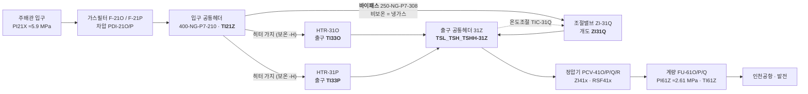
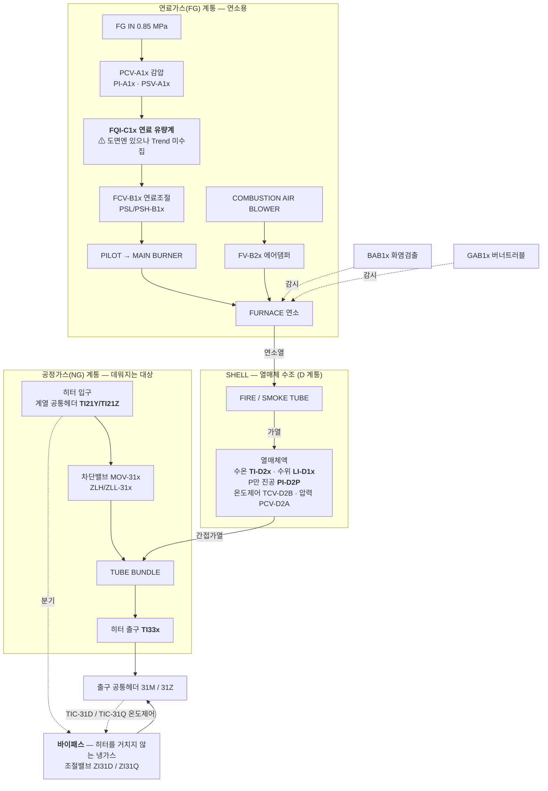

# HTR-31P 가스 흐름 다이어그램 및 태그 매핑 현황

> 목적: HTR-31P(가스히터 P호기) 고장예측 ODE(H1/H2, `data/docs/06_물리식_출처정리.md` §2)를 세우는 데 필요한
> "입력→출력 흐름"을 한 장으로 정리한다. ✅ 확정 / ⚠️ 불확실(가정 필요) / ❌ 미계측 을 명시해
> 어디까지 신뢰하고 어디부터 검증이 필요한지 한눈에 보이게 한다.
>
> 근거 문서: `data/docs/05_태그출처와_설비위치_매핑.md` §3(히터 내부 구조), `06_물리식_출처정리.md` §2(물리식),
> `04_고장이벤트_라벨분석.md` §5-1(KF-PINN 입력 구성안). 갱신: **2026-09-11 (P&ID 판독 반영 — §7)**.

## 0. 데이터 현황 — 있는 것 / 부족한 것

### 0-1. 있는 데이터

| 구분 | 내용 | 상태 |
|---|---|---|
| 연속 시계열 (Trend, 1분) | `PI21X TI21Y TI21Z TI33P TI-D2P PI-D2P` + `ZI41P PI43O RSF41P` — 9태그, 2011-10~2026-08, 결측 명시(reindex) | ✅ `prex/`에 반영, 사용 가능 |
| 이벤트/알람 로그 (DI/DO) | FAULT 10종 + STATUS 11종 + CONTROL 8종, 15년치 상승엣지 43,206건 | ✅ `prex/`에 반영. ⚠️ "진짜 고장" 판정(지속시간·반복횟수 필터)은 미적용 |
| 일/월 단위 계량 (Report) | `FI61O`(O/P/Q 계열 합산), `FI61A`(A/B/C 계열 합산) | ⚠️ 존재하나 1분 아님 + P 단독 분리 불가. 검증용 참고치로만 |
| 정기점검 결과 | `data/20260805_가스히터정압기 정기정검결과/.../가스히터/` — **H-31P 7건**(2011·2013·2015·2017·2019·2021·2024), `.../정압기/25년 PCV41P,42P 정기점검.pdf` | 📄 원본 확보. ❌ 아직 파싱·태그 연결 안 함 |
| 설계/사양 문서 | `HTR-31P 제작도서.pdf`(164MB 스캔, 영종 1차), `251016 영종 IO LIST.xlsx`(태그 정의 원본), PF/GROVE 정압기 카탈로그(PDF, T2/T3) | ✅ **OCR 파싱 완료(2026-09-10) → H1/H2 계수 전부 확보: `U·A`=16.2kW/K·전열면적 27.1m²·설계열량 0.86Gcal/h·`M_w·c_w`=60.76MJ/K(§5)** |
| 고장 경향성분석 보고서 | `24~25 공급설비 고장 경향성분석 결과/` 반기 보고서 4건(2024·2025) | 📄 원본 확보. 고장모드 정의 참고용, 시계열 라벨 아님 |
| 배관도(P&ID/CAD) | `.dwg` 16개(`P&ID` 폴더 6개 포함) | ✅ **판독 완료(2026-09-11)** — ODA File Converter로 DXF 변환 후 `ezdxf` 파싱. **#3·#4 해소, 단 `gas_flow_proxy` 전제 붕괴(§7)**. 재현: `python -m pid.pipeline` |

### 0-2. 부족한 데이터 (심각도순)

| # | 부족한 것 | 왜 문제인가 | 지금 우회 방법 |
|---|---|---|---|
| 1 | **연료가스 유량/열량 (`Q_burner`)** | 태그 자체가 없음(연속계측 불가). H1식의 구동항 | `H31POH`(on/off) + **설계열량 ~1.0 Gcal/h로 근사** (⚠️ 구 52 Gcal/h는 60배 오류, §5-1), 또는 KF-PINN 잠재변수 |
| 2 | **가스 질량유량 (`m_gas`) 1분단위** | `FI61x` 전량 NULL | ~~정압기 밸브식으로 역산(`gas_flow_proxy`)~~ → ⚠️ **§7-2로 역산 전제(직렬·무분기)가 무효화됨**. KF-PINN 잠재변수 공동추정으로 전환 권장 |
| 3 | ~~**히터↔정압기 배관 위상**~~ | ~~`PI43O`가 정말 P호기 출구압인지 미확정~~ | ✅ **해소(§7-2·§7-3)**: 히터2대 출구가 공통헤더(400-NG-P7-358)로 합류 후 정압기 4라인 분기 — **1:1 아님**. `PT-43O`는 41O 유닛 전용 출구배관에 설치(공용헤더 아님) |
| 4 | ~~**`TI21Y`/`TI21Z` 태그 정체**~~ | ~~둘 중 뭐가 P호기 실제 입력인지 미확정~~ | ✅ **해소(§7-1)**: `TI21Z`=O/P계열(HTR-31O·31P), `TI21Y`=A/B계열(HTR-31A·31B). **P호기 T_in은 `TI21Z` 단독** — 평균 사용은 오염이었음. 코드 반영 완료 |
| 5 | **`Cv`/밸브특성곡선** | 영종 P호기 자체 값이 아니라 남사 문서 값(T3 proxy) | 정압기 자체 도서는 참고용(PF)만 존재 → 파싱해도 T3 proxy에 머묾. **단 히터측 `U·A`/전열면적/설계열량은 제작도서 OCR로 확보됨(§5)** |
| 6 | **정비이력 ↔ 알람 대조** | 2015년 H-31P 알람 폭증(1,790건)이 진짜 고장인지 계기교체인지 미판정 | ✅ **OCR로 1차 판정(§5-2)**: 2015.3 정기점검(기밀·연소시험) 확인 → 점검활동성 알람에 무게. 세부 조치는 손글씨라 미판독 |

> 요약(2026-09-11 갱신): **3·4번은 P&ID 판독으로 해소됐다(§7).** 남은 것은 **1번(`Q_burner`)과
> 2번(`m_gas` 1분단위)** 이고, 둘 다 파싱해도 안 나온다 — `Q_burner`는 태그가 아예 없고,
> `m_gas`는 1분 트렌드 `FI61x`가 전량 NULL이다(일/월 Report `FI61O`/`FI61A`는 있으나 1분 아님+P 단독분리 불가).
> **⚠️ 그런데 2번의 우회로였던 밸브식 역산이 §7-2로 약해졌다** — 히터↔정압기가 1:1이 아니라
> 공통헤더로 섞이므로 `gas_flow_proxy`는 P호기 유량이 아니다. 따라서 우선순위는
> **① `Q_burner`·`m_gas`를 KF-PINN 잠재변수로 공동추정하는 쪽으로 이동, ② 5·6번은 이미 있는 파일 파싱**이다.

## 1. 설비 간 흐름 (지역번호 1→2→3→4→6)

> **2026-09-12 개정.** 이전 판에는 **바이패스가 빠져 있었다**. 그 누락이 §11~§13 추정 실패의
> 근본 원인이었다 — 경위와 증거는 §15, 검증은 §16.



- **A/B 계열도 같은 구조**다(도면 004): 입구 `TI21Y` → HTR-31A/31B + 바이패스(조절밸브 `ZI31D`)
  → 출구 헤더 **31M**(`TSL_TSH_TSHH-31M`) → 정압기 41A/B/C/D → 계량 61M(`PI61M` ≈0.81 MPa) → 인천도시가스.
  두 계열은 압력대부터 완전히 분리돼 있다(§14-2 표).
- **가스가 히터를 통과하는 비율은 중앙값 기준 A/B 58.7% · O/P 39.8%** 뿐이다(β = 0.413 / 0.602, §16-2).
  나머지는 바이패스로 흘러 히터를 거치지 않는다.
- **히터 출구온도는 자유변수가 아니라 피제어 변수다.** `TIC-31Q`/`TIC-31D` 가 헤더온도를 설정값에
  맞추려 바이패스 양을 조절한다. 열화로 히터 출구가 식으면 컨트롤러가 바이패스를 조여 헤더를 지킨다
  → **열화 신호는 출구온도가 아니라 β 에 남는다**(§15-3).
- **E 구간**: 유량계(FI61x) 컬럼은 존재하나 Trend 전체에서 100% NULL — ❌. 계열 전체 유량조차 미계측.

## 2. 히터 내부 구조 (연료가스 계통 + 공정가스 계통 + SHELL 열교환)

> 도면 003(HTR-31O 상세)·006(HTR-31A/B 상세) 판독. 히터 패키지 내부의 **문자코드 체계**:
> **A = 연료가스 감압, B = 버너·블로워, C = 연료가스 계량, D = 수조·용기**.



- **FG 계통**: 연속 계측이 없다. `PAHA1x`/`PAHHA1x` 는 압력 고/고고 **알람(이진)**이지 실시간 값이 아니다.
  그래서 H1식의 구동항 `Q_burner(t)` 는 설계 최대치(P: ~1.0 Gcal/h, §5-1)만 알고 실시간 값은 없다 — ❌.
  ⚠️ **단, 도면 003/006 에 `FQI-C1A`/`C1B`/`C2A`·`FQ-C1O` 연료 유량계가 있다.** Trend export 에만 빠져 있다.
  확보하면 `Q_burner(t)` 실측이 가능하다 — 이 프로젝트에서 **가장 가치 높은 추가 데이터 요청 항목**이다.
- **NG 계통 입구**: `TI21Z`(O/P) / `TI21Y`(A/B) — P&ID 확정(§7-1).
- **NG 계통 출구**: `TI33x` 는 히터 자신의 출구에 달려 있다(합류 전). 도면 001 좌표로 확인(§14-2).
- **바이패스**: §15. 이것이 이 그림에 새로 들어온 경로다.

## 3. 태그 → ODE 변수 매핑

> ⚠️ **아래 표는 2026-09-12 로 대체됐다 → `docs/kfpinn_state_space.md` §6.**
> 이 표는 히터 1대(P) 단위이고 **바이패스가 없던 시절**의 매핑이라 `m_gas`·`gas_flow_proxy` 항목이
> 지금 설계와 맞지 않는다. 기록으로만 남긴다.
> **§3-1(태그별 실측 통계)은 여전히 유효하다** — 그건 매핑이 아니라 데이터 현황이다.

| ODE 변수 | 의미 | 태그 | 신뢰도 | 비고 |
|---|---|---|---|---|
| `T_in` | 가스 입구온도 | **`TI21Z`** | ✅ | P&ID 확정(§7-1) — O/P 계열 필터출구 공통헤더. `TI21Y`는 A/B 계열이라 **쓰면 안 됨** |
| `T_out` | 가스 출구온도(관측) | `TI33P` | ✅ | 라인=H-31P 확정 |
| `T_bath` | 수조(열매체) 온도(상태) | `TI-D2P` | ✅ | 라인=H-31P 확정 |
| 수조 압력 | 진공압(P호기 전용 상태) | `PI-D2P` | ✅ | era별 스팬변경 → `PI-D2P_norm` 사용 권장 |
| `Q_burner(t)` | 버너 실시간 열출력 | — | ❌ | 실측 없음. 설계열량 **~1.0 Gcal/h** 상수(⚠️ 구 52 Gcal/h 정정, §5-1). `H31POH`로 근사하거나 학습파라미터로 처리 |
| `m_gas` | 가스 질량유량 | (역산) `gas_flow_proxy` | ❌→⚠️ | **§7-2로 강등**: 히터↔정압기 1:1이 아니라 공통헤더로 섞임 → 이 값은 "41P 라인 통과유량"이지 P호기 히터 통과유량이 아니다. **잠재변수 공동추정으로 전환 권장**, proxy는 약한 사전분포로만 |
| `P_in`(밸브식) | 정압기 입구압 | `PI21X` | ✅ | |
| `P_out`(밸브식) | 정압기 출구압 | `PI43O` | ⚠️ | **§7-3 정정**: 공용헤더가 아니라 **41O 유닛 전용 출구배관**(`360-NG-P7-456`)의 값. `PI-43P` 로컬 게이지는 있으나 전송기 없음 → SCADA 미수집 |
| `z`(밸브식) | 밸브 개도 | `ZI41P` | ⚠️ | 2023~2024 구간 스팬이 0~100→0~500로 바뀜 (휴리스틱으로 /5 보정) |

### 3-1. 각 태그 실측 데이터 현황 (뭐가 "있는지")

> 위 표가 "각 태그가 **뭐여야 하는지(ODE 역할)**"라면, 아래는 "각 태그에 **실제로 뭐가 들어있는지**"다.
> 원본 `data/Trend 데이터/AI_CV/*.csv` 175개 전수 집계(2026-09-10). 표본: **7,384,279행**, 1분, **2011-10 ~ 2026-08**.
> `정상범위`는 이상치에 강하도록 p1~p99, `스팬`은 계기 min~max(이상치·계기끝 포함). 결측%는 **관측행 기준**
> (1분 그리드로 reindex하면 관측 공백 시각이 NaN으로 추가됨 — 그건 별개, 문서 03 §2).

| 태그 | 의미 | 단위 | 정상범위(p1~p99) | 중앙값 | 스팬(min~max) | 결측 | 실제 데이터에서 보이는 것 |
|---|---|---|---|---|---|---|---|
| `PI21X` | 주배관 입구압 | MPa | 5.03 ~ 6.66 | 5.92 | 0 ~ 10 | ~0% | 5.9 MPa 근처로 안정. min 0·max 10은 계기 dropout/스팬끝(이상치) |
| `TI21Y` | **A/B계열** 필터출구 헤더온도 (P호기 무관) | ℃ | 1.6 ~ 29.5 | 12.99 | -30 ~ 50 | ~0% | 계절 변동 큼. 중앙값은 TI21Z와 비슷하나 **상단 분포가 다름**(p99 29.5) |
| `TI21Z` | **H-31P 입구온도** (O/P계열 헤더) | ℃ | 3.4 ~ 34.0 | 12.79 | -30 ~ 50 | ~0% | 〃. **p99가 TI21Y보다 +4.5℃** → 다른 계열(§7-1)이라 그렇다 |
| `TI33P` | 히터 출구온도(타깃) | ℃ | 2.0 ~ 59.4 | 23.45 | 0 ~ 100 | ~0% | 가열 후라 입구보다 높음. min 0 = dropout |
| `TI-D2P` | 수조 수온(상태) | ℃ | 0 ~ 76.8 | 59.05 | 0 ~ 100 | ~0% | 정상 55~65℃대. min 0 = dropout |
| `PI-D2P` | 수조 진공압(상태) | mmHg(추정) | -726 ~ -21 | -177.7 | -760 ~ 0 | ~0% | 음수=진공(-760≈완전진공). **era별 스팬 변동** → `PI-D2P_norm` 사용 |
| `ZI41P` | 정압기 개도 | % | 0 ~ 100* | 100* | 0 ~ 500 | ~0% | *스팬 혼재(2024구간 0~500). 보정 전 중앙값은 왜곡 → `/5` 휴리스틱 필요 |
| `PI43O` | 정압기 출구압(**41O 라인**) | MPa | 2.62 ~ 3.03 | 2.71 | 0 ~ 5 | ~0% | **범위 매우 좁음**(안정). 단 §7-3대로 41O 유닛 전용값 — P전용 아님 |
| `RSF41P` | 정압기 설정압(SP) | MPa | 2.54 ~ 2.74 | 2.63 | 0 ~ 2.79 | ~0% | 제어 목표값이라 거의 상수. `e = PI43O − RSF41P`가 제어오차 |
| `FI61x` | 계량 유량 | (Nm³/h) | — | — | — | **100%** | ❌ 전량 NULL — 존재만 하고 값 없음(§0-2 #2) |
| `Q_burner` | 버너 열출력 | (Gcal/h) | — | — | — | 태그 없음 | ❌ 연속계측 태그 자체가 없음. 설계최대 52 상수만(§0-2 #1) |

- **핵심 관찰**: 압력 3종(PI21X·PI43O·RSF41P)은 좁은 범위로 매우 안정, 온도 4종은 계절 변동이 큼.
- **TI21Y vs TI21Z**: 중앙값(12.99 vs 12.79)은 붙어 있지만 p99가 4.5℃ 벌어진다 → "둘이 다른 라인"이라는 심증을 데이터가 뒷받침했고, **§7-1에서 P&ID로 확정**됐다(서로 다른 수요처 계열).
- **ZI41P**: 중앙값이 100으로 찍히는 건 개도가 항상 만개라서가 아니라 **0~500 스팬 구간이 섞여** 통계를 끌어올린 것 — 반드시 스팬 보정 후 다시 봐야 함.

### 3-2. 왜 히터 고장 예측에 정압기 출구압(PI43O)이 들어오나 — 재검토(2026-09-10 → **09-11 결론 뒤집힘**)

> ⚠️ 아래 1·2번은 **당시(2026-09-10) 코드가 깔고 있던 논리**를 기록해 둔 것이다.
> 그 전제 2가지가 2026-09-11 P&ID로 반증됐다 — 이 절 끝의 "2026-09-11 갱신" 블록을 반드시 같이 볼 것.

**PI43O 자체는 히터 고장 지표가 아니다.** 히터 하류(정압기) 값이며, 코드에서 두 목적으로만 쓰인다:

1. **`gas_flow_proxy` 역산의 재료** — 밸브식 `Q = Cv·f(z)·√((PI21X² − PI43O²)/(G·T))`에서 PI43O는
   *출구압 자체가 궁금해서가 아니라* **밸브 양단 차압(PI21X − PI43O)** 을 만들려고 들어온다. 유량이 필요한 이유는
   히터 물리식 **(H2) `m_gas·c_p·(T_out − T_in) = U·A·ΔT_lm`** 에 `m_gas`가 **필수항**이기 때문(문서 06 §4).
   유량을 모르면 *"T_out 하락이 부하(유량↑) 탓인지 히터 열화(U·A↓) 탓인지"* 를 못 가른다. 유량계 `FI61x`가
   전량 NULL이라, 히터→정압기 직렬(질량보존) 가정 하에 정압기 통과유량으로 대신 역산한다.
   → **이 목적에선 PI43O가 (간접적으로) 필요하다.**
2. **`control_error_p = PI43O − RSF41P`** — 정압기 제어오차(e=PV−SP). 이건 **정압기** 고장모드(SLEEVE VALVE
   마모·PILOT 다이어프램·PIC 드리프트, 문서 06 §3-4)용이라 **히터 고장 스코프에선 곁다리**다.

**⚠️⚠️ 2026-09-11 갱신 — 여기서 우려했던 2가지가 P&ID로 "우려"가 아니라 "사실"로 확인됐다 (§7):**

- ~~PI43O는 O/P/Q 공용헤더~~ → **더 나쁘다**: 공용헤더조차 아니고 **41O 유닛 전용 출구배관**의 값이다(§7-3).
  차압 `PI21X − PI43O`는 P호기 정압기의 차압이 아니라 **옆 라인 차압**이다.
- ~~직렬·무분기 가정이 미검증~~ → **반증됨**: 히터 2대 출구가 공통헤더로 합류한 뒤 정압기 4라인이
  각자 뽑아 간다(§7-2). 질량보존으로 "정압기 통과유량 = 히터 통과유량"이라 할 근거가 없다.
- → **결론: `gas_flow_proxy`를 H2식의 `m_gas`로 그대로 쓰면 안 된다.** 여기 적어 뒀던 대안대로
  **`m_gas`를 KF-PINN 잠재변수로 공동추정**(`Q_burner`와 동일 방식)하는 쪽으로 옮긴다.
  `gas_flow_proxy`는 폐기하지 말고 **약한 관측/사전분포**(부하 변동의 대략적 지표)로만 남긴다.

| PI43O 용도 | 히터 고장과 관련성 | 판정 (2026-09-11) |
|---|---|---|
| `gas_flow_proxy` (m_gas 역산 재료) | H2 필수항 m_gas 없인 열화/부하 구분 불가 | ⚠️ **프록시 무효화 수준** — 잠재변수로 대체 |
| `control_error_p` (정압기 제어오차) | 정압기 고장모드용 | 히터 스코프면 곁다리 (변동 없음) |

## 4. 지금 상태 요약 (체크리스트)

- ✅ **확정**: 설비간 순서(1→2→3→4→6), 히터 출구(TI33P), 수조 상태(TI-D2P/PI-D2P), 정압기 입구압(PI21X).
  - 🆕 **히터 입구 `T_in` = `TI21Z` 단독** (2026-09-11 P&ID, §7-1). `TI21Y`는 인천도시가스(A/B) 계열이라
    P호기와 무관하다 — 종전 "평균 사용"은 다른 계열 온도를 섞은 오염이었고, `prex/` 수정 완료.
    (IO LIST 경로는 막혀 있었다: `0224_TI21Y`/`0224_TI21Z` 둘 다 설명이 `HEATER INLET TEMP.`뿐이고
    채널 01-02/01-03·1-5VDC로 완전 대칭이라 판별 불가. **P&ID가 유일한 해법이었고 실제로 풀렸다.**)
  - 🆕 **배관 위상 확정** (§7-2): 히터 2대 출구 → 공통헤더 `400-NG-P7-358` → 정압기 4라인 분기. **1:1 아님.**
- ⚠️ **가정 필요 (구현은 했으나 검증 안 됨)**:
  - **`gas_flow_proxy` 자체가 흔들린다** — ~~히터↔정압기 직렬 가정~~은 §7-2로 **반증**됐고,
    ~~`PI43O`=O/P/Q 공용헤더~~는 §7-3으로 **41O 유닛 전용값**임이 밝혀졌다.
    → H2식 `m_gas`로 그대로 쓰지 말 것. **KF-PINN 잠재변수 공동추정으로 전환**이 다음 과제.
  - `gas_flow_proxy`의 `Cv`(=250), 밸브특성곡선 `f(z)`(선형 근사) — 영종 P호기 정압기 자체 도서로 교체 필요
    (지금은 남사 문서의 동일 모델 카탈로그 값, T3 proxy). **P&ID에는 Cv 표기가 없다**(도서 사항).
  - `ZI41P` 2023~2024 구간 스팬 보정(÷5) — 정확한 계기 교체일 미확인, 휴리스틱임. P&ID에도 EU 스팬 표기 없음
    → 문서 03 §9-1대로 가스공사 확인 또는 KPOS 태그설정 화면이 유일 경로.
- ❌ **미계측 (대안으로 우회 중)**: 연료가스 유량/열량(`Q_burner`), 계량설비 유량(`FI61x`).
- 🆕 **OCR로 신규 확보/발견 (2026-09-10, §5)**:
  - 제작도서에서 `U`=513.6 kcal/m²h℃(597 W/m²K)·`A`=27.1 m²·**`U·A`=16.2 kW/K**·설계열량 0.86 Gcal/h·설계 `m_gas`=52,444 kg/h 확보.
  - ⚠️ **`Q_burner` "52 Gcal/h" 재검토 필요** — 제작도서 설계열량(0.86 Gcal/h)과 **60배 불일치**. "52"는 설계 질량유량(52,444 kg/h)과 수치 일치 → 오기입 의심(§5-1).
  - 2015 알람 폭증 = 정기점검(기밀·연소시험) 시기와 일치(§5-2).
- 🆕 **P&ID로 신규 확보/발견 (2026-09-11, §7)**:
  - `TI21Z`=P호기 입구 확정, 배관 위상 확정, `PI43O`의 실제 설치 위치 정정.
  - **`TT/TSL-31Z`(합류헤더 온도) → `SEQ.(HTR-31P)` 인터록** — `H31POH` 토글의 *원인 변수*가 도면에 있다(§7-4).
    지금까지 `H31POH`를 `Q_burner` 근사로만 봤는데, 라벨링·피처 단계에서 `TSL_TSH_TSHH-31Z`(LIVE)와 함께 볼 것.

## 5. 제작도서 OCR 추출 — HTR-31P 설계계수 (2026-09-10)

> 히터 제작도서(`경인 22-영종관리소진공식 가스히터(HTR-31P)-제작도서.pdf`, 385쪽, **전면 스캔**)를 OCR
> (tesseract 5.5.3 `kor+eng`, 200dpi)해서, 그동안 "미확보"였던 **U·A·전열면적·설계열량**을 확보했다.
> 원본: 열전달 계산서 SHEET 1~3 (원일티엔아이 WONIL, `PO-09-029`, 2009.07.06 승인). 신뢰도 **T1(1차 원본)**.
> ✅ **수조 열용량 `M_w·c_w`도 확보(2026-09-10)**: WEIGHT ANALYSIS(p31 "30. LIQUID=14,512 kg") + CALCULATION OF VOLUMN
> (p40, 체적 14.527 m³)에서. → H1/H2의 **현열 계수는 전부 1차 원본으로 확정**됨(물리식 문서 `06 §2-4`에도 전파 완료).
> ⚠️ 단 P는 진공식(감압 비등)이라 H1에 **잠열항**을 넣을 경우 기화잠열·비등비율은 **별도 미확보** — 위 값으로 닫히는 건 현열항까지다.

| 파라미터 | 기호 | 값 | SI 환산 | 비고 |
|---|---|---|---|---|
| 설계 가스유량 | `V` | 65,000 Nm³/h | — | 정압기 61,900과 정합 |
| **설계 질량유량** | `m_gas` | **52,444 kg/h** (=65,000×0.80683) | 14.6 kg/s | 밀도 0.80683 kg/Nm³ |
| 가스 정압비열 | `c_p` | 0.654 kcal/kg·℃ | 2,739.8 J/kg·K | 문서 06 §2 `c_p≈2.5`와 근사 |
| 가스 비중 | — | 0.624 (Air=1) | — | |
| **총괄전열계수** | `U` | **513.6 kcal/m²h·℃** | **597 W/m²K** | 내막 αio=2048·외막 αo=863.1·오염계수 포함 |
| **전열면적(튜브번들)** | `A` | **27.1 m²** | — | 106본×π×Ø25.4×L3200 |
| **➜ U·A** | `U·A` | **13,919 kcal/h·℃** | **16.2 kW/K** | =U×A (H1/H2 계수) |
| **설계 열량(번들 흡수)** | `Q` | **860,000 kcal/h = 0.86 Gcal/h** | 1.0 MW | 계산치 768,753 / 설계기준 860,000 |
| **버너 연료소비 / 발열** | `Q_burner` | **90 Nm³/h × 9,510 kcal/Nm³ ≈ 0.86 Gcal/h** | 0.996 MW | 버너 계산서 p278 (직접값, 구 52 Gcal/h ❌) |
| 열매체 수조온도 | `T_bath` | 80 ℃ | — | 설계점 |
| 설계 가스 입/출구 | — | 0 → 22.4 ℃ | — | LMTD 68.19 ℃ |
| **열매체 충전량** | `M_w` | **14,512 kg** | 14.527 m³ | 밀도 999 kg/m³(≈물), c_w=1.0 kcal/kg℃ |
| **➜ 수조 열용량** | `M_w·c_w` | **14,512 kcal/℃** | **60.76 MJ/K** | H1 `dT_bath/dt` 계수. τ=M_w·c_w/U·A≈63분 |
| 튜브번들 | — | 106본, Ø25.4×t2.11, L3200, 2pass | — | 가스측 유속 11.76 m/s |
| Fire tube | — | Ø650×t10, 면적 34.4 m² | — | flux 25,000 kcal/m²h |
| 가스측 압력강하(설계) | `Δp` | 3,714.6 mmAq = 0.371 kg/cm² | 0.041 MPa | |

### 5-1. ⚠️ 중대 발견 — `Q_burner` "52 Gcal/h"는 실제 설계열량과 60배 불일치

- 문서 06 §2는 `Q_burner`(설계 최대)를 **P=52 Gcal/h**로 쓴다(출처: `251016 영종설비현황.xlsx`, 이 저장소엔 없음).
- 그러나 **제작도서가 버너 설계값을 직접 명시**한다 — "CALCULATION SHEET FOR BURNER"(p278):
  `Qg(연료소비) = Qc/Hℓg = 860,000 / 9,510 = 90 Nm³/h` → **버너 발열 = 90 × 9,510 ≈ 856,000 kcal/h ≈ 0.86 Gcal/h**.
  (번들 흡수열 0.86 Gcal/h와도 일치 → **이중 확인**. 유추가 아니라 제작사 계산서 직접값.)
- **물리적으로도 52 Gcal/h는 불가능**: 65,000 Nm³/h를 Δt≈22~35℃(정압기 감압 재열, 문서 06 §2-2 "0.1MPa당 0.56℃")
  데우는 열량은 ~0.86 Gcal/h다. 제작도서가 **fire tube 자체를 860,000 kcal/h 기준(34.4 m²)으로 설계**했으므로
  버너가 52 Gcal/h일 수 없다(그러려면 fire tube ~2,000 m² 필요).
- **가설**: "52"는 **설계 질량유량 52,444 kg/h**와 수치가 일치 → `영종설비현황.xlsx`에서 **유량을 열량으로 오기입**했을 가능성.
- **조치**: H1 구동항 `Q_burner`(설계 상수)를 **0.86 Gcal/h(연료 90 Nm³/h)로 확정** — `config.HTR_QBURNER_DESIGN_W`(0.996 MW) 반영 완료.
  단 **실시간 `Q_burner(t)`는 여전히 미계측**(연료 유량계 없음) → `H31POH`×상수 근사 또는 잠재변수.
  `영종설비현황.xlsx` 원본 재확인 권장(O=98.72·A/B=14.08도 같은 출처 → 동반 검증; 여기선 P만 1차 확인).

### 5-2. 정기점검 OCR — 2015 알람 폭증(#6) 1차 판정

- `15년 H-31P 정기점검.pdf`(스캔) OCR 결과: **2015.3.16~17 정기점검 실시** 확인 — `관리소명:영종 / 설비번호:H-31P`,
  **기밀시험(3.16)** + **연소효율시험(3.17, testo 330-2)** + 기계 점검(스프링·블로워·튜브번들 누설·수조수위).
- → 2015년 알람 폭증(1,790건, `TALLD1P` 수온 LL 1,513건 등)은 **점검·시험 중 조작에 따른 알람일 가능성**에 무게.
  단 계기교체 등 세부 조치는 **손글씨 체크시트라 OCR 품질 낮아** 확정 못 함(인쇄 성적서만 판독됨).

## 6. 구현 위치

- `pid/` — **P&ID 판독 파이프라인 (2026-09-11 신규)**: `config.py`(도면 경로·도구 위치) + `convert.py`
  (DWG→DXF, ODA File Converter + xvfb-run) + `extract.py`(텍스트 좌표 추출 / PNG 렌더) + `pipeline.py`.
  실행 `\.venv/bin/python -m pid.pipeline`. 산출물은 `data/.../260410 영종GS 도면/_converted/`
  (`dxf/` 6장, `png/` 전체도 6장 + `판독_*.png` 9장, `pid_text.json` 텍스트 5,327건). git 미포함.
  최초 1회 시스템 설치 필요: `yay -S oda-file-converter`, `sudo pacman -S xorg-server-xvfb`.
- **`docs/kfpinn_state_space.md` (2026-09-11 신설)** — §7의 결과를 받아 `m_gas`를 잠재변수로 옮긴
  **KF-PINN 상태공간 설계**. ε-NTU 관측식, 식별성 분석, **태그↔ODE 변수 매핑표(입구/출구/수조/버너)**.
- `prex/trend.py::add_heat_exchange()`: ε·NTU 산출(`htx_eps`/`htx_ntu`/`htx_drive_c`).
  `PI43O`·`ZI41P`·`Cv` 없이 신뢰 태그 3개만 쓴다 → §7-2·§7-3의 영향을 받지 않는 유일한 경로.
- `prex/identify_mgas.py`(진단): 밸브식 없이 m_gas·U·A 분리 가능한지 검증 → 불가(진공 잠열항).
- `prex/config.py`: `HTR31P_INLET_TAG`(=TI21Z, §7-1), `EPS_MIN_DRIVE_C`, `FLOW_INPUT_TAGS`, `GAS_SG`, `PCV41P_CV`, `ZI41P_RESCALE_ABOVE`.
  - **히터 설계계수(2026-09-10 추가, §5 OCR)**: `HTR_UA_W_PER_K`(16.2 kW/K), `HTR_AREA_M2`, `HTR_U_KCAL`, `HTR_CP_GAS_J_KGK`,
    `HTR_DESIGN_MGAS_KG_S`, `HTR_DESIGN_DUTY_W`, `HTR_BATH_TEMP_C`, `HTR_DESIGN_LMTD_C`, **`HTR_QBURNER_DESIGN_W`≈1.18 MW(1.01 Gcal/h, 구 52 Gcal/h 폐기)**,
    **`HTR_MW_CW_J_PER_K`(수조 열용량 60.76 MJ/K), `HTR_BATH_LIQUID_MASS_KG`(14,512kg), `HTR_BATH_TIME_CONST_S`(τ≈3,754s)**.
- `prex/trend.py::estimate_gas_flow()`: 위 밸브식으로 `gas_flow_proxy`/`ZI41P_frac`/`control_error_p` 컬럼 생성.
- 출력: `prex/output/trend_htr31p.parquet` (git 미포함, `python -m prex.pipeline`로 재생성).
- OCR 파이프라인: `pdftoppm -r 200 → tesseract -l kor+eng` (tessdata `kor`는 tessdata_best, `/opt/homebrew/share/tessdata/`).

## 7. P&ID 판독 결과 (2026-09-11) — 미해결 #3·#4 해소

> 그동안 "이 환경에서 `.dwg`를 못 연다"는 이유로 막혀 있던 §0-2의 **#3(배관 위상)·#4(TI21Y/Z 정체)**
> 를 P&ID 원본 판독으로 확정했다. 도구: ODA File Converter로 AC1032 → DXF 변환 후 `ezdxf` 파싱 +
> 판독용 PNG 렌더. 재현: `.venv/bin/python -m pid.pipeline` (§6). 신뢰도 **T1(영종 1차 도면)**.
> 근거 도면: `09-15-R-32-001`(히터), `-002`(정압기 O/P/Q/R), `-004`(히터 A/B).
> 판독 확대본: `data/영종GS 현장 세부데이터/260410 영종GS 도면/_converted/png/판독_*.png`

### 7-1. ✅ #4 해소 — `TI21Y`/`TI21Z`는 이중화가 아니라 **서로 다른 계열의 필터 출구 헤더**다

| 태그 | 설치 배관 | 상류 | 하류 | P호기 |
|---|---|---|---|---|
| **`TI21Z`** | `400-NG-P7-210` | F-21O + F-21P 출구 합류 | **HTR-31O · HTR-31P** | ✅ **이게 T_in** |
| `TI21Y` | `350-NG-P7-211` | F-21A + F-21B 출구 합류 | 도면4 `350-NG-P7-301` → `250-NG-P7-302-H`/`303-H` → **HTR-31A · HTR-31B** | ❌ 무관 |

- 두 계기 모두 `TT-21x`(전송기) → `TI-21x`(지시) → `XR-610` 구조로 대칭이라 IO LIST만으로는 구분이 안 됐던 것이고,
  **물리적으로는 인천공항·발전 계열(O/P)과 인천도시가스 계열(A/B)로 완전히 갈린다.**
- 실측 상관 0.87 / p99 4.5℃ 차이(§3-1)는 "불완전 이중화"가 아니라 **애초에 다른 계열**이라 나온 것이다.
- **조치 완료**: `prex/config.py::HTR31P_INLET_TAG = "TI21Z"` 신설, `prex/trend.py::estimate_gas_flow()`와
  `prex/verify_ua.py`의 `mean(TI21Y, TI21Z)` → `TI21Z` 단독으로 교체. `TI21Y`는 계열 간 대조·QA용으로
  parquet에는 남긴다(계산엔 미사용). 파이프라인 재실행 완료(7,804,924행, 2026-09-11).

**정정 효과 (재실행 후 실측 비교, 7.38M행)** — 평균은 거의 안 움직이는데 **개별 시점 오차가 크다**:

| 항목 | 구(평균) | 신(TI21Z) | 차이 |
|---|---|---|---|
| H2 구동항 `ΔT = TI33P − T_in` | 평균 11.081 ℃ | 평균 10.979 ℃ | **평균 −0.101 ℃** |
| 〃 시점별 \|오차\| | — | — | **p50 0.59 / p95 3.96 / p99 6.42 ℃** |
| 〃 ΔT 대비 상대오차 | — | — | **p50 10.8%** |
| `gas_flow_proxy` | — | — | ×0.990 ~ ×1.008 (무시 가능) |

- 구 방식의 오차는 정확히 `|TI21Y − TI21Z| / 2`다 (실측 평균 2.16 / p95 7.91 / p99 12.84 ℃).
- **`gas_flow_proxy`는 거의 안 변한다** — 밸브식에서 T가 절대온도(≈286 K)로 `1/√T` 로만 들어가기 때문(±1%).
- **반면 H2 열수지는 크게 변한다** — ΔT가 겨우 11 ℃인데 시점별로 최대 6 ℃씩 틀렸다는 뜻이고,
  `U·A` 추정과 잔차 기반 이상탐지에 직접 들어가는 항이다. **이 정정의 실익은 전부 여기 있다.**

### 7-2. ⚠️ #3 해소 — 단, `gas_flow_proxy`의 전제가 무너졌다

```
HTR-31O 출구 (400-NG-P7-354-H) ┐
                               ├─→ 400-NG-P7-358 ─(400x350)→ 도면2 → 350-NG-P7-451
HTR-31P 출구 (400-NG-P7-355)  ┘                                  (정압기 공통 입구헤더)
                                                                      │
                                        ┌──────────┬──────────┬───────┴──────┐
                                    250-…-452  250-…-453  250-…-454     250-…-455
                                      41O/42O    41P/42P    41Q/42Q       41R
```

- **히터 2대 : 정압기 4라인이며 1:1 대응이 아니다.** 두 히터 출구가 하나의 공통 헤더로 합류한 뒤
  정압기 4라인이 각자 뽑아 간다.
- → §3-2가 우려했던 **"직렬·무분기(질량보존) 가정"이 실제로 성립하지 않는다.**
  `PCV-41P` 통과유량 ≠ `HTR-31P` 통과유량이므로, `gas_flow_proxy`는 "P호기 히터 통과유량"이 아니라
  **"O/P 공통헤더에서 41P 라인이 뽑아 간 유량"** 으로만 읽어야 한다.
  H2식의 `m_gas` 대용으로 그대로 넣으면 편향된다.
- **권장 방향**: §3-2에 이미 적어 둔 대안대로 **`m_gas`를 KF-PINN 잠재변수로 공동추정**(지금 `Q_burner`에
  쓰는 방식과 동일)하는 쪽으로 옮긴다. `gas_flow_proxy`는 폐기하지 말고 **약한 관측/사전분포**로만 유지.
- **크로스타이 존재**: `350-NG-P7-319`가 O/P 헤더에서 도면4(A/B측)로 넘어간다. 표제란 개정이력의
  `ADD HEATER COMMON LINE`('98.08.26)이 이것 — **계열 간 완전 독립도 아니다.**

### 7-3. ⚠️ `PI43O`는 "O/P/Q 공용 헤더"가 아니다 — 가정보다 한 단계 약함

- `PT-43O`(전송기)는 **`PCV-41O/42O` 유닛 전용 출구배관 `360-NG-P7-456`**(V-42O 직전)에 달려 있다.
  3라인(`456`/`457`/`458`)이 합류하는 지점은 그보다 **하류**인 `600-NG-P3-460`/`461`이다.
- `PCV-41P` 유닛에도 로컬 게이지 `PI-43P`는 **있다**. 다만 전송기(PT)가 없어 SCADA에 안 올라온다
  → KPOS에 `PI43P` 태그가 없는 이유가 이걸로 설명된다(§0-2 #3의 "P 전용 태그 없음").
- 즉 `PI43O`는 공용값이 아니라 **옆 라인(41O)의 출구압**이다. 세 라인이 같은 SP로 제어되고 하류에서
  합류하므로 값 자체는 가깝겠지만, **P호기 정압기 차압의 대용으로 쓰는 근거는 종전 가정보다 약하다.**
  §7-2와 합치면 `gas_flow_proxy`의 두 재료(`PI43O`, 직렬가정)가 **둘 다** 흔들린 셈이다.

### 7-4. 🆕 덤으로 확보 — 히터 시퀀스 인터록의 물리적 근거

- `TT-31Z` / `TSHH-31Z` / `TSH-31Z` / `TSL-31Z`가 **합류 헤더 `400-NG-P7-358` 바로 위**에 설치돼 있고,
  도면상 `TSL-31Z → "LOW TO HTR-31P"`, 그리고 `SEQ. (HTR-31O)` / `SEQ. (HTR-31P)` 인터록으로 연결된다.
- → **히터 기동/정지 시퀀스가 이 합류헤더 온도로 구동된다.** `H31POH`(운전상태 토글, 37,978건)를
  해석할 때 쓸 수 있는 직접적 인과관계다 — 지금까지 `H31POH`는 `Q_burner` 근사용으로만 봤는데,
  **그 토글의 원인 변수가 `TSL_TSH_TSHH-31Z`(Trend에 LIVE 아날로그로 존재)** 라는 뜻이다.
  라벨링·피처 엔지니어링 단계에서 검토할 것.
- 도면4에 `V-31C`/`MOV-31C` 자리는 있으나 히터 없이 점선으로 `V-32C`로 빠진다 — 문서 02의
  "`TI33C` = 존재하지 않는 설비"와 일치(설계상 자리만 확보).

### 7-5. 남은 것

| # | 항목 | 상태 |
|---|---|---|
| 1 | `Q_burner` 실시간 | ❌ 여전히 미계측(연료 유량계 없음). 설계상수 0.86 Gcal/h + `H31POH` 근사 유지 |
| 2 | `m_gas` 1분단위 | ❌ 여전히 없음. **§7-2로 역산 경로가 약해져 잠재변수 전환이 사실상 필수가 됨** |
| 5 | `Cv`/특성곡선 | ⚠️ T3 proxy 유지. P&ID엔 Cv가 없다(도서 사항) |
| 6 | 정비이력 ↔ 알람 | ✅ §5-2에서 1차 판정 완료 |
| — | `ZI41x` EU 스팬 | ⚠️ P&ID에도 스팬 표기 없음 → 문서 03 §9-1대로 **가스공사 확인 또는 KPOS 태그설정 화면**이 유일 경로 |

## 8. 2025년 ε 급등 추적 — 진공 regime과 운전 체제 변화 (2026-09-11)

> 발단: `trend/`의 신규 그림 `13_eps_yearly.png`에서 ε 중앙값이 2024→2025에 계단식으로 급등했다
> (버너 OFF 기준 0.10 → 0.66). ε 상승은 "열교환이 잘 된다"는 뜻이라 열화의 반대 방향이고,
> 6배 급등은 물리적으로 설명이 안 돼 계기 아티팩트를 의심하고 추적했다. **아티팩트가 아니었다.**

### 8-1. ε 분해 — 분자가 뛰었다 (계기 문제 아님)

`ε = (TI33P − TI21Z) / (TI-D2P − TI21Z)` 를 분자·분모로 갈라 보면:

| 연도 | TI21Z | TI33P | TI-D2P | 분자(승온폭) | 분모(구동차) | ε | PI-D2P |
|---|---|---|---|---|---|---|---|
| 2023 | 15.23 | 18.54 | 61.24 | **0.81** | 46.66 | 0.089 | −176.7 |
| 2024 | 10.11 | 17.56 | 60.81 | **1.82** | 50.32 | 0.139 | −182.3 |
| **2025** | 13.04 | **44.40** | 60.63 | **31.09** | 47.91 | **0.682** | **−614.8** |
| 2026 | 8.25 | 39.33 | 60.51 | 31.16 | 52.53 | 0.608 | −620.4 |

- **분모(`TI-D2P − TI21Z`)는 47~52로 안정**하다. 수조 온도계 스팬이 바뀐 게 아니다.
- **분자, 즉 히터 승온폭이 1.8℃ → 31℃로 뛰었다.** 히터가 실제로 가스를 데우기 시작한 것이다.

### 8-2. 전이 시점 — 13일 정지정비 직후

| 날짜 | 진공압 | 수조 | 승온폭 | 버너 ON |
|---|---|---|---|---|
| 2024-10-16 | −186.5 | 65.5 | −0.10 | 1.8% |
| **2024-10-17 ~ 10-29** | **−760.0**(스팬끝) | **0.00**(dropout) | — | **0%** | ← **13일 정지** |
| 2024-10-30 | −281.1 | 64.0 | 0.09 | 1.3% |
| 2024-11-01 | −556.4 | 55.7 | 0.28 | 0% |
| 2024-11-04 | −604.6 | 60.7 | **25.56** | 3.9% |
| 2024-11-30 | −617.6 | 60.7 | **39.32** | 21.7% |

**2024-10-17~29 13일간 완전 정지**(계기 dropout 동반) 후 재가동되면서 진공압·승온폭·버너 가동률이
**동시에** 바뀐다. 정비 작업으로 보는 것이 자연스럽다.

### 8-3. ⚠️ 정정 (2026-09-11, 같은 날 재검토) — 위 8-1·8-2의 해석은 과장이었다

**8-1의 표는 "전체 행 중앙값"이라 성능이 아니라 가동률을 본 것이다.** 히터가 꺼져 있으면
승온폭은 당연히 0에 가깝다. **버너 ON 구간만** 놓고 다시 비교하면 그림이 뒤집힌다:

| 구간 | 기간 | 버너 ON일 때 승온폭 | ε | 가동률 |
|---|---|---|---|---|
| deep-1 | 2011-10 ~ 2014-10-20 | **20.25℃** | 0.387 | 16.5% |
| shallow | 2014-10-21 ~ 2024-10 | **20.47℃** | 0.496 | 9.5% |
| deep-2 | 2024-11-01 ~ | 34.25℃ | 0.669 | 30.4% |

- **`shallow` 구간의 승온폭이 `deep-1`과 사실상 같다**(20.47 vs 20.25). ε는 오히려 더 높다.
  → **"진공 상실로 히터가 제 기능을 못 했다"는 해석은 성립하지 않는다. 켜졌을 때는 멀쩡히 데웠다.**
- 열화 추세도 없다. '히터가 실제로 일하는 중'(버너 ON & 승온>5℃)만 골라 연도별 ε를 보면
  0.196~0.694 사이를 오갈 뿐 단조 하락이 없다.
  ⚠ **단 2026-09-11 §9 로 보완 필요**: 2024-10 에 전열면 고압세척·튜브 개선 정비가 있었다.
    정비는 `U·A` 를 계단식으로 회복시키므로, 전 구간을 한 줄로 회귀하면 열화가 상쇄돼 보인다.
    **정비 시점(2011·2013·2015·2017·2019·2021·2024)을 경계로 끊어서 다시 봐야 한다.** 2015~2024 회귀 기울기 −0.014/년은
  표본이 적은 2021(n=4,305)·2023(n=2,738)년이 끌어내린 값이다.

**따라서 다음을 철회한다:**

| 철회 항목 | 사유 |
|---|---|
| ~~"10년간 진공이 상실돼 히터가 제 기능을 못 했다"~~ | 가동 중 성능이 정상 구간과 동일 |
| ~~"§5-2의 2015 알람 인과 해석을 뒤집는다"~~ | 2015 초 수조가 5~8℃까지 식은 것은 사실이나, 그것을 **진공 탓으로 연결할 근거가 없다**. §5-2 판정은 그대로 둔다 |
| ~~"`PI-D2P_norm`을 쓰지 말라"~~ | 성능과 연동되지 않으므로 **계기 스팬 변경 가설(문서 03 §4)이 오히려 유력**하다. `_norm` 사용 근거는 유지 |

**남는 사실 (이건 유효하다):**

- `PI-D2P`는 실제로 3구간으로 갈리고, **경계는 2014-10-21과 2024-11-01**이다.
  기존 `config.PI_D2P_ERAS`의 연 단위 근사(2015-01-01/2025-01-01)보다 2개월 정확하다 → 수정 유지.
- 2014-10-21 전이는 **수조온도 변화 없이 하루 만에** −649 → −113으로 계단 이동했다.
  계기 교체/재설정으로 보는 것이 가장 자연스럽다.
- `vacuum_regime` 컬럼은 유지하되 **"진공 상실"이 아니라 "PI-D2P 수준 구간" 라벨**로 읽을 것.

### 8-4. ⚠️ 재정정 — '일한 시간' 판별 기준이 틀렸다 (552일 → 2,535일)

앞서 '히터가 일한 시간'을 **`H31POH==1` AND `승온폭>5℃`** 로 셌는데, `H31POH` 조건이 틀렸다.

**`H31POH`는 "히터 가동 기간"이 아니라 "버너 점화 사이클"이다** — ON 구간 길이가
**중앙 15분 / 평균 28분 / p90 33분**이다. 수조 시정수가 63분(`HTR_BATH_TIME_CONST_S`)이라
버너는 수조 온도를 유지하려고 짧게 껐다 켰다 한다. 그동안에도 **가스는 계속 흐르며 데워진다.**
즉 "버너가 지금 타는 중"과 "히터가 가스를 데우는 중"은 별개인데 AND로 묶어 과소 집계했다.

**판별은 승온폭 하나로 한다** (`TI33P − TI21Z > 5℃`). 정체(격리된 히터 안의 가스가 수조열로
데워져 유량 없이 승온폭만 큰 경우)로 오판할 우려는 세 가지로 배제된다:

| 확인 | 결과 |
|---|---|
| ε ≈ 1 구간 (정체면 `T_out→T_bath`) | ε 0.90~0.99 가 **0.1%**뿐 |
| `MOV31PC`(입출구 밸브 닫힘) 상승엣지 | 연 **3~17건**뿐 — 격리 자체가 드물다 |
| 승온>5℃ 시각의 정압기 개도 | **92.8%가 개도>0.5** (유량 있음), 개도<0.05는 4.9% |

**정정된 수치:**

| 구간 | 관측일 | **일한 일수** | 가동률 | 일할 때 ε | 일할 때 승온폭 |
|---|---|---|---|---|---|
| deep-1 (2011~2014) | 1,121 | 595 | 53.1% | 0.326 | 16.15℃ |
| shallow (2014-11~2024-10) | 3,470 | **1,489** | 42.9% | 0.407 | 15.26℃ |
| deep-2 (2024-11~) | 537 | 451 | **83.9%** | **0.696** | **33.02℃** |
| **전체** | 5,128 | **2,535** | **49.4%** | | |

- 연도별로는 **77~310일(25~85%)** 이고 평균 49.4% — "연 6개월 가동"이라는 현장 감각과 맞는다.
- ~~"학습에 쓸 수 있는 데이터가 552일뿐"~~ → **철회.** 2,535일이고, `shallow` 구간만 해도 1,489일이다.
  **표본량은 부족하지 않다.**
- 일할 때 성능도 `shallow`(ε 0.407)가 `deep-1`(0.326)보다 오히려 높다 → §8-3의 "열화 없음" 결론은 유지·강화.

### 8-5. 남는 진짜 이슈 — deep-2는 운전 방식이 다르다

표본량 문제는 사라졌지만, **2024-11 이후 구간이 이전과 뚜렷이 다르다**는 사실은 남는다:

| | shallow (10년) | deep-2 (22개월) | 배수 |
|---|---|---|---|
| 가동률 | 42.9% | **83.9%** | 2.0× |
| 일할 때 승온폭 | 15.26℃ | **33.02℃** | 2.2× |
| 일할 때 ε | 0.407 | **0.696** | 1.7× |

히터가 **2배 자주, 2배 세게** 돌고 있다. 부하 증가인지 설정(TCV 목표온도 등) 변경인지는 미확정이다.

**학습/검증 분할에 주는 함의** (문서 04 §5-3):

| 구간 | 원안 | 일한 일수 | 판단 |
|---|---|---|---|
| Train 2016-01~2022-11 | 학습 | 약 945일 | 충분 |
| Val 2023-02~12 | 검증 | **77일** | 쓸 수는 있으나 그 해 가동률이 25.2%로 최저 |
| Test 2024-10~2026-04 | 시험 | 약 400일 | **운전 체제가 다른 구간** |

→ 표본 부족이 아니라 **체제 불일치**가 문제다. deep-2를 학습에 일부 포함하거나,
   `vacuum_regime`/가동률을 모델 입력 조건으로 넣어 체제를 구분해 줘야 한다.

### 8-6. 남은 확인 사항

- ✅ **2024-10 전이 = 대규모 overhaul로 확정** (2026-09-11, 정기점검 이력 파싱 — `data/docs/_ocr/정기점검_이력.md`):
  `24년 H-31P 정기점검`(작업기간 **2024.10.17~10.30**, 바로 그 13일 정지)이 **Fire&Smoke Tube 취외·고압세척·설비개선
  + Bundle Tube 취부 + 연료정압기 분해정비(포펫·다이어프램 교체) + 헤더 볼밸브 교체**(50톤 크레인 동원)였다.
  → deep-2의 "2배 세게" 운전(승온폭 34℃·ε 0.696)은 **오염 제거 + Fire/Smoke Tube 개선 + 버너정압기 정비로
  열교환·연소가 회복/향상**된 결과로 설명된다. **2024-10-30 전후는 사실상 다른 설비 상태** →
  `UA_ref` 열화지표는 이 시점에서 리셋하고, 학습/검증 분할도 기기상태 경계로 취급할 것.
- ⚠️ **2014-10-21 전이는 점검이력으로 확인 불가**: H-31P 점검이 2013-03 다음 2015-03이라 **2014년 점검이 없다.**
  §8-3의 계기교체 가능성은 이 자료로 확정·반증 불가 → 가스공사 계기 이력이 유일 경로.
- deep-2 승온폭이 높은 이유는 위 overhaul(열교환 회복)로 **상당 부분 설명**되나, 가동률 2배(부하/설정 변경)는
  별개일 수 있다. **모델의 정상범위 정의**에 직접 영향 있으므로 부하·설정 축은 계속 확인 가치가 있다.


## 9. 2024년 정기점검 기록 — §8 미확정 사항 해소 (2026-09-11)

> 출처: `data/20260805_가스히터정압기 정기정검결과/정기점검결과/가스히터/24년 H-31P 정기점검.xlsx`
> **OCR 불필요** — 이 파일은 스캔 PDF 가 아니라 **xlsx** 라 `openpyxl` 로 바로 읽힌다.
> (다른 연도는 pdf/xls 혼재 — 아래 §9-4 참고)

### 9-1. 작업 개요 — §8-2 의 13일 정지와 정확히 일치

```
영종GS HTR-31P 정기점검 결과보고    인천지사 기전부
작업기간 : 2024.10.17 ~ 10.30        작업자 : 박상일 등 6명
```

§8-2 에서 트렌드 데이터로 찾아낸 **2024-10-17 ~ 10-29 13일 정지**(진공압 −760 스팬끝,
`TI-D2P`=0 dropout, 버너 ON 0%)가 **정기점검 작업기간과 날짜까지 일치**한다.
→ 그 정지는 고장이 아니라 **계획 정비**였다. 확정.

### 9-2. 무슨 작업을 했나 (사진대장)

| 작업 | 계통 |
|---|---|
| 연료라인 취외 | 연료가스 |
| **Fire & Smoke Tube 취외 → 고압세척 → 취부** | **연소·열전달** |
| **Vessel 고압세척** | **수조** |
| **Fire & Smoke Tube 설비 개선 작업 / 개선 완료** | **연소·열전달** |
| Bundle Tube 취부 | 열전달(공정가스측) |
| 헤더 압력계라인 볼밸브 교체 | 계장 |
| 연료정압기 분해정비 · **포펫 교체** · **다이어프램 교체** | 연료가스 |

소요자재에서도 확인된다: VITON O-Ring(Ø9) 20M·520,000원, STUD BOLT/NUT(M18×130L) 50개,
POLY TOP SEAL 4종, RING GASKET(12"×600#) 2개, **정압기 1식(186,000원)**, 질소 14병,
LIFTING LUG 2개, 내열은분 페인트. 중장비는 **50톤 크레인 3회 + 굴착기 3회 + 스카이 3.5톤**.
→ 크레인으로 튜브번들을 들어낸 **대규모 개방정비**다.

### 9-3. 이것이 §8 에 주는 답

| §8 미확정 항목 | 답 |
|---|---|
| 2024-10 전이가 계기 교체인가 설비 작업인가(§8-3) | ✅ **설비 작업.** Fire & Smoke Tube 취외·세척·**개선**, Vessel 고압세척 |
| deep-2 의 가동률 2배·승온폭 2.2배·설정점 +17℃ 이유(§8-5) | ✅ **전열면 세척 + 튜브 개선으로 성능이 회복/향상**된 것으로 설명된다. 오염된 전열면을 청소하면 `U·A` 가 올라간다 |
| `PI-D2P` 계단 이동 | ⚠️ **여전히 미확정.** 점검 항목에 진공압 계기 교체 기록은 없다. 다만 Vessel 을 개방했으므로 진공 재형성 과정에서 값이 바뀌었을 수 있다 |

> **열화→정비→회복 사이클이 데이터에 잡혀 있다는 뜻이다.** 이건 KF-PINN 의 `UA_ref` 가
> 잡아내야 할 바로 그 패턴이다 — 2024-10 이전 완만한 `U·A` 저하, 정비 후 계단 상승.
> §8-3 에서 "열화 추세 없음"으로 결론냈는데, **정비 시점을 경계로 나눠서 다시 봐야 한다.**

### 9-3b. 2021년 정기점검 — 같은 방식으로 확인 (2026-09-11)

```
영종G/S HTR-31P 정기점검 결과보고    인천지사 기전부
작업기간 : 2021.03.29 ~ 04.02        작업자 : 권상문 등 6명
```

이것도 트렌드에 그대로 찍혀 있다 — 해당 기간 **정지 의심(수조 0℃ or 진공 −760) 99.5시간**.
(2024 정비 때는 294.6시간. 규모 차이가 그대로 보인다.)

**작업 내역(사진대장)** — 2024 와 비교하면 범위가 확연히 작다:

| | 2021 (5일, 99.5h 정지) | 2024 (14일, 294.6h 정지) |
|---|---|---|
| 버너·연료 | 버너박스 취외, 연료라인 취외, 연료정압기 **점검** | 연료라인 취외, 연료정압기 **분해정비 + 포펫·다이어프램 교체** |
| 전열면 | **Fire/Smoke Tube 청소** | Fire & Smoke Tube 취외 → **고압세척** → 취부, **설비 개선** |
| 수조(Vessel) | — | **Vessel 고압세척** |
| 튜브번들 | — | **Bundle Tube 취부** |
| 기타 | 스택 취외, 헤더 취외/취부 | 헤더 압력계라인 볼밸브 교체, LIFTING LUG |
| 중장비 | (기록 이미지라 미판독) | **50톤 크레인 3회 + 굴착기 3회 + 스카이** |

2021 은 `청소` 수준이고 2024 는 `취외 → 고압세척 → 개선` 이다. **2024 가 훨씬 큰 개방정비**다.

**정비 전후 성능 비교 (각 6개월)**:

| 구간 | 가동률 | 일할때 승온 | 일할때 ε | 진공압 |
|---|---|---|---|---|
| 2021 정비 前 | 11.7% | 8.12℃ | 0.182 | −130.3 |
| 2021 정비 後 | 41.5% | 10.45℃ | 0.236 | −70.0 |
| 2024 정비 前 | 34.5% | 12.03℃ | 0.273 | −165.1 |
| **2024 정비 後** | **90.1%** | **33.08℃** | **0.640** | **−616.7** |

- **두 정비 모두 직후 성능이 올랐다** — ε 가 0.182→0.236, 0.273→0.640.
  정비가 `U·A` 를 회복시킨다는 §9-3 의 해석과 정합한다.
- 다만 **2024 의 상승폭이 압도적**이다(ε 2.3배, 승온 2.7배). 작업 범위 차이와 맞는다.
- ⚠ **`PI-D2P` 는 2021 정비 때 오히려 −130 → −70 으로 얕아졌다.** 2024 정비 때는 −165 → −617 로
  깊어졌다. 방향이 반대다 → 진공압 변화를 "정비하면 깊어진다"로 단순화할 수 없다. §8-3 의
  "계기 교체 가능성"이 아직 살아 있는 이유다.

### 9-4. ⚠️ 고장 라벨은 여전히 없다

이 문서에도 **"무엇이 고장나서 교체했다"는 기록은 없다.** 전부 **예방정비 항목**이다
(세척·개선·소모품 교체). 연 1회 스냅샷이라 시계열 정렬도 안 된다.
→ 문서 04 §1·§4-3 의 결론("정기점검 결과는 시계열 라벨로 쓸 수 없다")은 유지된다.

### 9-5. 나머지 연도 파일 형식 (다시 뒤지지 않도록)

`.../정기점검결과/가스히터/` 의 H-31P 7건:

| 연도 | 파일 | 읽는 법 |
|---|---|---|
| 2011 | `11년 H-31P 정기점검.xls` | xls — `pandas.read_excel(engine="xlrd")` 필요 |
| 2013 | `13년 H-31P 정기점검.pdf` | 스캔 PDF → OCR 필요 |
| 2015 | `15년 H-31P 정기점검.pdf` | 스캔 PDF → OCR 완료(§5-2), 손글씨 미판독 |
| 2017 | `17년 H-31P 정기점검.pdf` | 스캔 PDF → OCR 필요 |
| 2019 | `19년 H-31P 정기점검.pdf` | 스캔 PDF → OCR 필요 |
| 2021 | `21년 H-31P 정기점검.xlsx` | **openpyxl 로 바로 읽힘** ← 판독 완료(§9-3b) |
| 2024 | `24년 H-31P 정기점검.xlsx` | **openpyxl 로 바로 읽힘** ← 판독 완료(§9-1~3) |

**xlsx 2건(2021·2024)은 OCR 없이 읽힌다 — 둘 다 판독 완료.** 텍스트가 있는 시트는 `표지`, `목차`,
`2.정기점검 사진대장`, `3.연소가스 분석결과`, `8.소요자재 및 중장비 사용 내역` 이고,
나머지 시트(`1.정기점검 Sheet`, `4.기밀시험`, `5.비파괴검사`, `6.두께측정`, `7.Distributor`)는
**셀이 아니라 이미지로 삽입**돼 있어 값을 읽으려면 이미지 추출 후 OCR 이 필요하다.
⚠ 이 환경에는 `tesseract`/`pdftoppm` 이 **설치돼 있지 않다**(2026-09-11 확인).


## 10. 정비 시점 자동 탐지 & 고장 경향성 보고서 (2026-09-11)

### 10-1. 정기점검 7건이 트렌드에서 그대로 잡힌다 — OCR 불필요

§9 에서 2021·2024 정기점검 기간이 트렌드의 정지 구간과 날짜까지 맞는 것을 확인했다.
같은 규칙(**수조 `TI-D2P`<1℃ 또는 진공 `PI-D2P`<−750 이 24시간 이상 연속**)을 전 구간에
적용하니 **9건**이 잡혔고, 그중 7건이 정기점검 기록 연도와 정확히 대응한다:

| 탐지 구간 | 길이 | 대응 |
|---|---|---|
| 2011-10-06 ~ 10-12 | 141.5h | 2011 정기점검 |
| 2013-03-19 ~ 03-28 | 150.7 + 65.4h | 2013 정기점검 |
| 2015-03-09 ~ 03-16 | 172.1h | 2015 정기점검 (§5-2 OCR 로 3/16~17 확인) |
| 2017-03-24 ~ 03-31 | 171.9h | 2017 정기점검 |
| 2019-03-18 ~ 03-21 | 73.0h | 2019 정기점검 |
| **2021-03-29 ~ 04-02** | **99.5h** | **2021 정기점검 (§9-3b 기록 일치)** |
| 2022-10-17 ~ 10-21 | 95.4h | ⚠ 정기점검 기록 없음 — 비정기 작업? |
| **2024-10-17 ~ 10-29** | **294.1h** | **2024 정기점검 (§9-1 기록 일치)** |

→ **나머지 4개 연도(2013·2015·2017·2019)의 스캔 PDF 를 OCR 하지 않아도 정비 시점은 확정된다.**
  PDF 는 "무엇을 했는지"가 필요할 때만 열면 된다.
→ 2022-10 은 기록에 없는 4일 정지다. 비정기 정비인지 사고인지 미확인 — **확인 대상**.
→ 주기가 **2011·2013·2015·2017·2019·2021 은 2년(3월), 2024 는 10월**로 바뀌었다.
  2021→2024 는 3.5년 간격이고 작업 규모도 훨씬 컸다(§9-3b).

### 10-2. 2024~25 고장 경향성분석 보고서 — 도메인 prior 로서의 가치

`data/24~25 공급설비 고장 경향성분석 결과/` 4건 중 **2025 하반기 PDF 가 유일하게 가스히터를 다룬다**
(상반기는 각주에 `※ 핵심설비 : (기계)정압설비, (계전)계량설비` 로 히터가 대상 외).
⚠ 둘 다 **텍스트 PDF 라 OCR 불필요** — `pypdf` 로 바로 읽힌다. 2024 년 2건은 `.hwp` 라 별도 도구 필요.

**전국 집계에서 가스히터가 단일 설비 1위다**(2025년 646건 중 **106건, 16.4%**; 밸브 90, 정압설비 69).

| 분야 | 건수 | 주요 현상 | 주요 원인 | 주요 조치 |
|---|---|---|---|---|
| 기계 | 41 | 외부Leak 10(24%)·내부Leak 6(14%)·**내용물 과/부족 4(10%)** | **노후/장기사용 21(51%)** | 교정 9·부품교체 7·**충진/보충 7** |
| 계전 | 65 | 계기불량 14(21%)·**경보(Alarm) 12(18%)** | 부품불량 22(34%)·노후 18(27%) | **부품교체 36(55%)** |

**우리 모델링과 직결되는 사례 2건**:

- **경기지사** — `가스히터 열매체액 외부 누수 / 원인: Tube Bundle 부식(장기사용, 수분&고온)으로 Hole 발생 / 조치: 부식부 및 Hole 용접 보강`
  → **튜브번들 부식 = `U·A` 저하의 실증된 경로.** KF-PINN 이 잡아야 할 열화 모드 그 자체다.
- **전북지사** — `Blower Motor 소음 / 원인: Bearing 노후 / 조치: Bearing 교체`
  → 문서 05 §3-3 의 "BLOWER 가 수조온도에 따라 회전수 조절"과 연결. 연소 공기측 열화.

계전 개선대책의 `Ignitor 작동 관련 연소케이블 절연불량 방지를 위한 주기적 교체` 는
**화염검출 알람(`BAB1P`)의 원인 후보**다 — 불꽃이 실제로 꺼진 게 아니라 점화 회로 문제일 수 있다.

**⚠ 한계 — 라벨로는 못 쓴다**: ① 전국 10개 지사 집계라 **영종 데이터가 아니다**
(인천지사 사례는 정압기 Pilot Body 누설 1건뿐, HTR-31P 기록 없음). ② **반기 단위 집계**라
1분 시계열과 정렬 불가.

**⚠ 다만 모델 가정을 하나 흔든다**: 기계고장 41건 중 **열매체액 충진/보충이 7건(17%)** 이다.
우리는 `M_w·c_w` 를 제작도서 값(60.76 MJ/K)으로 **고정**해 뒀는데(§5), 실제로는 열매체액이
누수·보충으로 변한다. §7-2 에서 이미 "수조 유효 열용량을 잠재변수로" 로 결론냈는데,
이 보고서가 **현장 근거를 제공**한다.


## 11. 열화지표 추정 시도와 그 한계 (2026-09-12)

> 1단계(정비 주기 분할) → 2·3단계(m_gas·UA_ref·C_eff 공동추정) 진행 기록.
> **결론부터: 상대 추세는 얻었으나 절대값은 못 얻었고, 그 원인이 HTR-31P 가 진공식이라는 데 있다.**
> 구현: `prex/degradation.py`(1단계), `prex/joint_estimate.py`(2·3단계).

### 11-1. 1단계 — 정비 주기로 끊어도 ε 추세가 안 보인다

정비 9건을 데이터에서 탐지해(§10-1) 8개 주기로 나눈 뒤 주기별 ε 추세를 회귀했다.
**결과: 하락 주기 3/8, 정비 후 상승 4/7, R² 전부 0.13 이하.** 톱니 미확인.
→ ε 는 `U·A` 와 `m_gas` 의 비라 **부하가 섞여 있다**. 부하보정 없이는 판정 불가.

### 11-2. 2·3단계 — 식별 경로와 네 번의 수정

**식별 경로** (신뢰 태그 TI21Z/TI33P/TI-D2P + 제작도서 상수만 사용):

1. `C_eff`(수조 유효 열용량) ← **자유 승온 구간**(냉간 기동)의 열수지
2. `m_gas` ← 버너 OFF 수조 열수지 회귀 (기울기=m·c_p, 절편=Q_loss)
3. `φ = 실제 U·A / 청정 U·A` ← ε 의 NTU 를 부하보정해 역산

**핵심 교훈**: `C_eff` 는 **정상 운전 구간에서 추정하면 안 된다.** 수조가 온도제어되고 있어
`dT/dt → 0` 이라 추정치가 발산한다(차분창 5→120분에서 222→7,828 MJ/K). 제어가 안 걸리는
냉간 기동 승온 구간에서만 물리가 드러난다.

**점검에서 찾은 결함 4개와 수정 결과**:

| 점검 | 결함 | 수정 | 효과 |
|---|---|---|---|
| A | `C_eff` 계산에서 `Q_gas` 를 0 으로 놓음 (실측상 버너 입열의 4~130%) | 반복 추정으로 `C_eff`↔`m_gas`↔`Q_gas` 수렴 | C_eff 272→182 MJ/K ✅ |
| B | 부하보정을 `UA=UA_ref·(m/m_d)^0.8` 로 함. **가스측 저항은 30% 뿐**인데 전체를 보정 | 직렬저항 모델 `1/U = 1/(α_io·r^0.8) + 1/α_o` | 과보정 제거 (m/m_d=0.58 에서 −25% 오차) ✅ |
| D | `m_gas` 는 버너 OFF·저부하 행, NTU 는 '가동 중' 행에서 뽑아 **부하 5배 다른 값을 결합** | 같은 행에서 둘 다 추출 | cycle 7·8 R² 개선 ✅ |
| C | `Q_loss` 가 음수 (물리적 불가) | `Q_burner` 동시추정 시도 | ❌ **실패** |

**`Q_burner` 동시추정 실패 상세**: 승온구간마다
`C_eff·(dT/dt)ᵢ − Q_b·onᵢ = −Q_gasᵢ − Q_loss` 가 `[C_eff, Q_b]` 에 선형이므로 풀릴 것으로
봤으나 **C_eff = −138.5 MJ/K (음수)** 가 나왔다. 원인 두 가지:
- **설계행렬 조건수 407.8** — `dT/dt` 와 `on_frac` 이 상관(0.294)돼 두 미지수가 안 갈린다.
  승온구간 51건으로는 부족.
- **`q_gas` 부호 역전** — 일부 승온구간에서 `TI33P < TI21Z`(출구가 입구보다 차가움)라
  물리적으로 불가능한 입력이 회귀를 오염시킨다.
→ 설계 `Q_burner` 로 폴백. **`Q_loss` 음수는 미해결로 남았다.**

### 11-3. 현재 얻은 값과 신뢰도

| 항목 | 값 | 판정 |
|---|---|---|
| `C_eff` | 185.2 MJ/K = 설계 현열의 **3.0배** | ✅ 네 번의 수정에도 3배 유지 → **진공 비등 잠열 실재** |
| `m_gas` | 5.86 kg/s (설계의 0.40배) | ⚠️ `Q_burner` 가정에 비례해 흔들림 |
| `φ` cycle 4→5→6 | 0.816 → 0.646 → 0.428 | ✅ **단조 하락. 모든 수정 후에도 살아남음** |
| `φ` cycle 9 (2024 정비 후) | **1.347** | ⚠️ 설계 청정값의 1.35배 — 과함 |
| `φ` cycle 7·8 | 0.142 / 0.222 (R² −0.01 / −0.42) | ❌ 사용 불가 |
| `Q_loss` | −17.9 kW (주기별 5개 음수) | ❌ **물리 위반 미해결** |

**요약: φ 의 상대 추세는 쓸 만하고 절대값은 못 믿는다.**

### 11-4. ⚠️ 근본 원인 — HTR-31P 는 관측하기 가장 나쁜 히터다

패치를 네 번 해도 `Q_loss` 음수가 남는 이유는 **P 가 진공식이라 수조 열용량이 미지**이기 때문이다.

| | **HTR-31P** | HTR-31A/B/O |
|---|---|---|
| 방식 | **진공식(감압비등)** | 대기압식 |
| 수조 유효 열용량 | **미지** — 잠열로 현열의 3~4.5배 | `M_w·c_w` 그대로 (상수) |
| 수조 수위계 | **없음**(`LI-D1P` 미설치) | `LI-D1A/B/O` 있음 |
| 진공압 | `PI-D2P` 있음 | 없음(불필요) |
| 1차 제작도서 | ✅ 있음 | ✗ 남사·안중 프록시(T3) |

**P 의 유일한 장점은 제작도서이고, 관측 가능성은 전부 불리하다.**
→ **A/B/O 로 범위를 넓히면 `C_eff` 미지수가 사라져 추정 파이프라인을 검증할 수 있다**(§12).

### 11-5. 🆕 설계 열량 오기입이 3대 전부에 걸쳐 있다 (§5-1 확장)

§5-1 에서 P 의 `52 Gcal/h` 가 실은 설계 질량유량 52,444 kg/h 의 오기입임을 제작도서로 밝혔다.
같은 패턴이 **나머지 히터에도 그대로 나타난다**:

| 히터 | `251016 영종설비현황.xlsx` 의 "Gcal/h" | 설계유량 × 밀도 0.80683 [kg/h] | 일치 |
|---|---|---|---|
| HTR-31A/B | 14.08 | 17,600 × 0.80683 = **14,200** | ✅ |
| HTR-31O | 98.72 | 123,400 × 0.80683 = **99,563** | ✅ |
| HTR-31P | 52 | 65,000 × 0.80683 = **52,444** | ✅ (제작도서로 확인) |

→ **설비현황 엑셀의 열량 컬럼은 3대 모두 질량유량(kg/h ÷ 1000)이다.** P 만의 오기입이 아니었다.
  A/B/O 의 설계 열량이 필요하면 `Q = m·c_p·Δt` 로 직접 산출해야 한다
  (P 검산: 52,444 × 0.654 × 22.4 ≈ 768,000 kcal/h — 제작도서 계산치 768,753 과 일치).


## 12. 참고용 제작도서(남사·안중) 판독 — φ 기준선 정정 (2026-09-12)

> `HTR-31A,B 제작도서 참고용/남사GS 가스히터 승인도서.zip`(74MB, 64항목)
> `HTR-31O 제작도서 참고용/안중 가스히터 승인용 도서.zip`(91MB, 56항목)
> 두 zip 안의 **`3. Calculation sheets for basic design`** 이 **텍스트 PDF** 라 OCR 없이 읽힌다.
> (P 제작도서는 385쪽 전면 스캔이라 OCR 이 필요했다 — §5)
> ⚠ 문서 06 §0 은 안중을 "원일T&I"로 적어 뒀으나 **실제 표지는 정우산업기계(JEONGWOO)** 다.
>   두 참고문서 모두 정우산업기계이고, 가스설비지부가 달라 출처 표기가 엇갈린 것으로 보인다.

### 12-1. 두 문서는 같은 설계 체계다 (용량만 스케일)

| 항목 | 남사 20T/h | 안중 100T/h | 영종 P (1차) |
|---|---|---|---|
| 제작사 | 정우산업기계 | 정우산업기계 | 원일T&I |
| 설계 열량 | 530,494 kcal/h | 2,657,000 kcal/h | 860,000 kcal/h |
| 설계 유량 | 25,000 Nm³/h | 125,200 Nm³/h | 65,000 Nm³/h |
| 번들 전열면적 | 19.99 m² | 78.80 m² | 27.1 m² |
| 번들 튜브 | U-40본 | U-96본 | 106본 |
| `U` 청정 / 오염 | 566.0 / 491.0 | 709.7 / 595.6 | — / 513.6 |
| 가스측 α | 1,346.7 | 2,434.7 | 2,048.0 |
| 수조측 α | 1,028.5 | 1,056.5 | **863.1** |
| Fouling (NG/수조) | 0.0001 / 0.00015 | 동일 | (문서에 U 로만) |
| 설계 수온 | 80.0 ℃ | 80.0 ℃ | 80.0 ℃ |

LMTD 60.6℃, NG 승온 35.3℃, Fouling 계수가 **소수점까지 동일**하다 → 같은 설계 기준의 스케일판.

### 12-2. 정합성 검사 — 4개 통과

| 검사 | 결과 |
|---|---|
| `1/U = 1/α_ng + 1/α_bw + fouling` | ✅ 세 문서 모두 성립 (계산이 2~3% 높은데, 튜브 벽 저항 누락분. 편차 방향·크기가 동일) |
| `Q = U_dirty · A · LMTD` | ✅ 과설계 여유 7~12%로 셋 다 유사 |
| **가스측 α ∝ 유속^0.8** | ✅ **유속비 2.099 → ^0.8 = 1.810 vs 실제 α비 1.808 (오차 −0.1%)** |
| 수조측 α 는 유량 무관 | ✅ 유량 5배 차이에 α 는 2.7%만 변함 |

→ **§11-2 점검 B 에서 도입한 직렬저항 모델의 두 전제(지수 0.8, 수조측 유량 무관)가 실증됐다.**

### 12-3. ⚠️ 정정 — φ 의 기준선은 1.0 이 아니라 **0.85** 다

`prex/joint_estimate.py::ua_clean()` 은 α 로 **오염을 뺀 청정 U·A** 를 계산한다. 그런데
제작도서의 `U = 513.6` 은 **오염계수가 이미 들어간 값**이다. 따라서:

```
P 청정 U (α 로 계산)   607.2 kcal/m²h℃
P 문서 U (오염 포함)    513.6
→ 신품이라도 설계 오염이면  φ = 513.6/607.2 = 0.846
```

남사·안중이 이를 독립적으로 확인한다 — **설계 오염 여유가 각각 13.3%, 16.1%**(φ 0.867, 0.839).

> **`φ = 1.0` 은 "설계대로"가 아니라 "오염 0 인 이상 상태"다. 설계 기준선은 φ ≈ 0.85.**
> `φ < 0.85` 면 설계 오염 한도를 넘은 것이고, 이것이 정비 판단의 물리적 임계선이다.

이 기준으로 §11-3 의 결과를 다시 읽으면:

| cycle | φ | 재해석 |
|---|---|---|
| 4 | 0.816 | 설계 기준선 바로 아래 — 정상 범위 |
| 5 | 0.646 | 설계 오염 한도 **초과** |
| 6 | 0.428 | 심한 열화 |
| 9 (2024 정비 후) | **1.347** | ⚠️ 청정 상태를 35% 초과 — **여전히 미설명** |

→ §11-3 에서 "φ 절대값을 못 믿겠다"고 한 것의 상당 부분은 **기준선을 잘못 잡은 탓**이었다.
  cycle 9 의 1.347 만 남는데, `C_eff`·`m_gas` 추정 오차가 원인으로 의심된다.

### 12-4. ⚠️ P 는 참고문서와 설계 사양이 다르다 — 같은 계열로 묶지 말 것

| | 남사·안중 | 영종 P |
|---|---|---|
| NG 설계 승온 | **0 → 35.3 ℃** | **0 → 22.4 ℃** |
| LMTD | **60.6 ℃** | **68.19 ℃** |
| 수조측 α | 1,028~1,057 | **863.1 (−16%)** |

- 승온폭이 다르므로 **설계 열량을 `Q = m·c_p·Δt` 로 산출할 때 Δt 를 공유하면 안 된다.**
  `prex_multi/config.py::DESIGN_DT_C = 22.4`(P 기준)로 O 를 계산했더니 1.697 MW 가 나왔는데
  안중 문서값(2,657,000 kcal/h = 3.09 MW)의 55% 밖에 안 된다. → **문서값을 직접 쓸 것.**
- 수조측 α 가 P 만 16% 낮다. **진공식이라 수조측 열전달 메커니즘이 다르기 때문**으로 보이나,
  비등이면 보통 대류보다 α 가 **높아야** 하는데 오히려 낮다. 설계 보수성인지 다른 이유인지 미확인.

### 12-5. 아직 안 쓴 것

두 zip 에는 이 밖에도 `11.16 SPECIFICATION FOR BURNER`(1.4MB), `18. Performance curve`,
`9. Data sheet for Blower and motor`, `10.22 LOGIC OR SEQUENCE DIAGRAM`(1.8~2.0MB),
`10.11 ALARM AND SET POINT LIST` 가 들어 있다. 특히:
- **`10.11 ALARM AND SET POINT LIST`** — 우리가 §8-5·§10 에서 해석에 애먹은 **알람 임계값의 설계 근거**
- **안중 문서 5쪽의 부하별 U 표**(100/75/50/25% 에서 `Overall HTC (U)`) — 제 부하보정식을
  교과서 지수 대신 **제작사 계산값으로 교체·검증**할 수 있다


## 13. 알람 SET POINT LIST 판독 — 물성은 전용, 설정값은 현장별 (2026-09-12)

> 출처: 두 참고 zip 의 `10.11 ALARM AND SET POINT LIST`(2쪽, **텍스트 PDF**).
> 표지는 안중(HTR-31A/C)·남사(HTR-31A/B) 것이지만, **영종에 같은 모델이 들어갔을 가능성**을
> 전제로 전용 가능성을 검증했다.

### 13-1. 설계 설정값 전문

| 구분 | 항목 | SET POINT |
|---|---|---|
| **알람** | 수조수온 H / L / **L-L** | 90 / 20 / **5 ℃** |
| | 수조수위 H / L | 950 / 150 mm |
| | 연료가스압 H | 300(안중) / 350(남사) kPa |
| | 가스감지 H (버너박스·밸브패널) | 5% LEL |
| | 공기압 L | 0.5 kPa |
| **정지 인터록** | 가스감지 H-H | 10% LEL |
| | 연료가스압 H-H | 350 / 450 kPa |
| | 버너입구압 L / H | 10 / 35 kPa |
| | 기밀(TIGHTNESS) | H 5 / L 2 kPa |
| | **스택온도 H-H** | **200 ℃** |
| | **수조수온 H-H** | **95 ℃** |
| | 수위 L-L | −150 mm |
| | **화염검출 OFF** | **4 μA** |
| **제어** | `TIC-D2` 수조온도 제어기 | **60~80 ℃** |
| | 연료가스 감압밸브 PCV-A1/A2 | 250 / 300 kPa |
| | 버너입구 감압 PCV-B1 | 20 kPa |

두 문서 간 차이는 **연료가스압 계열뿐**이고(PAH 300/350, PAHH 350/450, PSV 400/480 kPa),
온도·수위·화염 임계는 **완전히 동일**하다.

### 13-2. 실측 검증 — 무엇이 맞고 무엇이 안 맞나

| 설정 | 설계값 | 실측 | 판정 |
|---|---|---|---|
| `TALL` 수조수온 L-L | 5 ℃ | **P 알람 발생시 수조 5.5℃** (p10~p90 = 5.3~5.6) | ✅ **일치** |
| `TIC` 제어범위 | 60~80 ℃ | **P 버너 ON 시 p50 61.6℃, 범위 내 71.0%** | ✅ **일치** |
| `TIC` 제어범위 | 60~80 ℃ | A/B/O 최빈 47~51℃, 범위 내 3~14% | ❌ 다름 |
| `TAL` 수조수온 Low | 20 ℃ | P 알람 발생시 10.5℃ | ❌ 절반 |
| `TAH` 수조수온 High | 90 ℃ | P 알람 발생시 p10 5.9 ~ p90 100℃ (완전 산포) | ❌ **태그 자체가 의심** |

⚠ **초기 검증의 오류**: 처음엔 수조온도 **전체 중앙값**으로 비교해 "P 도 56%밖에 안 맞는다"고
판단했으나, 이는 **버너가 꺼진 동안 식는 시간까지 섞은 값**이었다. 제어가 실제로 작동하는
**버너 ON 구간**만 보면 P 는 71% 적중한다. → **"모델이 다르다"는 결론은 근거가 없어 철회한다.**

### 13-3. 결론 — 전용 가능한 것과 아닌 것

| 항목 | 전용 | 근거 |
|---|---|---|
| **설계 계산 체계** (1/U 분해·Fouling 계수·LMTD 방식) | ✅ | 세 문서가 동일 (§12-2) |
| **물리 상수** (가스측 α ∝ m^0.8, 수조측 α 유량무관) | ✅ | 두 문서로 실증, 오차 −0.1% |
| **설계 오염 여유** (13~16%) → φ 기준선 0.85 | ✅ | 세 문서 교차확인 (§12-3) |
| 수조수온 L-L 임계 5℃ | ✅ | P 실측과 일치 |
| `TIC` 제어범위 60~80℃ | ⚠️ **P 만** | A/B/O 는 45~55℃로 운전 |
| 그 밖의 알람 임계 | ❌ | 현장에서 조정하는 값 |

> **설비 물성은 전용해도 되고, 운전 설정값은 현장별로 봐야 한다.**
> 설정값 불일치는 **모델 차이의 증거가 아니다** — 현장에서 바꿀 수 있는 값이기 때문이다.

### 13-4. 🆕 새 관찰 — A/B/O 가 P 보다 10~14℃ 낮게 운전된다

정비 직후(2024-11~) 구간에서도:

| 히터 | 수조온도 최빈 | p90 | 60~80℃ 비율 |
|---|---|---|---|
| A | 49 ℃ | 57.6 | 4.8% |
| B | 51 ℃ | 58.1 | 3.2% |
| O | 47 ℃ | 61.7 | 14.3% |
| **P** | **61 ℃** | 64.8 | **69.6%** |

A/B/O 는 47~51℃에 **뚜렷한 봉우리**를 이룬다 — 흩어진 게 아니라 그 온도로 **제어되고 있다**.
가능성 세 가지이고 현재 데이터로는 못 가른다:
1. 수요처(인천도시가스) 요구 출구온도가 낮아 설정을 낮춤
2. 대기압식이라 수온을 높이면 증발 손실이 커서 낮게 운전
3. **실제로 60℃까지 못 올리는 상태(= 열화)** ← 사실이면 중요한 신호

물리적 상한은 충분하다(`TAHH-D4` 정지 인터록이 95℃). 실제로는 그 절반에서 돈다.

### 13-5. ⚠️ `TAHD1P` 태그 이상

`TAHD1P`(수조수온 HIGH, 설계 90℃) 발생 시 수조 온도가 **p10 5.9℃ ~ p90 100℃** 로 완전히
흩어진다. 수조가 5.9℃인데 "온도 높음" 알람이 나는 것은 설명이 안 된다.
→ **계기 이상이거나 태그 매핑이 다르다.** 이 태그(249건)는 라벨로 쓰지 말 것.

---

## 14. ⚠️ 구조 재점검 — 지금까지의 분석이 선 위에 서 있지 않았다 (2026-09-12)

사용자 지적: *"히터예측이라 해서 잘못된 것 같다. 전체 가스시스템 구조부터 파악하고 가자.
데이터는 실제 계측데이터라 틀릴 리가 없다."* — 맞는 지적이었다. 아래는 재점검 결과다.

### 14-1. 가장 큰 문제: 태그 60개 중 6~10개만 쓰고 있었다

`data/Trend 데이터/AI_CV/*.csv` 의 헤더는 **컬럼 141개**이고 그중 **실측값이 있는 것이 60개**다.
`prex`/`prex_multi` 가 쓴 것은 6~10개뿐이었다. 빠뜨린 것 중 구조적으로 중요한 것:

| 태그 | 정체 | 왜 중요한가 |
|---|---|---|
| **`ZI31D`** | TIC-31D 온도조절밸브 개도 (A/B 계열) | P&ID 도면 004 에 `ZI-31D` 로 명시. **상시 변조 중**(중앙 20.0%, 5~95% 11.3~33.2, 포화 없음) |
| **`ZI31Q`** | TIC-31Q 온도조절밸브 개도 (O/P 계열) | 도면 001. 중앙 28.2%, 5~95% 17.8~47.6 |
| **`TSL_TSH_TSHH-31M`** | A/B 계열 **출구 공통헤더 온도** | TIC-31D 의 제어대상(PV). 2019년 중앙 42.5℃ |
| **`TSL_TSH_TSHH-31Z`** | O/P 계열 **출구 공통헤더 온도** | TIC-31Q 의 제어대상. 2019년 중앙 26.9℃ |
| `PDI21A/B/O/P` | 필터 차압 | 도면 001 에 `PDI-21x`+`PDSH-21x`+`PDAH-21x`. 단 **분해능 0.05 로 거의 항상 0** — 실사용 불가 |
| `TI61M`/`PI61M`, `TI61Z`/`PI61Z` | 두 계열 계량설비 출구 | 계열 분리의 독립 증거 (아래 14-2) |
| `MOV31A/B/C/O/P` (DI) | **히터 차단밸브 개/폐 상태** | 히터가 통가스 중인지 아닌지. 도면에 `ZLH-31x`/`ZLL-31x` 리미트스위치로 존재 |

### 14-2. 확정된 계통 구조 — 두 계열이 완전히 분리돼 있다

지역번호가 공정 순서다: **11(입구) → 21(필터) → 31(히터) → 41·43(정압기) → 61(계량)**.
그 위에 **알파벳이 계열**을 가른다. 두 계열은 압력대부터 다르다:

| | A / B / C / D 계열 | O / P / Q / R 계열 |
|---|---|---|
| 도면 | 004(히터), 005(정압기) | 001(히터), 002(정압기) |
| 배관 | 350 mm (`350-NG-P7-2xx`) | 400 mm (`400-NG-P7-2xx`) |
| 히터 | HTR-31A, 31B (31C는 미계측 — `TI33C` 15년 내내 0) | HTR-31O, 31P |
| 히터 입구헤더 | `TI-21Y` | `TI-21Z` |
| 히터 출구헤더 | **31M** (`TAH-31M`, `TAHH-31M`) | **31Z** (`TAHH-31Z`, `YAH-31Z`) |
| 온도조절 | **TIC-31D** → 개도 `ZI31D` | **TIC-31Q** → 개도 `ZI31Q` |
| 정압 설정 | `RSF41A/B/C` ≈ **0.72~0.84 MPa** | `RSF41O/P/Q` ≈ **2.5~2.7 MPa** |
| 계량 | `TI61M`, `PI61M`(≈0.81) | `TI61Z`, `PI61Z`(≈2.61) |
| 수요처 | 인천도시가스 | 인천공항·발전 |

정압 설정값과 계량 출구압이 계열별로 정확히 짝을 이룬다(`PI43A`≈`PI61M`≈0.81 / `PI43O`≈`PI61Z`≈2.61)
— 두 계열이 섞이지 않는다는 **데이터 측 독립 증거**다.

P호기 라인의 도면상 배치(도면 001, x 가 흐름방향):
```
TI-21Z(x=501) → HS-31P(532) → ZLH/ZLL-31P(564) → [HTR-31P] → TI-33P(607) → 출구헤더 400-NG-P7-358(698)
```
→ **`TI33P` 는 P 자신의 출구에 달려 있다**(합류 전). 이 부분의 기존 가정은 옳았다.

### 14-3. 🔴 진짜 구조적 오류 — "히터가 가스를 데우는 시간"을 구분하지 않았다

ε = (T_out−T_in)/(T_bath−T_in) 를 **구동온도차 15℃ 이상**(수조가 확실히 뜨거운) 구간만 뽑아 보면:

| 호기 | n | p05 | 중앙 | p95 | **ε>0.9** | **ε<0.1** |
|---|---|---|---|---|---|---|
| A | 5,707,230 | 0.096 | 0.691 | 1.004 | **28.2%** | 5.3% |
| B | 4,756,911 | 0.147 | 0.803 | 0.998 | **27.2%** | 2.9% |
| O | 4,170,289 | −0.072 | 0.340 | 0.957 | **22.3%** | **34.6%** |
| P | 6,195,990 | −0.073 | 0.146 | 0.819 | 0.2% | **43.6%** |

정상 열교환이라면 ε 는 설계 부근(0.3~0.6)에 모여야 한다. 실제로는 **양 극단에 뭉쳐 있다**:

- **ε ≈ 1** (A/B 의 27~28%): 출구온도가 수조온도와 같다 = **가스가 흐르지 않아 튜브 안에서 정체**된 상태.
- **ε ≈ 0** (P 의 43.6%, O 의 34.6%): 뜨거운 수조를 두고도 출구가 입구와 같다 = **그 히터로 가스가 가지 않는다**(차단·사장관).

즉 데이터의 상당 부분이 **열교환이 일어나지 않는 구간**인데, 나는 이걸 전부 열전달로 해석해
`m_gas`·`Q_loss`·`UA` 를 추정하고 있었다. 추정이 닫히지 않았던 근본 원인이 여기다.
사용자 말대로 **데이터가 틀린 게 아니라 내가 그 데이터가 무엇인지 잘못 안 것**이다.

그리고 그 "흐르느냐"를 판정할 태그(`MOV31x` 개폐, `ZI31D`/`ZI31Q` 조절밸브)를 **가지고 있으면서 안 썼다.**

### 14-4. DI(알람/상태) 로그의 3가지 함정 — 재작업 방지용 기록

`H31POH`(P호기 가동상태) 기준으로 실측한 값이다. 4대 전부, 모든 DI 태그가 같은 성질을 가진다.

1. **행 중복 93%.** 시각이 있는 `H31POH` 이벤트 1,112,185건 → `(Time, 값)` 중복 제거 시 **78,791건**.
   중복을 안 없애면 "연속 이벤트의 값이 바뀌는 비율"이 0.084 로 나와 상태 로그로 보이지 않는다.
   제거 후에는 0.941 로 정상 교번한다.
2. **시각 없는 이벤트 47.5%.** `Time` 이 `2011-10-06 n/a` 형태로 **날짜만** 있는 행이 1,006,642건.
   `pd.to_datetime(errors="coerce")` → `NaT` → 조용히 버려진다. 이벤트가 있는 4,781일 중
   **435일(9.1%)은 시각 있는 이벤트가 하나도 없어 그날 버너 상태를 전혀 모른다.**
3. **값이 비트팩된 행 6%.** `4294967041`, `87565569` 같은 값이 섞여 있다. **하위 1비트가 실제 상태**다
   (`4294967041 & 1 = 1`, `4294967040 & 1 = 0`). `v & 1` 로 복원하면 정상 0/1 이 된다.

**단, 버너 게이트 자체는 방향이 맞았다** — 수조온도 변화율로 검증하면
ON 구간 중앙 **+0.488 ℃/h**, OFF 구간 중앙 **−0.976 ℃/h** 이고 OFF 구간의 **90.8%가 실제 냉각**이다.
그러므로 §11~§13 의 추정 실패를 DI 결측 탓으로 돌릴 수는 없다. 주범은 14-3 이다.
(반대로 ON 구간은 51.8%만 승온 — ON→OFF 전이가 누락돼 ON 구간이 부풀려져 있다.)

### 14-5. 기타 정정

- **`ZI41A/B/C` 는 0~100% 가 아니다.** 최대 3,000, 중앙 174~266 으로 나온다. `ZI41O/P/Q` 만 0~100 이다.
  A/B/C 계열에 스팬 0~100 을 가정한 보정은 틀린다.
- **`ZI41O/P/Q` 는 중앙값이 100.00** — 사실상 상시 완전개도라 부하지표로 쓸 수 없다.
- **`RS41x` 는 `RSF41x` 의 스팬 백분율**이라 중복 정보다 (`RSF41A` 0.84 / 스팬 1.5 = 56 ≈ `RS41A` 55.87;
  `RSF41O` 2.57 / 스팬 5.0 = 51.4 ≈ `RS41O` 51.48).
- **`PDI21x` 는 분해능 0.05·중앙 0.00** — 필터 막힘 지표로도 유량 지표로도 못 쓴다.

### 14-6. 다음 단계 (순서를 지킬 것)

1. **통가스 상태 레이어를 먼저 만든다.** `MOV31x` 개/폐(DI, 위 3함정 보정 적용) + `TI33x`−`TI-D2x` 근접도로
   히터별 `상태 ∈ {통가스, 정체, 차단}` 을 판정한다. ε 양봉 분포가 갈라지는지로 검증한다.
2. 그 레이어를 통과한 **통가스 구간에서만** ε·NTU·`UA` 를 다시 계산한다.
3. 온도조절 루프(`TIC-31D`/`TIC-31Q` → `ZI31D`/`ZI31Q` → 헤더온도 `31M`/`31Z`)를 모델에 넣는다.
   히터 출구온도는 자유변수가 아니라 **제어되는 변수**이고, 그 제어량이 열화를 가린다(§11-4).
4. 그 다음에야 열화지표·고장예측으로 간다. §11~§13 의 수치는 1~2 를 거치기 전까지 **보류**한다.

---

## 15. 🔴 바이패스 구조 확정 — 가스의 34~59%는 히터를 통과하지 않는다 (2026-09-12)

§14-6 의 1단계를 착수하기 전 점검하다가 찾은 것이다. **§1~§14 의 모든 열전달 계산이 놓친 구조**다.

### 15-1. 도면 증거 — 조절밸브가 히터와 **다른 라인**에 있다

도면 004(A/B 계열) 좌표 배치:

| 요소 | x | y | 비고 |
|---|---|---|---|
| 히터 가지배관 | — | 229~429 | `250-NG-P7-302-H` ~ `307-H` — 전부 **`-H` 접미사** |
| `ZLH/ZLL-31A`, `TI-33A` | 349 / 470 | 458~478 | A호기 차단밸브·출구온도 |
| `ZLH/ZLL-31B`, `TI-33B` | 349 / 471 | 358~378 | B호기 |
| **`TIC-31D` + `ZI-31D` + `ZAF-31D`** | **368~395** | **162~172** | 히터들보다 **아래 별도 행** |
| `250-NG-P7-308` | 262 | 127 | 그 밸브가 달린 배관 — **`-H` 없음** |
| 출구 헤더 `31M` (`TAH-31M`, `TAHH-31M`) | 665~680 | 296~336 | 합류점 |

`-H` 는 보온 대상 배관 표기다(도면 주기 (2)). 히터 가지는 전부 `-H`, `308` 라인만 `-H` 가 없다
→ **냉가스가 지나는 배관**. 즉 `308` 은 입구헤더에서 출구헤더로 히터를 **건너뛰는 바이패스**이고,
`TIC-31D` 가 `ZI-31D` 밸브로 그 양을 조절해 헤더온도 `31M` 을 설정값에 맞춘다.
O/P 계열도 같은 구조다 — `TIC-31Q` / `ZI-31Q` / `ZAF-31Q`, 헤더 `31Z`.

`ZAF-31D`/`ZAF-31Q` 는 있는데 DI 에 `MOV31D`/`MOV31Q` 개폐쌍이 **없다** — 개폐식이 아니라
**변조식(modulating)** 밸브라는 뜻이고, 위 해석과 맞는다.

### 15-2. 데이터 증거 — 독립적인 두 경로가 r ≈ 0.9 로 일치한다

합류점 열수지:  `T_header = (1−β)·T_히터출구 + β·T_입구`  →  **`β = (T_out − T_header)/(T_out − T_in)`**

2019~2022 (4년, 1분 격자) 실측:

| 계열 | 헤더가 [입구, 최고히터출구] 사이 | **β 중앙** | β p10~p90 | **β vs 밸브개도 Spearman** |
|---|---|---|---|---|
| A/B (`31M`) | **98.8%** | **0.345** | 0.102~0.793 | **+0.922** (`ZI31D`) |
| O/P (`31Z`) | **99.5%** | **0.592** | 0.304~0.963 | **+0.896** (`ZI31Q`) |

- 혼합모형 성립조건(헤더온도가 입구와 히터출구 사이)이 99% 만족된다.
- **온도만으로 계산한 β** 와 **기계적 밸브 개도** 가 r≈0.9 로 맞는다. 두 값은 서로 독립적인
  계측 경로다 — 우연의 일치로 보기 어렵다. 구조가 확정됐다고 본다.

### 15-3. 이것이 지금까지의 실패를 설명한다

- **O/P 계열은 중앙값 기준 가스의 59.2% 가 히터를 지나지 않는다.** A/B 는 34.5%.
- §14-3 의 "ε≈0 이 P 는 43.6%, O 는 34.6%" 가 그대로 설명된다 — β→1 이면 그 히터로 가는 유량이
  거의 0 이라 출구온도가 입구온도에 붙는다. 고장도 계기이상도 아니고 **정상 제어 동작**이다.
- §11~§13 에서 `m_gas` 를 "설계유량 대비 몇 배"로 읽으려던 시도가 닫히지 않은 이유도 같다.
  히터를 지나는 유량은 `(1−β)×전체유량` 인데 β 를 모르고 있었다.
- §11-4 의 "제어가 열화를 가린다"는 관찰이 **정확히 이 루프**였다. 열화로 히터 출구온도가 떨어지면
  TIC 가 바이패스를 조여(β↓) 헤더온도를 유지한다. → **열화 신호는 출구온도가 아니라 β 에 남는다.**

### 15-4. 제약 — 언제부터 쓸 수 있나

`TSL_TSH_TSHH-31M`/`-31Z`(헤더온도)는 **2013년 6월부터** 유효하다(2013년 0.42, 2014년부터 1.00).
β 기반 분석의 시작점은 2011-10 이 아니라 **2013-06** 이다. `ZI31Q` 는 2011 부터, `ZI31D` 는 2011 부터
대체로 유효하므로, 2013-06 이전은 밸브개도만으로 β 를 대리할 수 있다(회귀식은 2013-06 이후로 보정).

### 15-5. 태그 가용성 실측 (175개월 전수 조사)

- 트렌드 CSV 는 **175개월 전부 동일한 134열** 헤더다(헤더 변형 없음).
- 그중 **실사용 가능(값 있고 상수 아님) 태그는 52개**.
- **`TI33C`·`RSF41D`·`RS41D`·`ACCEL`·`SI_` 는 사실상 미계측** — 15년 7,384,352행 중 0 아닌 값이
  1,032~9,598건뿐. **HTR-31C 는 계측이 없다**(설비 자체는 도면에 있음: `HS-31C`, `ZLH-31C`).
- 히터 패키지 내부 문자코드(도면 003/006): **A=연료가스 감압, B=버너·블로워, C=연료가스 계량,
  D=수조·용기**. 수조 온도제어는 `TCV-D2B`, 수조 압력은 `PCV-D2A`.
  ⚠️ **`FQI-C1A`/`C1B`/`C2A`, `FQ-C1O` — 히터별 연료가스 유량계가 도면에 있다.** 트렌드 export 에는
  없다. 확보하면 `Q_burner(t)` 실측이 가능해진다(§2 의 "실시간 값 없음"을 뒤집을 수 있는 항목).

### 15-6. ⚠️ 계획 수정 — `MOV31x` 로는 분 단위 게이트를 못 만든다

§14-6 1단계는 `MOV31x` 개폐로 통가스 여부를 판정하려 했으나, 실측해 보니 쓸 수 없다:

| 태그 | 원본 이벤트 | 시각없음 | **유효 상태변화** | 범위 |
|---|---|---|---|---|
| `MOV31A` | 11,198 | 62.6% | **269건** | 2011-11-14 ~ 2026-04-09 |
| `MOV31B` | 31,223 | 65.0% | 299건 | 2011-11-22 ~ 2026-04-09 |
| `MOV31C` | 11,593 | 65.8% | 38건 | 2011-11-22 ~ 2025-04-29 |
| `MOV31O` | 12,358 | 60.8% | 307건 | 2011-10-06 ~ 2026-03-27 |
| `MOV31P` | 11,777 | 62.6% | 269건 | 2011-10-06 ~ 2026-03-27 |

15년간 상태변화가 **연 20건 수준**이다. 정비 시 격리 기록이지 상시 운전 신호가 아니고,
DI_01 은 **2026-04-09 에서 끝나** 트렌드(2026-08-07)를 다 덮지도 못한다.
→ 통가스 판정은 **열적 신호(β + `TI33x`/`TI-D2x`/`TI21x` 관계)로 하고**, `MOV31x` 는
그것이 실제로 격리된 날짜와 맞는지 **검증용**으로만 쓴다.

---

## 16. 1단계 완료 — 관측 레이어(β + 운전상태)와 그 검증 (2026-09-12)

§15 에서 확정한 바이패스 구조를 전처리에 반영하고, **판정에 쓰지 않은 신호로** 검증했다.

### 16-1. 구현

- `prex_multi/config.py` — 계열 구조 상수(`TRAIN`, `TRAIN_INLET`, `TRAIN_HEADER`, `TRAIN_BYPASS_VALVE`),
  `HEADER_VALID_FROM = 2013-06-01`, 상태 임계값 유도 함수(`design_ntu`, `regime_thresholds`).
- `prex_multi/trend.py` — 태그 10개 → **18개**(헤더온도·바이패스 밸브 추가).
  `add_train_features()` 로 계열별 `beta_M`/`beta_Z`, `add_unit_features()` 로 히터별 `regime_u`.
- `prex_multi/pipeline.py` — `train_summary.csv` 추가.
- `prex_multi/verify_regime.py` (신규) — 아래 T1~T4.

**상태 임계값은 임의 상수가 아니다.** ε = 1 − exp(−NTU_설계/r) 을 뒤집어 유량비 r 로 정의했다.
제작도서 P: U·A = 16,188 W/K, m_설계·c_p = 39,913 W/K → **NTU_설계 = 0.4056** (A/B/O 는 U·A 를
설계유량비로 스케일하므로 NTU_설계가 같다).

| 상태 | 조건 | 뜻 |
|---|---|---|
| `isolated` | ε ≤ ε(3.0) = **0.126** | 설계의 3배 유량은 불가 ⇒ **가스가 이 히터로 가지 않는다** |
| `flow` | 0.126 < ε < 0.803 | 설계의 0.25~3배. **열전달 해석은 여기서만 유효** |
| `lowflow` | ε ≥ ε(0.25) = **0.803** | 설계 25% 미만. 유량 0 이 아니라 **저유량**(16-3 참고) |

### 16-2. 결과 (7,804,924행, 2011-10 ~ 2026-08)

| 계열 | β 유효 | **β 중앙** | β p10~p90 | 밸브개도 중앙 | **β vs 밸브 Spearman** |
|---|---|---|---|---|---|
| M (A+B) | 66.0% | **0.413** | 0.153~0.837 | 19.2% | **+0.871** |
| Z (O+P) | 49.0% | **0.602** | 0.283~0.937 | 32.6% | **+0.842** |

| 히터 | `flow` | `lowflow` | `isolated` | **통가스 일수** |
|---|---|---|---|---|
| A | 49.6% | 42.9% | 7.5% | 1,817일 |
| B | 49.0% | 47.1% | 3.9% | 1,515일 |
| O | 29.5% | 47.3% | 23.1% | 692일 |
| P | **57.4%** | 7.2% | **35.4%** | 2,000일 |

→ **열전달 해석에 쓸 수 있는 표본이 히터당 692~2,000일** 있다. §11~§13 은 이 구분 없이
전 구간을 썼으니, 히터 O 는 표본의 70%가 해석 불가 구간이었던 셈이다.

### 16-3. ⚠️ 명명 오류 정정 — "정체(stagnant)"가 아니라 "저유량(lowflow)"

처음엔 ε ≥ 0.803 을 "정체 = 튜브 안에 갇힌 가스"로 불렀는데 **틀렸다.** ε≥0.803 은 유량이 0 이라는
뜻이 아니라 **설계의 25% 미만**이라는 뜻이다. 설계 20% 유량이면 ε≈0.87 로 출구가 수조온도에
붙지만 가스는 계속 흐르고 데워진다.

이 오류는 아래 T3 가 잡아냈다. 첫 시도에서 "차단+정체"를 묶어 "비통가스"로 보고
헤더온도 ≈ 입구온도를 기대했는데 실제로는 **헤더가 입구보다 27.7℃(계열 M) 높았다** — 데우고 있었던 것이다.
`lowflow` 로 바꾸고 T3 를 `isolated` 만으로 다시 하니 통과했다.

### 16-4. 검증 T1~T4

**T1·T2 — 상태별 절대 온도차** (ε 비율이 아닌 절대값으로 본다)

| 히터 | 상태 | n | \|T_out−T_bath\| | \|T_out−T_in\| | 수조−입구 |
|---|---|---|---|---|---|
| A | flow | 2,615,931 | 23.01 | 11.54 | 34.70 |
| A | lowflow | 2,263,180 | **4.33** | 38.82 | 43.99 |
| A | isolated | 395,159 | 30.58 | **2.72** | 33.31 |
| P | flow | 2,880,524 | 25.79 | 18.12 | 50.06 |
| P | lowflow | 363,529 | **7.58** | 43.46 | 51.64 |
| P | isolated | 1,777,478 | 41.99 | **1.86** | 44.35 |

(B·O 도 같은 패턴: lowflow 3.56~3.97, isolated 1.58~2.26)
→ `lowflow` 는 출구가 **수조온도**에, `isolated` 는 출구가 **입구온도**에 붙는다. 수조−입구가
27~52℃ 벌어져 있는 상태에서 나온 값이라 우연이 아니다.

**T3 — 계열 정합성 (진짜 독립 검증).** `regime` 은 히터별 ε 로만 만들었고 **헤더온도는 안 들어갔다.**
한 계열의 히터가 둘 다 `isolated` 면 가스를 데울 경로가 없으니 헤더온도 ≈ 입구온도여야 한다.

| 계열 | 조건 | n | **헤더−입구 중앙[℃]** | p90 |
|---|---|---|---|---|
| M | **둘 다 차단** | 42,953 | **2.49** | 4.85 |
| M | 둘 다 저유량 | 143,861 | 32.82 | 39.95 |
| M | 한쪽 이상 통가스 | 4,190,560 | 18.29 | 32.25 |
| Z | **둘 다 차단** | 310,934 | **3.81** | 8.14 |
| Z | 둘 다 저유량 | 25,879 | 14.78 | 23.91 |
| Z | 한쪽 이상 통가스 | 2,743,178 | 9.45 | 20.08 |

→ 통과. 둘 다 차단이면 헤더가 입구에서 **2.5~3.8℃** 안에 들어온다.
(정확히 0 이 아닌 잔차는 배관 축열·주위 온도 픽업, 또는 검출한계 아래의 미소유량으로 본다.)

**T4 — β 와 밸브개도의 단조성.** 서로 독립인 두 계측 경로다.

| 밸브개도[%] | 0~10 | 10~20 | 20~30 | 30~40 | 40~50 | 50~70 | 70~100 |
|---|---|---|---|---|---|---|---|
| **β 중앙 (M)** | 0.190 | 0.337 | 0.609 | 0.812 | 0.905 | 0.900 | 0.917 |
| **β 중앙 (Z)** | 0.086 | 0.238 | 0.485 | 0.646 | 0.786 | 0.951 | 0.949 |

→ 통과. 두 계열 모두 단조 증가하고 40~50% 개도에서 포화한다(밸브 특성곡선과 일관).

### 16-5. 1단계 결론과 다음

관측 레이어는 검증됐다. 2단계에서 구조도 §1·§2 와 `kfpinn_state_space.md` 의 ODE 를 다시 썼다.

바이패스가 밝혀지면서 **합류점 식**이 새로 생긴다:
```
합류점   :  (T_hdr − T_in) = f₁·(T_out₁ − T_in) + f₂·(T_out₂ − T_in)
히터 i   :  ε_i = 1 − exp(−U·A_i /(f_i·m_tot·c_p))          ← ε_i 는 실측
```

> ⚠️ **정정 (같은 날 재검토).** 처음엔 "미지수 `f₁`·`f₂`·`m_tot` 셋에 식도 셋이라 닫힌다"고 썼는데
> **틀렸다.** 위 두 히터식에는 `U·A₁`·`U·A₂` 가 들어 있고 그게 바로 우리가 구하려는 열화지표다.
> 시점별로 세면 미지수 5개(`f₁`,`f₂`,`m_tot`,`UA₁`,`UA₂`)에 식 3개 — **2개 모자란다.**
>
> 닫으려면 **수조 열수지 2개**를 더 넣어야 한다. N 시점으로 묶으면 미지수 3N+8
> (시점별 `f₁`·`f₂`·`m_tot` + 느린 모수 `UA_i`·`Q_burner,i`·`Q_loss,i`·`C_eff,i` 각 2개),
> 식은 5N 이라 **N ≥ 4 에서 과결정**이 된다. 즉 **시점별로는 안 닫히고 시간축으로 묶어야 닫힌다**
> — 이것이 필터(KF-PINN)를 쓰는 이유다. 자세한 것은 `kfpinn_state_space.md` §3.

§11~§13 에서 `m_gas` 가 안 풀린 것은 방정식이 모자라서가 아니라 **바이패스를 몰라 합류점 식을
세우지 못했고**, 게다가 열교환이 없는 구간(§16-2 의 `isolated`·`lowflow`)을 섞어 넣었기 때문이다.

---

## 17. 2단계 완료 — 구조도·ODE 재작성과 설계 타당성 확인 (2026-09-12)

### 17-1. 무엇을 고쳤나

| 대상 | 변경 |
|---|---|
| **§1 설비 간 흐름** | 바이패스 경로(`250-NG-P7-308` + `TIC-31Q`/`ZI31Q`)와 합류점을 그림에 넣음. A/B 계열도 병기 |
| **§2 히터 내부 구조** | 연료측 문자코드(A=감압·B=버너·C=연료계량·D=수조) 반영, `FQI-C1x` 연료유량계 표시, 바이패스 분기 추가 |
| **§3 태그→ODE 매핑** | **대체됨** 표시 → `kfpinn_state_space.md` §6. (§3-1 실측 통계는 그대로 유효) |
| **`kfpinn_state_space.md`** | **전면 재작성.** 대상 단위를 히터 1대 → **계열 1개(히터 2대 + 바이패스)** 로 변경 |

새 물리식에서 달라진 핵심 두 가지:
- **(H5) 합류점 혼합식이 추가**됐다: `(T_hdr−T_in) = f₁·(T_out,₁−T_in) + f₂·(T_out,₂−T_in)`.
  `β = 1−f₁−f₂` 로 바이패스가 자동으로 나온다.
- **(H4) 부하보정이 직렬 열저항 형태**로 확정됐다(§12-2 에서 정정한 것을 ODE 에 반영).
  구 `U·A = UA_ref·(m/m_d)^0.8` 은 수조측 저항까지 유량 의존으로 만들어 틀렸다.

### 17-2. 설계가 성립하는지 수치로 확인했다

문서만 고치고 넘기면 §11~§13 을 반복하므로, `U·A` 를 청정값으로 고정하고 (H3)+(H5) 로
`f_i`·`m_tot` 을 실제로 풀어 봤다. 전체 결과는 `kfpinn_state_space.md` §3-1.

**통과한 것**
- `f_i ≥ 0` — **100%** 만족.
- `m_tot` 중앙값 — 계열 M 3.14 kg/s(설계의 0.40배), 계열 Z 24.18 kg/s(0.57배). 타당한 범위.
- **`U·A` 공통배율 λ 는 상쇄된다**(λ 4배 변화에 `Σf` 1.72→1.51). §3 에서 "스케일은 안 풀린다"고
  쓴 것이 수치로 확인됐다.
- **혼합식 자체는 데이터와 맞는다** — 17-2b.

**걸린 것**: `Σf ≤ 1` 이 계열 M 24.6%, 계열 Z 71.7% 만 만족. 원인은 17-2b 에서 셋으로 갈렸다.

### 17-2b. ⚠️ 정정 — "모순"이 아니라 내 가정과 도면 판독이 틀렸다

처음엔 이 위반을 "ε 역산과 혼합식이 서로 모순"이라고 적었다. **틀린 진단이었다.**
`U·A` 가정이 **전혀 안 들어가는** 검사를 따로 했다 — 혼합식이 어떤 `f` 조합으로든 풀리려면
그 행에서 `ΔH ≤ max(Δ_i)` 이기만 하면 된다(헤더가 가장 뜨거운 히터 출구보다 뜨거울 수는 없다).

| 계열 | 조건 | n | **실현가능** |
|---|---|---|---|
| M | 한쪽 이상 통가스 (`isolated+isolated` 제외) | 3,139,974 | **99.7%** |
| Z | 〃 | 1,451,943 | **97.0%** |
| M | `isolated+isolated` | 15,330 | 27.8% |
| Z | `isolated+isolated` | 183,838 | 5.9% |

**→ 데이터는 모순이 아니다.** 히터가 하나라도 도는 구간에서는 혼합식이 97~99.7% 성립한다.
위반은 전부 **아무 히터도 안 도는 구간**에 몰려 있고(Z 위반행의 `max Δ_Z` 중앙 **1.35℃**,
헤더는 +5.27℃), 이는 헤더 배관의 잔열·주위 픽업이다. 교차공급도 아니고(위반행에서 M 계열이
뜨겁긴 하나 대조군에서도 마찬가지), 헤더 시간지연도 아니다(60분 지연을 줘도 81.5→83.5% 뿐).
→ **`isolated+isolated` 는 식별에서 제외**하면 된다. 상태 레이어가 이미 그 구간을 짚어 준다.

그러면 `Σf > 1` 의 진짜 원인은 셋이다:

1. ~~계열 M 의 히터 수를 잘못 셌다~~ → **이 정정 자체가 틀렸다. §18-1 에서 다시 뒤집었다.**
   도면 004 3행의 버블은 `INST-FU`(**FUTURE**) 레이어이고, 거기 섞여 보이던 `ZLH-31B` 등은
   블록 복사 시 남은 ATTRIB 정의 텍스트였다. **HTR-31C 는 미설치(계획) 설비**다.
   → 최초의 **2대 + 2대** 모델이 옳았다.

2. **`U·A₁:U·A₂` 비율 가정.** A/B/O 의 `U·A` 는 P 도서를 설계유량비로 스케일한 T3 프록시다.
   `Σf ≤ 1` 이 이 비율을 실제로 자르는 유효 제약이므로, 3단계에서 **자유 모수로 풀어야 한다.**

3. **`isolated+isolated` 구간 포함.** 위 표대로 제외하면 된다.

### 17-2c. 내 제시 방식도 틀렸다 (방법론)

앞서 "A 가 37.15℃, B 가 12.79℃ 올리는데 헤더가 23.57℃ — 모순" 이라고 썼는데,
그 세 숫자는 **각 열의 중앙값을 따로 뽑은 것**이라 같은 행의 값이 아니다. 비교 자체가 성립하지 않는다.
행 단위로 다시 하니 위 표대로 99.7%/97.0% 가 실현가능이었다.
→ **앞으로 이런 검사는 반드시 행 단위로 한다.**

### 17-3. 남은 것

- `T_hdr` 이 2013-06 부터라 2011-10~2013-05 는 (H5)를 못 쓴다(§15-4).
- `FQI-C1x`(히터별 연료가스 유량계)는 도면에 있으나 Trend 미수집 — **확보 시 `Q_burner(t)` 실측 전환**.
  이 프로젝트에서 가장 가치 높은 추가 데이터 요청 항목이다.
- A/B/O 의 `A`·`M_w·c_w`·`U·A` 는 전부 T3 프록시. `φ` 절대값은 P 만, A/B/O 는 상대추세만 읽을 것.

---

## 18. 3단계 진입 전 감사 (2026-09-12)

질문: *"데이터에 모순이 없고, 준비가 되었고, 설계가 가능한가?"* — 셋을 따로 답한다.

### 18-1. ✅ 구조 확정 — 도면은 **레이어를 나눠서** 읽어야 한다

§17-2b 에서 "계열 M 은 히터 3대"라고 정정했는데 **그 정정이 틀렸다. 다시 뒤집는다.**

DXF 레이어를 보니 도면 004 세 번째 행의 버블은 **`INST-FU` 레이어**다. 도면 006 주기에
**"(1) : FUTURE ITEMS & LINES"** 가 있다 — `-FU` 는 **미설치 계획 설비**다.
그 자리에 겹쳐 보이던 `ZLH-31B`·`ZLL-31B` 문자열은 `INST` 레이어의 **ATTRIB 정의 텍스트**로,
블록을 복사할 때 갱신되지 않고 남은 것이다. 1·2행은 전부 `INST` 레이어에 `31A`/`31B` 로 깔끔하다.

레이어로 분리해 전 도면을 재추출한 결과:

| | FUTURE(`-FU`) 레이어 | 실설비 레이어의 31 계열 |
|---|---|---|
| 도면 001 (O/P) | `IV-11F`, `PGR-11A`, `PI-11A`, `PV-11A/11G/12A/12G/16A/17A` | `ZLH/ZLL/ZAF-31O`, `ZLH/ZLL/ZAF-31P`, `TI-33O`, `TI-33P`, `TIC-31Q`, `ZI-31Q`, `ZAF-31Q`, `HS-31O/P` |
| 도면 004 (A/B) | **`31C`** | `ZLH/ZLL/ZAF-31A`, `ZLH/ZLL/ZAF-31B`, `TI-33A`, `TI-33B`, `TIC-31D`, `ZI-31D`, `ZAF-31D`, `HS-31A/B` |
| 002/003/005/006 | 없음 | — |

→ **`HTR-31C` 는 미설치(FUTURE)다.** 배관 `250-NG-P7-304-H`/`307-H` 는 실레이어(`MPIPE`)라
**배관만 선시공**돼 있다. `TI33C` 가 15년간 0 인 것, A·B 가 둘 다 차단일 때 헤더가 입구+2.49℃ 인 것이
모두 이것으로 설명된다.
→ **최초의 "계열당 히터 2대 + 바이패스 1" 모델이 옳다.** §17-2b 1번을 철회한다.

> **교훈(재발 방지)**: 이 도면은 실설비와 계획설비가 **같은 좌표에 겹쳐** 그려져 있고,
> ATTRIB 정의 텍스트까지 섞인다. 좌표만으로 읽으면 안 되고 **반드시 `l`(레이어)로 먼저 거른다.**
> 오늘 이 한 가지로 두 번 틀렸다(2대→3대→2대).

### 18-2. ✅ 데이터에 모순은 없다

`U·A` 가정이 전혀 안 들어가는 검사(`ΔH ≤ max(Δ_i)`, 행 단위)로 재확인 — §17-2b 표 그대로:
히터가 하나라도 도는 구간에서 **계열 M 99.7% · 계열 Z 97.0%** 가 실현가능하다.
위반은 `isolated+isolated`(아무것도 안 도는 구간, 헤더 잔열 4~6℃)에만 몰려 있고 제외하면 된다.

### 18-3. ⚠️ 준비 상태 — 데이터층은 됐고, **식별층은 아직 안 된다**

**된 것**: 태그 52개 전수 특성화·가용시점(§15-5), DI 3함정(§14-4), 운전상태 레이어 T1~T4 검증(§16-4),
β 산출과 밸브 단조 대응(§16-4 T4), 구조 확정(18-1).

**안 된 것** — (H3)+(H5) 만으로는 아직 안 풀린다. 실측:

| 시도 | 계열 M | 계열 Z |
|---|---|---|
| 청정 `U·A` 고정 | `Σf≤1` **26.2%** | **76.3%** |
| `U·A` 비율 ρ 격자탐색 (0.2~50) | 최선 55.7% — 단 **ρ 가 격자 끝으로 발산**, `m_tot` 18×설계 | 최선 83.0%, `m_tot` 1.21×설계 |
| 대안: `lowflow` 히터를 ε 대신 **혼합식으로** 풂 | 물리해 존재 **88.0%** | **49.7%** |
| **가장 깨끗한 `flow+flow` 부분집합** | `Σf≤1` **48.2%** | **32.9%** |

→ **단일 시불변 `U·A` 비율로는 해결되지 않는다.** 가장 신뢰도 높은 `flow+flow` 구간에서도
절반 이상이 안 맞는다. 이 상태로 필터를 붙이면 §11~§13 을 반복하게 된다.

### 18-4. 🔴 남은 최대 미확인 항목 — 헤더온도 태그의 정체

(H5)는 전적으로 `TSL_TSH_TSHH-31M`/`-31Z` 가 **그 출구 공통헤더의 온도 전송기(PV)** 라는 데 걸려 있다.
지금까지의 근거는 전부 **정황**이다:

| 근거 | 강도 |
|---|---|
| 밸브개도 `ZI31D` 와 Spearman **−0.847** (폐루프 PV↔MV 관계) | 중 |
| 헤더온도가 [입구, 최고 히터출구] 안에 드는 비율 98.8% / 99.5% | 중 |
| 열수지 β 와 밸브개도가 단조 대응 (r +0.87/+0.84) | 중 |
| DI `TAH31M` 발생 순간 중앙 **50.01℃** vs `TAL31M` **24.56℃** (전 구간 중앙 29.63℃) | 약~중 — 방향은 맞으나 산포가 크고 `TAHH31M` 은 0.21~100℃ 로 무의미 |

**태그명 자체가 `TSL_TSH_TSHH-31M`(스위치 3종 조합)라 전송기 PV 가 아닐 여지가 남는다.**
이게 아니면 (H5)가 통째로 무너지므로 **3단계 진입 전 1순위 확인 항목**이다.

### 18-5. 권고 — 3단계로 직행하지 말 것

두 가지를 먼저 한다.

1. **(H1) 수조 열수지를 (H5)의 독립 검증으로 먼저 쓴다.** 새 데이터 없이 가능하다.
   `flow+flow` 구간에서 수조 열수지로 구한 히터별 유량과 (H5)로 구한 유량이 맞는지 본다.
   - 맞으면 → 헤더 태그가 옳다는 강력한 방증. `U·A` 절대값도 같이 풀린다.
   - 안 맞으면 → 18-4 가 원인일 가능성이 높다. 그때 (H5)를 버리고 (H1) 단독 경로로 돌아간다.
2. **현장 확인 요청 2건**
   - `TSL_TSH_TSHH-31M`/`-31Z` 의 실제 계기번호와 설치위치 (18-4)
   - **`FQI-C1A/C1B/C2A`, `FQ-C1O` 히터별 연료가스 유량계 데이터** — 도면에 있으나 Trend 미수집.
     확보하면 `Q_burner(t)` 가 실측이 되어 (H1)의 최대 미지수가 사라진다.

---

## 19. (H1)×(H5) 교차검증 — 검정 하나는 실패, 대신 헤더 태그가 확인됐다 (2026-09-12)

### 19-1. 설계했던 검정과 그 결과

한 계열에서 한쪽이 `isolated` 면 (H5)는 `f = ΔH/Δ` 가 되어 U·A 도 ε 도 필요 없다. 그러면
버너 OFF 수조 열수지는 **ΔH 에 비례**해야 한다(`−C_eff·dT/dt = m_tot·c_p·ΔH + Q_loss`).
바이패스가 없다면 **Δ 에 비례**해야 한다. `dT_bath/dt` 는 (H3)·(H5) 어디에도 안 쓰인 신호다.

⚠ `Δ = T_out − T_in` 은 `T_out` 을 통해 `T_bath` 와 얽혀 있어 단순 R² 비교는 편향된다.
그래서 `T_bath` 를 통제한 **증분 R²** 로 판정했다. 구현: `prex_multi/crosscheck.py`.

| 계열 | 히터(flow) | 차단 | 런수 | M0(T_bath) | M1(+Δ) | M2(+ΔH) | M3(둘다) | **ΔH 증분** | **Δ 증분** |
|---|---|---|---|---|---|---|---|---|---|
| M | A | B | 370 | 0.292 | 0.731 | 0.425 | 0.732 | **+0.001** | +0.306 |
| M | B | A | 309 | 0.158 | 0.507 | 0.320 | 0.511 | **+0.004** | +0.191 |
| Z | O | P | 568 | 0.281 | 0.448 | 0.306 | 0.450 | **+0.002** | +0.144 |
| Z | P | O | 1,572 | 0.022 | 0.128 | 0.237 | 0.238 | **+0.110** | +0.001 |

**4건 중 3건이 Δ 쪽이다. (H5)를 지지하지 못했다.**

### 19-2. 그런데 이 검정은 애초에 잘못 설계됐다

되짚어 보니 두 가설의 예측이 **`m_tot`(계열 전체 유량, 미관측)을 공통으로 포함**한다:
`Q_gas = m_tot·c_p·ΔH` (H5) vs `Q_gas = m_tot·c_p·Δ` (바이패스 없음).
`m_tot` 을 빼고 `ΔH` 나 `Δ` 하나만 넣으면 **두 모형 다 설정오류**이고, 어느 쪽이 곱 `m_tot·(·)` 와
더 닮았는지를 볼 뿐이다. 수요가 크면 `m_tot` 이 크고 `Δ` 는 작아지는 음의 상관이 있어
`Δ` 가 유리해진다. 즉 **구조를 가르는 검정이 아니었다.**

거기에 검정력도 없었다. 계열 M 의 해당 런들은 `ΔH` 중앙이 **2.75℃** 인데 헤더의 기저 오프셋
(두 히터가 모두 `isolated` 일 때의 헤더−입구)이 **2.49℃** 다. 신호가 오프셋에 묻혀 있었다.
전체 R² 도 0.13~0.73 으로 낮다.

> 🐛 **코드 버그도 하나 있었다.** 처음 `fit()` 은 모델마다 잔차를 따로 절사했다.
> 표본이 달라지면 R² 를 비교할 수 없다 — 실제로 값이 −2.195 ~ 0.943 을 널뛰었다.
> MAD 로 **한 번만** 걸러 네 모델 공통 표본을 쓰도록 고쳤다(`mad_keep` / `ols_r2`).
> 위 표는 수정 후 값이다.

### 19-3. ✅ 대신 직접 검정 — 헤더 태그 정체가 확인됐다 (§18-4 해소)

수조 열수지를 **거치지 않는** 검정으로 갈아탔다. 헤더 센서가 바이패스 합류점 **하류**에 있다면,
히터 출구온도를 고정한 채 바이패스 밸브를 열수록 헤더온도는 내려가야 한다.

**편상관 (두 히터 출구 Δ 와 `T_in` 을 통제한 `ΔH` vs 밸브개도):**
계열 M **−0.524**, 계열 Z **−0.527** (각 n=500,000)

밸브개도 구간별로 보면 더 분명하다 — **히터 출구온도는 거의 그대로인데 헤더만 식는다**:

| 밸브개도[%] | 0~10 | 10~20 | 20~30 | 30~40 | 40~50 | 50~70 | 70~100 |
|---|---|---|---|---|---|---|---|
| **계열 Z** `maxΔ` 중앙 | 17.7 | 25.1 | **32.0** | **32.9** | **30.4** | 22.5 | 15.6 |
| **계열 Z** `ΔH` 중앙 | 15.0 | 18.5 | **16.5** | **12.1** | **6.0** | 1.5 | 1.2 |
| **계열 Z** 비율 `ΔH/maxΔ` | 0.922 | 0.762 | 0.517 | 0.355 | 0.219 | 0.074 | 0.078 |
| **계열 M** 비율 `ΔH/maxΔ` | 0.823 | 0.663 | 0.392 | 0.198 | 0.119 | 0.123 | 0.125 |

20~50% 개도 구간에서 `maxΔ` 는 30~33℃ 로 사실상 고정인데 `ΔH` 는 16.5 → 6.0 으로 떨어진다.
→ **`TSL_TSH_TSHH-31M`/`-31Z` 는 바이패스 합류점 하류의 혼합 헤더온도가 맞다.**
§18-4 의 1순위 위험은 해소됐다. (β 는 `ΔH` 로 만든 값이라 순환이지만, 이 검정은 `ΔH` **원값**과
밸브개도의 관계이므로 순환이 아니다.)

### 19-4. 상태 재정의 — 깨진 것은 (H5)가 아니라 (H3)다

| 항목 | 상태 |
|---|---|
| 바이패스 존재·헤더 센서 위치 | ✅ **확인** (19-3, 편상관 −0.52 / 구간 단조) |
| (H5) 합류점 혼합식의 **구조** | ✅ 타당 (행 단위 실현가능 99.7%/97.0%, §17-2b) |
| (H5)의 **정량 해** `f_i` | ⚠️ `Σf ≤ 1` 위반 — 원인은 아래 |
| **(H3) ε → 유량 역산** | 🔴 **여기가 문제다.** 청정 U·A 로 풀면 M 26%·Z 76% 만 제약 만족, 비율을 자유화해도 발산 |
| (H1) 수조 열수지 | ⚠️ 이 형태로는 검정력 없음. `m_tot` 미관측이 양쪽을 오염 |

**방향 전환**: ε 로 유량을 역산하지 말 것. 순서를 뒤집는다 —
**(H5)로 `f_i` 를 먼저 얻고, ε 은 `U·A` 를 뽑는 데만 쓴다**(`U·A_i = f_i·m_tot·c_p·NTU_i`).
ε 은 원래 열화지표를 만드는 관측이지 유량계가 아니다. 남는 미지수는 `m_tot` 하나이고,
그것은 (H1)을 **런별이 아니라 장기간 누적 에너지수지**로 걸어 풀어야 한다(다음 단계).

### 19-5. 남은 현장 요청은 1건으로 줄었다

- ~~`TSL_TSH_TSHH-31M`/`-31Z` 의 계기 확인~~ → **데이터로 해소**(19-3).
- **`FQI-C1A`/`C1B`/`C2A`, `FQ-C1O` 히터별 연료가스 유량계** — 도면에 있으나 Trend 미수집.
  확보하면 (H1)의 최대 미지수 `Q_burner(t)` 가 실측이 되어 `m_tot` 이 풀린다. **여전히 1순위.**

---

## 20. 유량계 없이 `m_tot` 역산 — 버너 가동률 열량법 (2026-09-12)

사용자 지시: *"현장 요청은 더 이상 없다. 데이터 안에서 찾아야 한다. 없으면 알리고, 역산으로 해결 가능한가."*

### 20-1. ❌ 없다 — 유량은 어디에도 계측되지 않는다 (전수 확인)

| 후보 | 결과 |
|---|---|
| `FI61*` · `FQ61*` · `SG61*` · `QY61*` (유량·적산 계열 **40개 컬럼**) | 175개월 전수에서 **값이 하나도 없음** (전부 NULL) |
| `ZI41O`/`P`/`Q` (정압기 개도) | 중앙 99.6~100, p10 **0.00** — 사실상 **개폐 신호**. 변조 위치가 아니라 밸브식 역산 불가 |
| `ZI41A`/`B`/`C` | 변조하나 스팬이 0~3000 으로 다르고(§14-5) A/B/C 계열 전용 |
| `PDI21x` (필터 차압) | 분해능 0.05·중앙 0.00 — Δp∝m² 역산 불가 |

→ **계열 유량 `m_tot` 도, 히터별 유량 `m_i` 도 직접 계측값이 없다.** 확정.

### 20-2. ✅ 역산은 된다 — 버너가 유량계 역할을 한다

버너는 ON/OFF 사이클로 돈다(`H31xOH`). **수조 온도가 정상상태인 창**에서는 축열 변화가 0 이므로

```
s̄ · Q_b = Q_gas + Q_loss                s̄ = 그 창의 버너 ON 비율
```

`Q_loss` 는 **따로 구할 필요가 없다.** 그 히터가 `isolated`(가스 안 지나감) 이면서 정상상태인 창에서는
`Q_gas = 0` 이므로 `s̄_iso · Q_b = Q_loss` 다. 두 식을 빼면 손실이 소거된다:

```
m_i = (s̄ − s̄_iso) · Q_b / (c_p · Δ_i)
```

**ε 도 U·A 도 안 쓴다** — §19-4 에서 문제로 지목된 (H3) 역산을 통째로 우회한다.
`isolated` 구간을 골라낼 수 있게 된 것(§16 상태 레이어)이 이 방법을 가능하게 했다.
구현: `prex_multi/backsolve.py` (60분 창 130,083개).

### 20-3. 결과

**무부하 가동률 → 열손실** (`s̄_iso = b·(T_bath − T_in)`, 절편 없는 1모수 — 절편을 풀어주면
B 호기가 40℃ 에서 `s̄_iso < 0` 이 되는 비물리 해가 나왔다):

| 히터 | 창 수 | ΔT=45℃ 에서 `s̄_iso` | **Q_loss** | 설계열량 대비 |
|---|---|---|---|---|
| A | 4,699 | 0.017 | 4.4 kW | 1.8% |
| B | 2,080 | 0.078 | 20.8 kW | 8.6% |
| O | 9,496 | 0.037 | 70.1 kW | 4.1% |
| P | 20,146 | 0.040 | 39.7 kW | 4.4% |

⚠ 이 적합의 **R² 는 −0.002 ~ 0.057** 로 사실상 0 이다. 즉 무부하 가동률은 수조 온도차로 설명되지 않고,
위 값은 **평균 무부하 가동률**에 가깝다. `Q_loss` 의 온도 의존성은 확인되지 않았다.

**히터별 유량** (60분 창, 정상상태·`flow` 구간):

| 계열 | m 중앙 | 설계비 | `m_tot` 중앙 | 설계비 | **Σm ≤ m_tot** |
|---|---|---|---|---|---|
| M (A+B) | m_B 2.64 kg/s | 0.67 | 3.41 kg/s | 0.43 | **96.5%** |
| Z (O+P) | m_P 8.04 kg/s | 0.55 | 16.02 kg/s | 0.38 | **93.9%** |

ε 경로(§18-3)의 `Σf ≤ 1` 만족률 26%/76% 와 비교하면 큰 개선이다.

### 20-4. ⚠️ 비순환 검증 — 지지하지만 표본이 작다

전체 창에서 β(버너) 와 β(헤더식)가 r=0.93/0.96 으로 맞지만, **한 히터만 도는 창에서는 두 정의가
같은 식이라 순환**이다. 비순환 검증은 **두 히터가 동시에 통가스**인 창에서만 가능하다 —
그때 버너 두 개가 서로 독립인 유량계가 된다.

| 계열 | 창 수 | `ΔH ≤ 유량가중평균Δ` | **β(버너) vs 밸브개도** | β(버너) | β(헤더식) |
|---|---|---|---|---|---|
| M | **27** | 96.3% | **+0.609** | 0.525 | 0.755 |
| Z | **51** | **13.7%** | **+0.721** | 0.028 | 0.538 |

- **지지**: β(버너)와 밸브개도의 상관 +0.61/+0.72. 버너 가동률과 기계적 밸브 위치는 완전히 독립인
  계측이므로 이건 **바이패스 구조의 비순환 증거**다.
- **미흡**: 계열 Z 의 혼합식 필요조건이 13.7% 밖에 안 맞고, `m_O` 가 **설계의 1.25배**로 나온다.
  무엇보다 **창이 27·51개뿐**이라 결론을 세울 표본이 아니다.

### 20-5. 남은 자유도 하나 — 그리고 그것도 데이터 안에서 잡을 수 있다

`m_O` 가 설계를 넘는 것은 방향이 분명한 오차다. **`Q_b` 를 상수로 뒀기 때문**이다.
실제 버너는 블로워 회전수로 연속 변조되므로(문서 05 §3-3) `s̄` 는 **점화 시간 비율**이지
화력 비율이 아니다. 저화력으로 오래 켜져 있으면 `s̄` 가 열량을 **과대평가**하고 `m_i` 도 과대평가된다.

→ 히터별 **유효 화력계수 `κ_i ∈ (0,1]`** 하나를 도입한다:
```
m_i = κ_i · (s̄ − s̄_iso) · Q_b / (c_p · Δ_i)
```
`κ_i` 는 현장 데이터 없이 **내부에서 식별된다** — 두 조건이 동시에 걸리기 때문이다:
1. 혼합식 `Σ m_i·Δ_i = m_tot·ΔH` 와 `Σ m_i ≤ m_tot`
2. β(버너)가 밸브개도와 단조 일치

히터당 모수 1개, 제약은 수만 창이므로 **과결정**이다. 이것이 다음 단계다.
추가 데이터 요청은 필요 없다.
