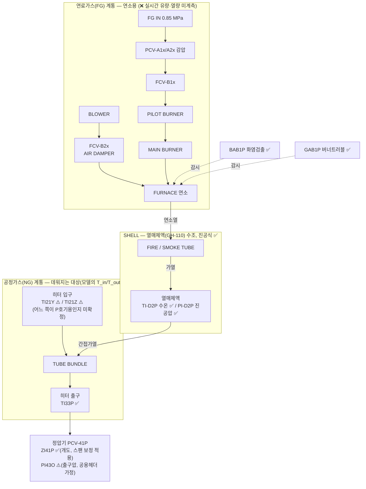

# HTR-31P 가스 흐름 다이어그램 및 태그 매핑 현황

> 목적: HTR-31P(가스히터 P호기) 고장예측 ODE(H1/H2, `data/docs/06_물리식_출처정리.md` §2)를 세우는 데 필요한
> "입력→출력 흐름"을 한 장으로 정리한다. ✅ 확정 / ⚠️ 불확실(가정 필요) / ❌ 미계측 을 명시해
> 어디까지 신뢰하고 어디부터 검증이 필요한지 한눈에 보이게 한다.
>
> 근거 문서: `data/docs/05_태그출처와_설비위치_매핑.md` §3(히터 내부 구조), `06_물리식_출처정리.md` §2(물리식),
> `04_고장이벤트_라벨분석.md` §5-1(KF-PINN 입력 구성안). 갱신: 2026-09-10.

## 0. 데이터 현황 — 있는 것 / 부족한 것

### 0-1. 있는 데이터

| 구분 | 내용 | 상태 |
|---|---|---|
| 연속 시계열 (Trend, 1분) | `PI21X TI21Y TI21Z TI33P TI-D2P PI-D2P` + `ZI41P PI43O RSF41P` — 9태그, 2011-10~2026-08, 결측 명시(reindex) | ✅ `prex/`에 반영, 사용 가능 |
| 이벤트/알람 로그 (DI/DO) | FAULT 10종 + STATUS 11종 + CONTROL 8종, 15년치 상승엣지 43,206건 | ✅ `prex/`에 반영. ⚠️ "진짜 고장" 판정(지속시간·반복횟수 필터)은 미적용 |
| 일/월 단위 계량 (Report) | `FI61O`(O/P/Q 계열 합산), `FI61A`(A/B/C 계열 합산) | ⚠️ 존재하나 1분 아님 + P 단독 분리 불가. 검증용 참고치로만 |
| 정기점검 결과 | `data/20260805_가스히터정압기 정기정검결과/.../가스히터/` — **H-31P 7건**(2011·2013·2015·2017·2019·2021·2024), `.../정압기/25년 PCV41P,42P 정기점검.pdf` | 📄 원본 확보. ❌ 아직 파싱·태그 연결 안 함 |
| 설계/사양 문서 | `HTR-31P 제작도서.pdf`(164MB 스캔, 영종 1차), `251016 영종 IO LIST.xlsx`(태그 정의 원본), PF/GROVE 정압기 카탈로그(PDF, T2/T3) | ✅ **OCR 파싱 완료(2026-09-10) → H1/H2 계수 전부 확보: `U·A`=16.2kW/K·전열면적 27.1m²·설계열량 0.86Gcal/h·`M_w·c_w`=60.76MJ/K(§5)** |
| 고장 경향성분석 보고서 | `24~25 공급설비 고장 경향성분석 결과/` 반기 보고서 4건(2024·2025) | 📄 원본 확보. 고장모드 정의 참고용, 시계열 라벨 아님 |
| 배관도(P&ID/CAD) | `.dwg` 16개(`P&ID` 폴더 6개 포함) | 📄 원본 확보. ❌ 이 환경에서 변환기 없어 못 엶 → §1의 배관위상 미확정의 근본 원인 |

### 0-2. 부족한 데이터 (심각도순)

| # | 부족한 것 | 왜 문제인가 | 지금 우회 방법 |
|---|---|---|---|
| 1 | **연료가스 유량/열량 (`Q_burner`)** | 태그 자체가 없음(연속계측 불가). H1식의 구동항 | `H31POH`(on/off) + **설계열량 ~1.0 Gcal/h로 근사** (⚠️ 구 52 Gcal/h는 60배 오류, §5-1), 또는 KF-PINN 잠재변수 |
| 2 | **가스 질량유량 (`m_gas`) 1분단위** | `FI61x` 전량 NULL | 정압기 밸브식으로 역산(`gas_flow_proxy`) — 1차 근사치 |
| 3 | **히터↔정압기 배관 위상** | `PI43O`가 정말 P호기 출구압인지 미확정 | 계열 추정(O/P/Q 공용)으로 대체. P&ID 확인 시 해소 |
| 4 | **`TI21Y`/`TI21Z` 태그 정체** | 둘 중 뭐가 P호기 실제 입력인지 미확정. **IO LIST로는 판별 불가**(둘 다 `HEATER INLET TEMP`로만 정의, 라인 배정 없음 — 원본 파싱해 확인함) | 평균값 사용. 판별하려면 **P&ID(area 02-24) 또는 GAS HEATER LAYOUT** 도면 필요 |
| 5 | **`Cv`/밸브특성곡선** | 영종 P호기 자체 값이 아니라 남사 문서 값(T3 proxy) | 정압기 자체 도서는 참고용(PF)만 존재 → 파싱해도 T3 proxy에 머묾. **단 히터측 `U·A`/전열면적/설계열량은 제작도서 OCR로 확보됨(§5)** |
| 6 | **정비이력 ↔ 알람 대조** | 2015년 H-31P 알람 폭증(1,790건)이 진짜 고장인지 계기교체인지 미판정 | ✅ **OCR로 1차 판정(§5-2)**: 2015.3 정기점검(기밀·연소시험) 확인 → 점검활동성 알람에 무게. 세부 조치는 손글씨라 미판독 |

> 요약(2026-09-10 정정): **"데이터 자체가 없는" 항목은 1번(`Q_burner`)과 2번(`m_gas` 1분단위) 둘**이다.
> 둘 다 파싱해도 안 나온다 — `Q_burner`는 태그가 아예 없고, `m_gas`는 1분 트렌드 `FI61x`가 전량 NULL이라
> (일/월 Report `FI61O`/`FI61A`는 있으나 1분 아님+P 단독분리 불가) 밸브식 역산으로 우회할 수밖에 없다.
> **3~6번**은 원본 파일(`.dwg`/PDF/xlsx)이 이미 `data/`에 있고 **파싱·연결만 하면 되는** 것들이다
> (단 3·4번의 유일 소스인 P&ID `.dwg`는 이 환경에서 못 엶 → PDF/DXF 변환 필요). 즉 우선순위는
> 새 데이터 확보가 아니라 **① `Q_burner`/`m_gas`는 역산·잠재변수로 계속 우회, ② 3~6번은 이미 있는 파일 파싱**이다.

## 1. 설비 간 흐름 (지역번호 1→2→3→4→6)

- 흐름 순서 자체(1→2→3→4→6)는 태그 명명규칙(설치지역번호)으로 확정됨 — ✅.
- **D 구간(정압기 P_out)**: `PI43P`라는 태그가 없고 `PI43O`(발전계열 공용 헤더)를 대신 쓴다. 실측 출구압(2.74MPa)이
  일치해 정황상 맞지만, **P&ID로 실제 배관 위상(히터4대↔정압기7라인 연결)을 확인한 적은 없음** — ⚠️.
- **E 구간**: 유량계(FI61x) 컬럼은 존재하나 Trend 전체(7,384,352행)에서 100% NULL — ❌.

## 2. HTR-31P 내부 구조 (연료가스 계통 + 공정가스 계통 + SHELL 열교환)

- **FG 계통**은 통째로 안전장치(알람)만 있고 연속 계측이 없다 — `PAHA1P`/`PAHHA1P`는 압력 고/고고 **알람(이진)**이지
  실시간 압력·유량 값이 아니다. 그래서 H1식의 구동항 `Q_burner(t)`는 설계 최대치(**~1.0 Gcal/h**, 상수; ⚠️ 구 52 Gcal/h 정정 §5-1)만 알고
  **실시간 값은 없음** — ❌.
- **NG 계통 입구**가 이 다이어그램에서 유일하게 남은 애매한 지점이다: `TI21Y`/`TI21Z` 둘 다 "히터 입구온도"라고만
  적혀 있고 라인 배정(`H-31P` 같은)이 없다. 실측 상관계수 0.87(완전 이중화라면 ~1.0에 더 가까워야 함)로 미루어
  서로 다른 필터트레인 하류일 가능성이 있음 — ⚠️ (지금은 평균해서 씀, `prex/trend.py::estimate_gas_flow`).
- **NG 계통 출구/SHELL**은 전부 라인 배정이 확실한 태그(TI33P, TI-D2P, PI-D2P) — ✅.

## 3. 태그 → ODE 변수 매핑

| ODE 변수 | 의미 | 태그 | 신뢰도 | 비고 |
|---|---|---|---|---|
| `T_in` | 가스 입구온도 | `TI21Y`, `TI21Z` | ⚠️ | 둘 중 어느 쪽이 P호기 실제 입력인지 미확정. 지금은 평균 사용 |
| `T_out` | 가스 출구온도(관측) | `TI33P` | ✅ | 라인=H-31P 확정 |
| `T_bath` | 수조(열매체) 온도(상태) | `TI-D2P` | ✅ | 라인=H-31P 확정 |
| 수조 압력 | 진공압(P호기 전용 상태) | `PI-D2P` | ✅ | era별 스팬변경 → `PI-D2P_norm` 사용 권장 |
| `Q_burner(t)` | 버너 실시간 열출력 | — | ❌ | 실측 없음. 설계열량 **~1.0 Gcal/h** 상수(⚠️ 구 52 Gcal/h 정정, §5-1). `H31POH`로 근사하거나 학습파라미터로 처리 |
| `m_gas` | 가스 질량유량 | (역산) `gas_flow_proxy` | ⚠️ | `FI61x` 전량 NULL → 정압기 밸브식(G1)으로 역산. Cv=T3 proxy, ZI41P 스팬 휴리스틱 보정 |
| `P_in`(밸브식) | 정압기 입구압 | `PI21X` | ✅ | |
| `P_out`(밸브식) | 정압기 출구압 | `PI43O` | ⚠️ | P 전용 태그 없음 — O/P/Q 공용헤더로 대체(가정) |
| `z`(밸브식) | 밸브 개도 | `ZI41P` | ⚠️ | 2023~2024 구간 스팬이 0~100→0~500로 바뀜 (휴리스틱으로 /5 보정) |

### 3-1. 각 태그 실측 데이터 현황 (뭐가 "있는지")

> 위 표가 "각 태그가 **뭐여야 하는지(ODE 역할)**"라면, 아래는 "각 태그에 **실제로 뭐가 들어있는지**"다.
> 원본 `data/Trend 데이터/AI_CV/*.csv` 175개 전수 집계(2026-09-10). 표본: **7,384,279행**, 1분, **2011-10 ~ 2026-08**.
> `정상범위`는 이상치에 강하도록 p1~p99, `스팬`은 계기 min~max(이상치·계기끝 포함). 결측%는 **관측행 기준**
> (1분 그리드로 reindex하면 관측 공백 시각이 NaN으로 추가됨 — 그건 별개, 문서 03 §2).

| 태그 | 의미 | 단위 | 정상범위(p1~p99) | 중앙값 | 스팬(min~max) | 결측 | 실제 데이터에서 보이는 것 |
|---|---|---|---|---|---|---|---|
| `PI21X` | 주배관 입구압 | MPa | 5.03 ~ 6.66 | 5.92 | 0 ~ 10 | ~0% | 5.9 MPa 근처로 안정. min 0·max 10은 계기 dropout/스팬끝(이상치) |
| `TI21Y` | 히터 입구온도 ① | ℃ | 1.6 ~ 29.5 | 12.99 | -30 ~ 50 | ~0% | 계절 변동 큼. TI21Z와 중앙값은 비슷하나 **상단 분포가 다름**(p99 29.5) |
| `TI21Z` | 히터 입구온도 ② | ℃ | 3.4 ~ 34.0 | 12.79 | -30 ~ 50 | ~0% | 〃. **p99가 TI21Y보다 +4.5℃** → 완전 이중화 아님(corr 0.87)의 증거 |
| `TI33P` | 히터 출구온도(타깃) | ℃ | 2.0 ~ 59.4 | 23.45 | 0 ~ 100 | ~0% | 가열 후라 입구보다 높음. min 0 = dropout |
| `TI-D2P` | 수조 수온(상태) | ℃ | 0 ~ 76.8 | 59.05 | 0 ~ 100 | ~0% | 정상 55~65℃대. min 0 = dropout |
| `PI-D2P` | 수조 진공압(상태) | mmHg(추정) | -726 ~ -21 | -177.7 | -760 ~ 0 | ~0% | 음수=진공(-760≈완전진공). **era별 스팬 변동** → `PI-D2P_norm` 사용 |
| `ZI41P` | 정압기 개도 | % | 0 ~ 100* | 100* | 0 ~ 500 | ~0% | *스팬 혼재(2024구간 0~500). 보정 전 중앙값은 왜곡 → `/5` 휴리스틱 필요 |
| `PI43O` | 정압기 출구압(공용헤더) | MPa | 2.62 ~ 3.03 | 2.71 | 0 ~ 5 | ~0% | **범위 매우 좁음**(안정). 실측 2.74와 일치하나 O/P/Q 공용이라 P전용 아님 |
| `RSF41P` | 정압기 설정압(SP) | MPa | 2.54 ~ 2.74 | 2.63 | 0 ~ 2.79 | ~0% | 제어 목표값이라 거의 상수. `e = PI43O − RSF41P`가 제어오차 |
| `FI61x` | 계량 유량 | (Nm³/h) | — | — | — | **100%** | ❌ 전량 NULL — 존재만 하고 값 없음(§0-2 #2) |
| `Q_burner` | 버너 열출력 | (Gcal/h) | — | — | — | 태그 없음 | ❌ 연속계측 태그 자체가 없음. 설계최대 52 상수만(§0-2 #1) |

- **핵심 관찰**: 압력 3종(PI21X·PI43O·RSF41P)은 좁은 범위로 매우 안정, 온도 4종은 계절 변동이 큼.
- **TI21Y vs TI21Z**: 중앙값(12.99 vs 12.79)은 붙어 있지만 p99가 4.5℃ 벌어진다 → §2·§4의 "둘이 다른 라인일 수 있다"는 심증을 데이터가 뒷받침.
- **ZI41P**: 중앙값이 100으로 찍히는 건 개도가 항상 만개라서가 아니라 **0~500 스팬 구간이 섞여** 통계를 끌어올린 것 — 반드시 스팬 보정 후 다시 봐야 함.

### 3-2. 왜 히터 고장 예측에 정압기 출구압(PI43O)이 들어오나 — 재검토(2026-09-10)

**PI43O 자체는 히터 고장 지표가 아니다.** 히터 하류(정압기) 값이며, 코드에서 두 목적으로만 쓰인다:

1. **`gas_flow_proxy` 역산의 재료** — 밸브식 `Q = Cv·f(z)·√((PI21X² − PI43O²)/(G·T))`에서 PI43O는
   *출구압 자체가 궁금해서가 아니라* **밸브 양단 차압(PI21X − PI43O)** 을 만들려고 들어온다. 유량이 필요한 이유는
   히터 물리식 **(H2) `m_gas·c_p·(T_out − T_in) = U·A·ΔT_lm`** 에 `m_gas`가 **필수항**이기 때문(문서 06 §4).
   유량을 모르면 *"T_out 하락이 부하(유량↑) 탓인지 히터 열화(U·A↓) 탓인지"* 를 못 가른다. 유량계 `FI61x`가
   전량 NULL이라, 히터→정압기 직렬(질량보존) 가정 하에 정압기 통과유량으로 대신 역산한다.
   → **이 목적에선 PI43O가 (간접적으로) 필요하다.**
2. **`control_error_p = PI43O − RSF41P`** — 정압기 제어오차(e=PV−SP). 이건 **정압기** 고장모드(SLEEVE VALVE
   마모·PILOT 다이어프램·PIC 드리프트, 문서 06 §3-4)용이라 **히터 고장 스코프에선 곁다리**다.

**단, 역산 방식 자체가 약하다 (재검토 포인트 2가지):**

- **PI43O는 O/P/Q 공용헤더** → 차압이 P호기 정압기의 실제 차압이 아닐 수 있음 → `m_gas` 추정 오염.
- **직렬·무분기 가정이 미검증** → 정당성이 통째로 여기 걸려 있는데 정작 배관위상은 히터4대↔정압기7라인이라
  분기 가능성 있음(§1과 같은 뿌리, P&ID 필요).
- **대안**: `m_gas`를 노이즈 큰 공용헤더 프록시로 역산하기보다 **KF-PINN 잠재변수로 공동추정**하면
  (지금 `Q_burner`에 쓰는 방식과 동일) PI43O 의존도를 낮출 수 있다.

| PI43O 용도 | 히터 고장과 관련성 | 판정 |
|---|---|---|
| `gas_flow_proxy` (m_gas 역산 재료) | 간접적으로 필요 — H2 필수항 m_gas 없인 열화/부하 구분 불가 | 관련 O, 단 프록시가 약함 |
| `control_error_p` (정압기 제어오차) | 정압기 고장모드용 | 히터 스코프면 곁다리 |

## 4. 지금 상태 요약 (체크리스트)

- ✅ **확정**: 설비간 순서(1→2→3→4→6), 히터 출구(TI33P), 수조 상태(TI-D2P/PI-D2P), 정압기 입구압(PI21X).
- ⚠️ **가정 필요 (구현은 했으나 검증 안 됨)**:
  - 히터 입구가 `TI21Y`/`TI21Z` 중 무엇인지 — ~~IO LIST 원본~~ 또는 P&ID로 확인 필요.
    - **(2026-09-10 확인) IO LIST 경로는 막힘**: `251016 영종 IO LIST.xlsx` 원본을 파싱하니 `0224_TI21Y`/`0224_TI21Z`
      둘 다 설명이 `HEATER INLET TEMP.`뿐이고 라인/호기 배정이 없다(채널 01-02/01-03, 1-5VDC, 완전 대칭).
      → **판별 가능한 유일한 문서 경로는 P&ID(area 02-24, `09-15-R-32-001~006`) 또는 `SS02-24-M-19-001_GAS HEATER LAYOUT.dwg`**.
      두 계장이 **같은 라인에 이중화**면 지금처럼 평균 사용 OK, **다른 라인/필터트레인 하류**면 하나만 P호기 입력
      (실측 상관 0.87이 후자 가능성을 시사). 단 P&ID `.dwg`는 AC1032(2018) 바이너리라 이 환경에선 못 엶 →
      PDF/DXF 변환본이 있으면 파싱해 판별 가능.
  - `PI43O`를 P호기 정압기 출구압으로 대체 — 히터4대↔정압기7라인 배관 위상을 P&ID로 확인 필요.
  - `gas_flow_proxy`의 `Cv`(=250), 밸브특성곡선 `f(z)`(선형 근사) — 영종 P호기 정압기 자체 도서로 교체 필요
    (지금은 남사 문서의 동일 모델 카탈로그 값, T3 proxy).
  - `ZI41P` 2023~2024 구간 스팬 보정(÷5) — 정확한 계기 교체일 미확인, 휴리스틱임.
- ❌ **미계측 (대안으로 우회 중)**: 연료가스 유량/열량(`Q_burner`), 계량설비 유량(`FI61x`).
- 🆕 **OCR로 신규 확보/발견 (2026-09-10, §5)**:
  - 제작도서에서 `U`=513.6 kcal/m²h℃(597 W/m²K)·`A`=27.1 m²·**`U·A`=16.2 kW/K**·설계열량 0.86 Gcal/h·설계 `m_gas`=52,444 kg/h 확보.
  - ⚠️ **`Q_burner` "52 Gcal/h" 재검토 필요** — 제작도서 설계열량(0.86 Gcal/h)과 **60배 불일치**. "52"는 설계 질량유량(52,444 kg/h)과 수치 일치 → 오기입 의심(§5-1).
  - 2015 알람 폭증 = 정기점검(기밀·연소시험) 시기와 일치(§5-2).

## 5. 제작도서 OCR 추출 — HTR-31P 설계계수 (2026-09-10)

> 히터 제작도서(`경인 22-영종관리소진공식 가스히터(HTR-31P)-제작도서.pdf`, 385쪽, **전면 스캔**)를 OCR
> (tesseract 5.5.3 `kor+eng`, 200dpi)해서, 그동안 "미확보"였던 **U·A·전열면적·설계열량**을 확보했다.
> 원본: 열전달 계산서 SHEET 1~3 (원일티엔아이 WONIL, `PO-09-029`, 2009.07.06 승인). 신뢰도 **T1(1차 원본)**.
> ✅ **수조 열용량 `M_w·c_w`도 확보(2026-09-10)**: WEIGHT ANALYSIS(p31 "30. LIQUID=14,512 kg") + CALCULATION OF VOLUMN
> (p40, 체적 14.527 m³)에서. → H1/H2의 **현열 계수는 전부 1차 원본으로 확정**됨(물리식 문서 `06 §2-4`에도 전파 완료).
> ⚠️ 단 P는 진공식(감압 비등)이라 H1에 **잠열항**을 넣을 경우 기화잠열·비등비율은 **별도 미확보** — 위 값으로 닫히는 건 현열항까지다.

| 파라미터 | 기호 | 값 | SI 환산 | 비고 |
|---|---|---|---|---|
| 설계 가스유량 | `V` | 65,000 Nm³/h | — | 정압기 61,900과 정합 |
| **설계 질량유량** | `m_gas` | **52,444 kg/h** (=65,000×0.80683) | 14.6 kg/s | 밀도 0.80683 kg/Nm³ |
| 가스 정압비열 | `c_p` | 0.654 kcal/kg·℃ | 2,739.8 J/kg·K | 문서 06 §2 `c_p≈2.5`와 근사 |
| 가스 비중 | — | 0.624 (Air=1) | — | |
| **총괄전열계수** | `U` | **513.6 kcal/m²h·℃** | **597 W/m²K** | 내막 αio=2048·외막 αo=863.1·오염계수 포함 |
| **전열면적(튜브번들)** | `A` | **27.1 m²** | — | 106본×π×Ø25.4×L3200 |
| **➜ U·A** | `U·A` | **13,919 kcal/h·℃** | **16.2 kW/K** | =U×A (H1/H2 계수) |
| **설계 열량(번들 흡수)** | `Q` | **860,000 kcal/h = 0.86 Gcal/h** | 1.0 MW | 계산치 768,753 / 설계기준 860,000 |
| 열매체 수조온도 | `T_bath` | 80 ℃ | — | 설계점 |
| 설계 가스 입/출구 | — | 0 → 22.4 ℃ | — | LMTD 68.19 ℃ |
| **열매체 충전량** | `M_w` | **14,512 kg** | 14.527 m³ | 밀도 999 kg/m³(≈물), c_w=1.0 kcal/kg℃ |
| **➜ 수조 열용량** | `M_w·c_w` | **14,512 kcal/℃** | **60.76 MJ/K** | H1 `dT_bath/dt` 계수. τ=M_w·c_w/U·A≈63분 |
| 튜브번들 | — | 106본, Ø25.4×t2.11, L3200, 2pass | — | 가스측 유속 11.76 m/s |
| Fire tube | — | Ø650×t10, 면적 34.4 m² | — | flux 25,000 kcal/m²h |
| 가스측 압력강하(설계) | `Δp` | 3,714.6 mmAq = 0.371 kg/cm² | 0.041 MPa | |

### 5-1. ⚠️ 중대 발견 — `Q_burner` "52 Gcal/h"는 실제 설계열량과 60배 불일치

- 문서 06 §2는 `Q_burner`(설계 최대)를 **P=52 Gcal/h**로 쓴다(출처: `251016 영종설비현황.xlsx`, 이 저장소엔 없음).
- 그러나 **제작도서 1차 계산서의 설계 흡수열은 0.86 Gcal/h**(860,000 kcal/h)다. 버너는 효율 감안해도 **~1 Gcal/h**급.
- **물리적으로도 52 Gcal/h는 불가능**: 65,000 Nm³/h를 Δt≈22~35℃(정압기 감압 재열, 문서 06 §2-2 "0.1MPa당 0.56℃")
  데우는 열량은 ~1 Gcal/h다. 제작도서가 **fire tube 자체를 860,000 kcal/h 기준(34.4 m²)으로 설계**했으므로
  버너가 52 Gcal/h일 수 없다(그러려면 fire tube ~2,000 m² 필요).
- **가설**: "52"는 **설계 질량유량 52,444 kg/h**와 수치가 일치 → `영종설비현황.xlsx`에서 **유량을 열량으로 오기입**했을 가능성.
- **조치**: H1 구동항 `Q_burner`를 52 대신 **~1 Gcal/h급으로 재검토** 필요. `영종설비현황.xlsx` 원본 재확인 권장.
  (O=98.72·A/B=14.08 Gcal/h도 같은 xlsx 출처 → 동반 검증 필요. 단 여기선 P만 1차 원본으로 확인함.)

### 5-2. 정기점검 OCR — 2015 알람 폭증(#6) 1차 판정

- `15년 H-31P 정기점검.pdf`(스캔) OCR 결과: **2015.3.16~17 정기점검 실시** 확인 — `관리소명:영종 / 설비번호:H-31P`,
  **기밀시험(3.16)** + **연소효율시험(3.17, testo 330-2)** + 기계 점검(스프링·블로워·튜브번들 누설·수조수위).
- → 2015년 알람 폭증(1,790건, `TALLD1P` 수온 LL 1,513건 등)은 **점검·시험 중 조작에 따른 알람일 가능성**에 무게.
  단 계기교체 등 세부 조치는 **손글씨 체크시트라 OCR 품질 낮아** 확정 못 함(인쇄 성적서만 판독됨).

## 6. 구현 위치

- `prex/config.py`: `FLOW_INPUT_TAGS`, `GAS_SG`, `PCV41P_CV`, `ZI41P_RESCALE_ABOVE`.
  - **히터 설계계수(2026-09-10 추가, §5 OCR)**: `HTR_UA_W_PER_K`(16.2 kW/K), `HTR_AREA_M2`, `HTR_U_KCAL`, `HTR_CP_GAS_J_KGK`,
    `HTR_DESIGN_MGAS_KG_S`, `HTR_DESIGN_DUTY_W`, `HTR_BATH_TEMP_C`, `HTR_DESIGN_LMTD_C`, **`HTR_QBURNER_DESIGN_W`≈1.18 MW(1.01 Gcal/h, 구 52 Gcal/h 폐기)**,
    **`HTR_MW_CW_J_PER_K`(수조 열용량 60.76 MJ/K), `HTR_BATH_LIQUID_MASS_KG`(14,512kg), `HTR_BATH_TIME_CONST_S`(τ≈3,754s)**.
- `prex/trend.py::estimate_gas_flow()`: 위 밸브식으로 `gas_flow_proxy`/`ZI41P_frac`/`control_error_p` 컬럼 생성.
- 출력: `prex/output/trend_htr31p.parquet` (git 미포함, `python -m prex.pipeline`로 재생성).
- OCR 파이프라인: `pdftoppm -r 200 → tesseract -l kor+eng` (tessdata `kor`는 tessdata_best, `/opt/homebrew/share/tessdata/`).
