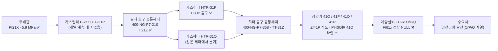
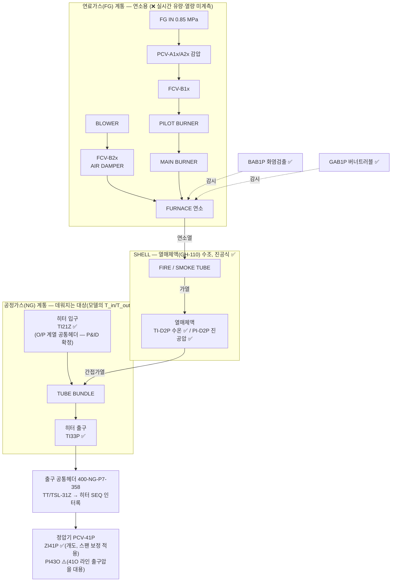

# HTR-31P 가스 흐름 다이어그램 및 태그 매핑 현황

> 목적: HTR-31P(가스히터 P호기) 고장예측 ODE(H1/H2, `data/docs/06_물리식_출처정리.md` §2)를 세우는 데 필요한
> "입력→출력 흐름"을 한 장으로 정리한다. ✅ 확정 / ⚠️ 불확실(가정 필요) / ❌ 미계측 을 명시해
> 어디까지 신뢰하고 어디부터 검증이 필요한지 한눈에 보이게 한다.
>
> 근거 문서: `data/docs/05_태그출처와_설비위치_매핑.md` §3(히터 내부 구조), `06_물리식_출처정리.md` §2(물리식),
> `04_고장이벤트_라벨분석.md` §5-1(KF-PINN 입력 구성안). 갱신: **2026-09-11 (P&ID 판독 반영 — §7)**.

## 0. 데이터 현황 — 있는 것 / 부족한 것

### 0-1. 있는 데이터

| 구분 | 내용 | 상태 |
|---|---|---|
| 연속 시계열 (Trend, 1분) | `PI21X TI21Y TI21Z TI33P TI-D2P PI-D2P` + `ZI41P PI43O RSF41P` — 9태그, 2011-10~2026-08, 결측 명시(reindex) | ✅ `prex/`에 반영, 사용 가능 |
| 이벤트/알람 로그 (DI/DO) | FAULT 10종 + STATUS 11종 + CONTROL 8종, 15년치 상승엣지 43,206건 | ✅ `prex/`에 반영. ⚠️ "진짜 고장" 판정(지속시간·반복횟수 필터)은 미적용 |
| 일/월 단위 계량 (Report) | `FI61O`(O/P/Q 계열 합산), `FI61A`(A/B/C 계열 합산) | ⚠️ 존재하나 1분 아님 + P 단독 분리 불가. 검증용 참고치로만 |
| 정기점검 결과 | `data/20260805_가스히터정압기 정기정검결과/.../가스히터/` — **H-31P 7건**(2011·2013·2015·2017·2019·2021·2024), `.../정압기/25년 PCV41P,42P 정기점검.pdf` | 📄 원본 확보. ❌ 아직 파싱·태그 연결 안 함 |
| 설계/사양 문서 | `HTR-31P 제작도서.pdf`(164MB 스캔, 영종 1차), `251016 영종 IO LIST.xlsx`(태그 정의 원본), PF/GROVE 정압기 카탈로그(PDF, T2/T3) | ✅ **OCR 파싱 완료(2026-09-10) → H1/H2 계수 전부 확보: `U·A`=16.2kW/K·전열면적 27.1m²·설계열량 0.86Gcal/h·`M_w·c_w`=60.76MJ/K(§5)** |
| 고장 경향성분석 보고서 | `24~25 공급설비 고장 경향성분석 결과/` 반기 보고서 4건(2024·2025) | 📄 원본 확보. 고장모드 정의 참고용, 시계열 라벨 아님 |
| 배관도(P&ID/CAD) | `.dwg` 16개(`P&ID` 폴더 6개 포함) | ✅ **판독 완료(2026-09-11)** — ODA File Converter로 DXF 변환 후 `ezdxf` 파싱. **#3·#4 해소, 단 `gas_flow_proxy` 전제 붕괴(§7)**. 재현: `python -m pid.pipeline` |

### 0-2. 부족한 데이터 (심각도순)

| # | 부족한 것 | 왜 문제인가 | 지금 우회 방법 |
|---|---|---|---|
| 1 | **연료가스 유량/열량 (`Q_burner`)** | 태그 자체가 없음(연속계측 불가). H1식의 구동항 | `H31POH`(on/off) + **설계열량 ~1.0 Gcal/h로 근사** (⚠️ 구 52 Gcal/h는 60배 오류, §5-1), 또는 KF-PINN 잠재변수 |
| 2 | **가스 질량유량 (`m_gas`) 1분단위** | `FI61x` 전량 NULL | ~~정압기 밸브식으로 역산(`gas_flow_proxy`)~~ → ⚠️ **§7-2로 역산 전제(직렬·무분기)가 무효화됨**. KF-PINN 잠재변수 공동추정으로 전환 권장 |
| 3 | ~~**히터↔정압기 배관 위상**~~ | ~~`PI43O`가 정말 P호기 출구압인지 미확정~~ | ✅ **해소(§7-2·§7-3)**: 히터2대 출구가 공통헤더(400-NG-P7-358)로 합류 후 정압기 4라인 분기 — **1:1 아님**. `PT-43O`는 41O 유닛 전용 출구배관에 설치(공용헤더 아님) |
| 4 | ~~**`TI21Y`/`TI21Z` 태그 정체**~~ | ~~둘 중 뭐가 P호기 실제 입력인지 미확정~~ | ✅ **해소(§7-1)**: `TI21Z`=O/P계열(HTR-31O·31P), `TI21Y`=A/B계열(HTR-31A·31B). **P호기 T_in은 `TI21Z` 단독** — 평균 사용은 오염이었음. 코드 반영 완료 |
| 5 | **`Cv`/밸브특성곡선** | 영종 P호기 자체 값이 아니라 남사 문서 값(T3 proxy) | 정압기 자체 도서는 참고용(PF)만 존재 → 파싱해도 T3 proxy에 머묾. **단 히터측 `U·A`/전열면적/설계열량은 제작도서 OCR로 확보됨(§5)** |
| 6 | **정비이력 ↔ 알람 대조** | 2015년 H-31P 알람 폭증(1,790건)이 진짜 고장인지 계기교체인지 미판정 | ✅ **OCR로 1차 판정(§5-2)**: 2015.3 정기점검(기밀·연소시험) 확인 → 점검활동성 알람에 무게. 세부 조치는 손글씨라 미판독 |

> 요약(2026-09-11 갱신): **3·4번은 P&ID 판독으로 해소됐다(§7).** 남은 것은 **1번(`Q_burner`)과
> 2번(`m_gas` 1분단위)** 이고, 둘 다 파싱해도 안 나온다 — `Q_burner`는 태그가 아예 없고,
> `m_gas`는 1분 트렌드 `FI61x`가 전량 NULL이다(일/월 Report `FI61O`/`FI61A`는 있으나 1분 아님+P 단독분리 불가).
> **⚠️ 그런데 2번의 우회로였던 밸브식 역산이 §7-2로 약해졌다** — 히터↔정압기가 1:1이 아니라
> 공통헤더로 섞이므로 `gas_flow_proxy`는 P호기 유량이 아니다. 따라서 우선순위는
> **① `Q_burner`·`m_gas`를 KF-PINN 잠재변수로 공동추정하는 쪽으로 이동, ② 5·6번은 이미 있는 파일 파싱**이다.

## 1. 설비 간 흐름 (지역번호 1→2→3→4→6)



- 흐름 순서 자체(1→2→3→4→6)는 태그 명명규칙(설치지역번호)으로 확정됨 — ✅.
- **⚠️ 직렬 단일경로가 아니다 (2026-09-11 P&ID 확정, §7-2)**: 히터 입구·출구 **양쪽 모두 공통헤더**이고
  히터 2대(31O·31P) ↔ 정압기 4라인(41O/P/Q/R)이 섞인다. 따라서 이 그림의 P호기 경로는
  "질량이 그대로 흐르는 직렬 배관"이 아니라 **논리적 계통 순서**로만 읽어야 한다.
- **D 구간(정압기 P_out)**: `PI43P` 전송 태그가 없어 `PI43O`를 쓰는데, 이건 공용 헤더값이 아니라
  **`PCV-41O/42O` 유닛 전용 출구배관(`360-NG-P7-456`)의 값**이다 — §7-3. ⚠️
- **E 구간**: 유량계(FI61x) 컬럼은 존재하나 Trend 전체(7,384,352행)에서 100% NULL — ❌.

## 2. HTR-31P 내부 구조 (연료가스 계통 + 공정가스 계통 + SHELL 열교환)



- **FG 계통**은 통째로 안전장치(알람)만 있고 연속 계측이 없다 — `PAHA1P`/`PAHHA1P`는 압력 고/고고 **알람(이진)**이지
  실시간 압력·유량 값이 아니다. 그래서 H1식의 구동항 `Q_burner(t)`는 설계 최대치(**~1.0 Gcal/h**, 상수; ⚠️ 구 52 Gcal/h 정정 §5-1)만 알고
  **실시간 값은 없음** — ❌.
- **NG 계통 입구**는 ✅ **확정됐다(2026-09-11, §7-1)**: `TI21Z`가 F-21O/F-21P 출구 공통헤더에 달려
  HTR-31O·HTR-31P로 가고, `TI21Y`는 F-21A/F-21B 출구 헤더로 **인천도시가스 계열(HTR-31A/31B)** 이다.
  실측 상관 0.87 / p99 4.5℃ 차이는 "불완전 이중화"가 아니라 **애초에 다른 계열**이라 나온 것.
  → `prex/`는 `TI21Z` 단독을 쓰도록 수정 완료(구 평균 방식은 도시가스 계열 온도를 섞고 있었음).
- **NG 계통 출구/SHELL**은 전부 라인 배정이 확실한 태그(TI33P, TI-D2P, PI-D2P) — ✅.

## 3. 태그 → ODE 변수 매핑

| ODE 변수 | 의미 | 태그 | 신뢰도 | 비고 |
|---|---|---|---|---|
| `T_in` | 가스 입구온도 | **`TI21Z`** | ✅ | P&ID 확정(§7-1) — O/P 계열 필터출구 공통헤더. `TI21Y`는 A/B 계열이라 **쓰면 안 됨** |
| `T_out` | 가스 출구온도(관측) | `TI33P` | ✅ | 라인=H-31P 확정 |
| `T_bath` | 수조(열매체) 온도(상태) | `TI-D2P` | ✅ | 라인=H-31P 확정 |
| 수조 압력 | 진공압(P호기 전용 상태) | `PI-D2P` | ✅ | era별 스팬변경 → `PI-D2P_norm` 사용 권장 |
| `Q_burner(t)` | 버너 실시간 열출력 | — | ❌ | 실측 없음. 설계열량 **~1.0 Gcal/h** 상수(⚠️ 구 52 Gcal/h 정정, §5-1). `H31POH`로 근사하거나 학습파라미터로 처리 |
| `m_gas` | 가스 질량유량 | (역산) `gas_flow_proxy` | ❌→⚠️ | **§7-2로 강등**: 히터↔정압기 1:1이 아니라 공통헤더로 섞임 → 이 값은 "41P 라인 통과유량"이지 P호기 히터 통과유량이 아니다. **잠재변수 공동추정으로 전환 권장**, proxy는 약한 사전분포로만 |
| `P_in`(밸브식) | 정압기 입구압 | `PI21X` | ✅ | |
| `P_out`(밸브식) | 정압기 출구압 | `PI43O` | ⚠️ | **§7-3 정정**: 공용헤더가 아니라 **41O 유닛 전용 출구배관**(`360-NG-P7-456`)의 값. `PI-43P` 로컬 게이지는 있으나 전송기 없음 → SCADA 미수집 |
| `z`(밸브식) | 밸브 개도 | `ZI41P` | ⚠️ | 2023~2024 구간 스팬이 0~100→0~500로 바뀜 (휴리스틱으로 /5 보정) |

### 3-1. 각 태그 실측 데이터 현황 (뭐가 "있는지")

> 위 표가 "각 태그가 **뭐여야 하는지(ODE 역할)**"라면, 아래는 "각 태그에 **실제로 뭐가 들어있는지**"다.
> 원본 `data/Trend 데이터/AI_CV/*.csv` 175개 전수 집계(2026-09-10). 표본: **7,384,279행**, 1분, **2011-10 ~ 2026-08**.
> `정상범위`는 이상치에 강하도록 p1~p99, `스팬`은 계기 min~max(이상치·계기끝 포함). 결측%는 **관측행 기준**
> (1분 그리드로 reindex하면 관측 공백 시각이 NaN으로 추가됨 — 그건 별개, 문서 03 §2).

| 태그 | 의미 | 단위 | 정상범위(p1~p99) | 중앙값 | 스팬(min~max) | 결측 | 실제 데이터에서 보이는 것 |
|---|---|---|---|---|---|---|---|
| `PI21X` | 주배관 입구압 | MPa | 5.03 ~ 6.66 | 5.92 | 0 ~ 10 | ~0% | 5.9 MPa 근처로 안정. min 0·max 10은 계기 dropout/스팬끝(이상치) |
| `TI21Y` | **A/B계열** 필터출구 헤더온도 (P호기 무관) | ℃ | 1.6 ~ 29.5 | 12.99 | -30 ~ 50 | ~0% | 계절 변동 큼. 중앙값은 TI21Z와 비슷하나 **상단 분포가 다름**(p99 29.5) |
| `TI21Z` | **H-31P 입구온도** (O/P계열 헤더) | ℃ | 3.4 ~ 34.0 | 12.79 | -30 ~ 50 | ~0% | 〃. **p99가 TI21Y보다 +4.5℃** → 다른 계열(§7-1)이라 그렇다 |
| `TI33P` | 히터 출구온도(타깃) | ℃ | 2.0 ~ 59.4 | 23.45 | 0 ~ 100 | ~0% | 가열 후라 입구보다 높음. min 0 = dropout |
| `TI-D2P` | 수조 수온(상태) | ℃ | 0 ~ 76.8 | 59.05 | 0 ~ 100 | ~0% | 정상 55~65℃대. min 0 = dropout |
| `PI-D2P` | 수조 진공압(상태) | mmHg(추정) | -726 ~ -21 | -177.7 | -760 ~ 0 | ~0% | 음수=진공(-760≈완전진공). **era별 스팬 변동** → `PI-D2P_norm` 사용 |
| `ZI41P` | 정압기 개도 | % | 0 ~ 100* | 100* | 0 ~ 500 | ~0% | *스팬 혼재(2024구간 0~500). 보정 전 중앙값은 왜곡 → `/5` 휴리스틱 필요 |
| `PI43O` | 정압기 출구압(**41O 라인**) | MPa | 2.62 ~ 3.03 | 2.71 | 0 ~ 5 | ~0% | **범위 매우 좁음**(안정). 단 §7-3대로 41O 유닛 전용값 — P전용 아님 |
| `RSF41P` | 정압기 설정압(SP) | MPa | 2.54 ~ 2.74 | 2.63 | 0 ~ 2.79 | ~0% | 제어 목표값이라 거의 상수. `e = PI43O − RSF41P`가 제어오차 |
| `FI61x` | 계량 유량 | (Nm³/h) | — | — | — | **100%** | ❌ 전량 NULL — 존재만 하고 값 없음(§0-2 #2) |
| `Q_burner` | 버너 열출력 | (Gcal/h) | — | — | — | 태그 없음 | ❌ 연속계측 태그 자체가 없음. 설계최대 52 상수만(§0-2 #1) |

- **핵심 관찰**: 압력 3종(PI21X·PI43O·RSF41P)은 좁은 범위로 매우 안정, 온도 4종은 계절 변동이 큼.
- **TI21Y vs TI21Z**: 중앙값(12.99 vs 12.79)은 붙어 있지만 p99가 4.5℃ 벌어진다 → "둘이 다른 라인"이라는 심증을 데이터가 뒷받침했고, **§7-1에서 P&ID로 확정**됐다(서로 다른 수요처 계열).
- **ZI41P**: 중앙값이 100으로 찍히는 건 개도가 항상 만개라서가 아니라 **0~500 스팬 구간이 섞여** 통계를 끌어올린 것 — 반드시 스팬 보정 후 다시 봐야 함.

### 3-2. 왜 히터 고장 예측에 정압기 출구압(PI43O)이 들어오나 — 재검토(2026-09-10 → **09-11 결론 뒤집힘**)

> ⚠️ 아래 1·2번은 **당시(2026-09-10) 코드가 깔고 있던 논리**를 기록해 둔 것이다.
> 그 전제 2가지가 2026-09-11 P&ID로 반증됐다 — 이 절 끝의 "2026-09-11 갱신" 블록을 반드시 같이 볼 것.

**PI43O 자체는 히터 고장 지표가 아니다.** 히터 하류(정압기) 값이며, 코드에서 두 목적으로만 쓰인다:

1. **`gas_flow_proxy` 역산의 재료** — 밸브식 `Q = Cv·f(z)·√((PI21X² − PI43O²)/(G·T))`에서 PI43O는
   *출구압 자체가 궁금해서가 아니라* **밸브 양단 차압(PI21X − PI43O)** 을 만들려고 들어온다. 유량이 필요한 이유는
   히터 물리식 **(H2) `m_gas·c_p·(T_out − T_in) = U·A·ΔT_lm`** 에 `m_gas`가 **필수항**이기 때문(문서 06 §4).
   유량을 모르면 *"T_out 하락이 부하(유량↑) 탓인지 히터 열화(U·A↓) 탓인지"* 를 못 가른다. 유량계 `FI61x`가
   전량 NULL이라, 히터→정압기 직렬(질량보존) 가정 하에 정압기 통과유량으로 대신 역산한다.
   → **이 목적에선 PI43O가 (간접적으로) 필요하다.**
2. **`control_error_p = PI43O − RSF41P`** — 정압기 제어오차(e=PV−SP). 이건 **정압기** 고장모드(SLEEVE VALVE
   마모·PILOT 다이어프램·PIC 드리프트, 문서 06 §3-4)용이라 **히터 고장 스코프에선 곁다리**다.

**⚠️⚠️ 2026-09-11 갱신 — 여기서 우려했던 2가지가 P&ID로 "우려"가 아니라 "사실"로 확인됐다 (§7):**

- ~~PI43O는 O/P/Q 공용헤더~~ → **더 나쁘다**: 공용헤더조차 아니고 **41O 유닛 전용 출구배관**의 값이다(§7-3).
  차압 `PI21X − PI43O`는 P호기 정압기의 차압이 아니라 **옆 라인 차압**이다.
- ~~직렬·무분기 가정이 미검증~~ → **반증됨**: 히터 2대 출구가 공통헤더로 합류한 뒤 정압기 4라인이
  각자 뽑아 간다(§7-2). 질량보존으로 "정압기 통과유량 = 히터 통과유량"이라 할 근거가 없다.
- → **결론: `gas_flow_proxy`를 H2식의 `m_gas`로 그대로 쓰면 안 된다.** 여기 적어 뒀던 대안대로
  **`m_gas`를 KF-PINN 잠재변수로 공동추정**(`Q_burner`와 동일 방식)하는 쪽으로 옮긴다.
  `gas_flow_proxy`는 폐기하지 말고 **약한 관측/사전분포**(부하 변동의 대략적 지표)로만 남긴다.

| PI43O 용도 | 히터 고장과 관련성 | 판정 (2026-09-11) |
|---|---|---|
| `gas_flow_proxy` (m_gas 역산 재료) | H2 필수항 m_gas 없인 열화/부하 구분 불가 | ⚠️ **프록시 무효화 수준** — 잠재변수로 대체 |
| `control_error_p` (정압기 제어오차) | 정압기 고장모드용 | 히터 스코프면 곁다리 (변동 없음) |

## 4. 지금 상태 요약 (체크리스트)

- ✅ **확정**: 설비간 순서(1→2→3→4→6), 히터 출구(TI33P), 수조 상태(TI-D2P/PI-D2P), 정압기 입구압(PI21X).
  - 🆕 **히터 입구 `T_in` = `TI21Z` 단독** (2026-09-11 P&ID, §7-1). `TI21Y`는 인천도시가스(A/B) 계열이라
    P호기와 무관하다 — 종전 "평균 사용"은 다른 계열 온도를 섞은 오염이었고, `prex/` 수정 완료.
    (IO LIST 경로는 막혀 있었다: `0224_TI21Y`/`0224_TI21Z` 둘 다 설명이 `HEATER INLET TEMP.`뿐이고
    채널 01-02/01-03·1-5VDC로 완전 대칭이라 판별 불가. **P&ID가 유일한 해법이었고 실제로 풀렸다.**)
  - 🆕 **배관 위상 확정** (§7-2): 히터 2대 출구 → 공통헤더 `400-NG-P7-358` → 정압기 4라인 분기. **1:1 아님.**
- ⚠️ **가정 필요 (구현은 했으나 검증 안 됨)**:
  - **`gas_flow_proxy` 자체가 흔들린다** — ~~히터↔정압기 직렬 가정~~은 §7-2로 **반증**됐고,
    ~~`PI43O`=O/P/Q 공용헤더~~는 §7-3으로 **41O 유닛 전용값**임이 밝혀졌다.
    → H2식 `m_gas`로 그대로 쓰지 말 것. **KF-PINN 잠재변수 공동추정으로 전환**이 다음 과제.
  - `gas_flow_proxy`의 `Cv`(=250), 밸브특성곡선 `f(z)`(선형 근사) — 영종 P호기 정압기 자체 도서로 교체 필요
    (지금은 남사 문서의 동일 모델 카탈로그 값, T3 proxy). **P&ID에는 Cv 표기가 없다**(도서 사항).
  - `ZI41P` 2023~2024 구간 스팬 보정(÷5) — 정확한 계기 교체일 미확인, 휴리스틱임. P&ID에도 EU 스팬 표기 없음
    → 문서 03 §9-1대로 가스공사 확인 또는 KPOS 태그설정 화면이 유일 경로.
- ❌ **미계측 (대안으로 우회 중)**: 연료가스 유량/열량(`Q_burner`), 계량설비 유량(`FI61x`).
- 🆕 **OCR로 신규 확보/발견 (2026-09-10, §5)**:
  - 제작도서에서 `U`=513.6 kcal/m²h℃(597 W/m²K)·`A`=27.1 m²·**`U·A`=16.2 kW/K**·설계열량 0.86 Gcal/h·설계 `m_gas`=52,444 kg/h 확보.
  - ⚠️ **`Q_burner` "52 Gcal/h" 재검토 필요** — 제작도서 설계열량(0.86 Gcal/h)과 **60배 불일치**. "52"는 설계 질량유량(52,444 kg/h)과 수치 일치 → 오기입 의심(§5-1).
  - 2015 알람 폭증 = 정기점검(기밀·연소시험) 시기와 일치(§5-2).
- 🆕 **P&ID로 신규 확보/발견 (2026-09-11, §7)**:
  - `TI21Z`=P호기 입구 확정, 배관 위상 확정, `PI43O`의 실제 설치 위치 정정.
  - **`TT/TSL-31Z`(합류헤더 온도) → `SEQ.(HTR-31P)` 인터록** — `H31POH` 토글의 *원인 변수*가 도면에 있다(§7-4).
    지금까지 `H31POH`를 `Q_burner` 근사로만 봤는데, 라벨링·피처 단계에서 `TSL_TSH_TSHH-31Z`(LIVE)와 함께 볼 것.

## 5. 제작도서 OCR 추출 — HTR-31P 설계계수 (2026-09-10)

> 히터 제작도서(`경인 22-영종관리소진공식 가스히터(HTR-31P)-제작도서.pdf`, 385쪽, **전면 스캔**)를 OCR
> (tesseract 5.5.3 `kor+eng`, 200dpi)해서, 그동안 "미확보"였던 **U·A·전열면적·설계열량**을 확보했다.
> 원본: 열전달 계산서 SHEET 1~3 (원일티엔아이 WONIL, `PO-09-029`, 2009.07.06 승인). 신뢰도 **T1(1차 원본)**.
> ✅ **수조 열용량 `M_w·c_w`도 확보(2026-09-10)**: WEIGHT ANALYSIS(p31 "30. LIQUID=14,512 kg") + CALCULATION OF VOLUMN
> (p40, 체적 14.527 m³)에서. → H1/H2의 **현열 계수는 전부 1차 원본으로 확정**됨(물리식 문서 `06 §2-4`에도 전파 완료).
> ⚠️ 단 P는 진공식(감압 비등)이라 H1에 **잠열항**을 넣을 경우 기화잠열·비등비율은 **별도 미확보** — 위 값으로 닫히는 건 현열항까지다.

| 파라미터 | 기호 | 값 | SI 환산 | 비고 |
|---|---|---|---|---|
| 설계 가스유량 | `V` | 65,000 Nm³/h | — | 정압기 61,900과 정합 |
| **설계 질량유량** | `m_gas` | **52,444 kg/h** (=65,000×0.80683) | 14.6 kg/s | 밀도 0.80683 kg/Nm³ |
| 가스 정압비열 | `c_p` | 0.654 kcal/kg·℃ | 2,739.8 J/kg·K | 문서 06 §2 `c_p≈2.5`와 근사 |
| 가스 비중 | — | 0.624 (Air=1) | — | |
| **총괄전열계수** | `U` | **513.6 kcal/m²h·℃** | **597 W/m²K** | 내막 αio=2048·외막 αo=863.1·오염계수 포함 |
| **전열면적(튜브번들)** | `A` | **27.1 m²** | — | 106본×π×Ø25.4×L3200 |
| **➜ U·A** | `U·A` | **13,919 kcal/h·℃** | **16.2 kW/K** | =U×A (H1/H2 계수) |
| **설계 열량(번들 흡수)** | `Q` | **860,000 kcal/h = 0.86 Gcal/h** | 1.0 MW | 계산치 768,753 / 설계기준 860,000 |
| **버너 연료소비 / 발열** | `Q_burner` | **90 Nm³/h × 9,510 kcal/Nm³ ≈ 0.86 Gcal/h** | 0.996 MW | 버너 계산서 p278 (직접값, 구 52 Gcal/h ❌) |
| 열매체 수조온도 | `T_bath` | 80 ℃ | — | 설계점 |
| 설계 가스 입/출구 | — | 0 → 22.4 ℃ | — | LMTD 68.19 ℃ |
| **열매체 충전량** | `M_w` | **14,512 kg** | 14.527 m³ | 밀도 999 kg/m³(≈물), c_w=1.0 kcal/kg℃ |
| **➜ 수조 열용량** | `M_w·c_w` | **14,512 kcal/℃** | **60.76 MJ/K** | H1 `dT_bath/dt` 계수. τ=M_w·c_w/U·A≈63분 |
| 튜브번들 | — | 106본, Ø25.4×t2.11, L3200, 2pass | — | 가스측 유속 11.76 m/s |
| Fire tube | — | Ø650×t10, 면적 34.4 m² | — | flux 25,000 kcal/m²h |
| 가스측 압력강하(설계) | `Δp` | 3,714.6 mmAq = 0.371 kg/cm² | 0.041 MPa | |

### 5-1. ⚠️ 중대 발견 — `Q_burner` "52 Gcal/h"는 실제 설계열량과 60배 불일치

- 문서 06 §2는 `Q_burner`(설계 최대)를 **P=52 Gcal/h**로 쓴다(출처: `251016 영종설비현황.xlsx`, 이 저장소엔 없음).
- 그러나 **제작도서가 버너 설계값을 직접 명시**한다 — "CALCULATION SHEET FOR BURNER"(p278):
  `Qg(연료소비) = Qc/Hℓg = 860,000 / 9,510 = 90 Nm³/h` → **버너 발열 = 90 × 9,510 ≈ 856,000 kcal/h ≈ 0.86 Gcal/h**.
  (번들 흡수열 0.86 Gcal/h와도 일치 → **이중 확인**. 유추가 아니라 제작사 계산서 직접값.)
- **물리적으로도 52 Gcal/h는 불가능**: 65,000 Nm³/h를 Δt≈22~35℃(정압기 감압 재열, 문서 06 §2-2 "0.1MPa당 0.56℃")
  데우는 열량은 ~0.86 Gcal/h다. 제작도서가 **fire tube 자체를 860,000 kcal/h 기준(34.4 m²)으로 설계**했으므로
  버너가 52 Gcal/h일 수 없다(그러려면 fire tube ~2,000 m² 필요).
- **가설**: "52"는 **설계 질량유량 52,444 kg/h**와 수치가 일치 → `영종설비현황.xlsx`에서 **유량을 열량으로 오기입**했을 가능성.
- **조치**: H1 구동항 `Q_burner`(설계 상수)를 **0.86 Gcal/h(연료 90 Nm³/h)로 확정** — `config.HTR_QBURNER_DESIGN_W`(0.996 MW) 반영 완료.
  단 **실시간 `Q_burner(t)`는 여전히 미계측**(연료 유량계 없음) → `H31POH`×상수 근사 또는 잠재변수.
  `영종설비현황.xlsx` 원본 재확인 권장(O=98.72·A/B=14.08도 같은 출처 → 동반 검증; 여기선 P만 1차 확인).

### 5-2. 정기점검 OCR — 2015 알람 폭증(#6) 1차 판정

- `15년 H-31P 정기점검.pdf`(스캔) OCR 결과: **2015.3.16~17 정기점검 실시** 확인 — `관리소명:영종 / 설비번호:H-31P`,
  **기밀시험(3.16)** + **연소효율시험(3.17, testo 330-2)** + 기계 점검(스프링·블로워·튜브번들 누설·수조수위).
- → 2015년 알람 폭증(1,790건, `TALLD1P` 수온 LL 1,513건 등)은 **점검·시험 중 조작에 따른 알람일 가능성**에 무게.
  단 계기교체 등 세부 조치는 **손글씨 체크시트라 OCR 품질 낮아** 확정 못 함(인쇄 성적서만 판독됨).

## 6. 구현 위치

- `pid/` — **P&ID 판독 파이프라인 (2026-09-11 신규)**: `config.py`(도면 경로·도구 위치) + `convert.py`
  (DWG→DXF, ODA File Converter + xvfb-run) + `extract.py`(텍스트 좌표 추출 / PNG 렌더) + `pipeline.py`.
  실행 `\.venv/bin/python -m pid.pipeline`. 산출물은 `data/.../260410 영종GS 도면/_converted/`
  (`dxf/` 6장, `png/` 전체도 6장 + `판독_*.png` 9장, `pid_text.json` 텍스트 5,327건). git 미포함.
  최초 1회 시스템 설치 필요: `yay -S oda-file-converter`, `sudo pacman -S xorg-server-xvfb`.
- **`docs/kfpinn_state_space.md` (2026-09-11 신설)** — §7의 결과를 받아 `m_gas`를 잠재변수로 옮긴
  **KF-PINN 상태공간 설계**. ε-NTU 관측식, 식별성 분석, **태그↔ODE 변수 매핑표(입구/출구/수조/버너)**.
- `prex/trend.py::add_heat_exchange()`: ε·NTU 산출(`htx_eps`/`htx_ntu`/`htx_drive_c`).
  `PI43O`·`ZI41P`·`Cv` 없이 신뢰 태그 3개만 쓴다 → §7-2·§7-3의 영향을 받지 않는 유일한 경로.
- `prex/identify_mgas.py`(진단): 밸브식 없이 m_gas·U·A 분리 가능한지 검증 → 불가(진공 잠열항).
- `prex/config.py`: `HTR31P_INLET_TAG`(=TI21Z, §7-1), `EPS_MIN_DRIVE_C`, `FLOW_INPUT_TAGS`, `GAS_SG`, `PCV41P_CV`, `ZI41P_RESCALE_ABOVE`.
  - **히터 설계계수(2026-09-10 추가, §5 OCR)**: `HTR_UA_W_PER_K`(16.2 kW/K), `HTR_AREA_M2`, `HTR_U_KCAL`, `HTR_CP_GAS_J_KGK`,
    `HTR_DESIGN_MGAS_KG_S`, `HTR_DESIGN_DUTY_W`, `HTR_BATH_TEMP_C`, `HTR_DESIGN_LMTD_C`, **`HTR_QBURNER_DESIGN_W`≈1.18 MW(1.01 Gcal/h, 구 52 Gcal/h 폐기)**,
    **`HTR_MW_CW_J_PER_K`(수조 열용량 60.76 MJ/K), `HTR_BATH_LIQUID_MASS_KG`(14,512kg), `HTR_BATH_TIME_CONST_S`(τ≈3,754s)**.
- `prex/trend.py::estimate_gas_flow()`: 위 밸브식으로 `gas_flow_proxy`/`ZI41P_frac`/`control_error_p` 컬럼 생성.
- 출력: `prex/output/trend_htr31p.parquet` (git 미포함, `python -m prex.pipeline`로 재생성).
- OCR 파이프라인: `pdftoppm -r 200 → tesseract -l kor+eng` (tessdata `kor`는 tessdata_best, `/opt/homebrew/share/tessdata/`).

## 7. P&ID 판독 결과 (2026-09-11) — 미해결 #3·#4 해소

> 그동안 "이 환경에서 `.dwg`를 못 연다"는 이유로 막혀 있던 §0-2의 **#3(배관 위상)·#4(TI21Y/Z 정체)**
> 를 P&ID 원본 판독으로 확정했다. 도구: ODA File Converter로 AC1032 → DXF 변환 후 `ezdxf` 파싱 +
> 판독용 PNG 렌더. 재현: `.venv/bin/python -m pid.pipeline` (§6). 신뢰도 **T1(영종 1차 도면)**.
> 근거 도면: `09-15-R-32-001`(히터), `-002`(정압기 O/P/Q/R), `-004`(히터 A/B).
> 판독 확대본: `data/영종GS 현장 세부데이터/260410 영종GS 도면/_converted/png/판독_*.png`

### 7-1. ✅ #4 해소 — `TI21Y`/`TI21Z`는 이중화가 아니라 **서로 다른 계열의 필터 출구 헤더**다

| 태그 | 설치 배관 | 상류 | 하류 | P호기 |
|---|---|---|---|---|
| **`TI21Z`** | `400-NG-P7-210` | F-21O + F-21P 출구 합류 | **HTR-31O · HTR-31P** | ✅ **이게 T_in** |
| `TI21Y` | `350-NG-P7-211` | F-21A + F-21B 출구 합류 | 도면4 `350-NG-P7-301` → `250-NG-P7-302-H`/`303-H` → **HTR-31A · HTR-31B** | ❌ 무관 |

- 두 계기 모두 `TT-21x`(전송기) → `TI-21x`(지시) → `XR-610` 구조로 대칭이라 IO LIST만으로는 구분이 안 됐던 것이고,
  **물리적으로는 인천공항·발전 계열(O/P)과 인천도시가스 계열(A/B)로 완전히 갈린다.**
- 실측 상관 0.87 / p99 4.5℃ 차이(§3-1)는 "불완전 이중화"가 아니라 **애초에 다른 계열**이라 나온 것이다.
- **조치 완료**: `prex/config.py::HTR31P_INLET_TAG = "TI21Z"` 신설, `prex/trend.py::estimate_gas_flow()`와
  `prex/verify_ua.py`의 `mean(TI21Y, TI21Z)` → `TI21Z` 단독으로 교체. `TI21Y`는 계열 간 대조·QA용으로
  parquet에는 남긴다(계산엔 미사용). 파이프라인 재실행 완료(7,804,924행, 2026-09-11).

**정정 효과 (재실행 후 실측 비교, 7.38M행)** — 평균은 거의 안 움직이는데 **개별 시점 오차가 크다**:

| 항목 | 구(평균) | 신(TI21Z) | 차이 |
|---|---|---|---|
| H2 구동항 `ΔT = TI33P − T_in` | 평균 11.081 ℃ | 평균 10.979 ℃ | **평균 −0.101 ℃** |
| 〃 시점별 \|오차\| | — | — | **p50 0.59 / p95 3.96 / p99 6.42 ℃** |
| 〃 ΔT 대비 상대오차 | — | — | **p50 10.8%** |
| `gas_flow_proxy` | — | — | ×0.990 ~ ×1.008 (무시 가능) |

- 구 방식의 오차는 정확히 `|TI21Y − TI21Z| / 2`다 (실측 평균 2.16 / p95 7.91 / p99 12.84 ℃).
- **`gas_flow_proxy`는 거의 안 변한다** — 밸브식에서 T가 절대온도(≈286 K)로 `1/√T` 로만 들어가기 때문(±1%).
- **반면 H2 열수지는 크게 변한다** — ΔT가 겨우 11 ℃인데 시점별로 최대 6 ℃씩 틀렸다는 뜻이고,
  `U·A` 추정과 잔차 기반 이상탐지에 직접 들어가는 항이다. **이 정정의 실익은 전부 여기 있다.**

### 7-2. ⚠️ #3 해소 — 단, `gas_flow_proxy`의 전제가 무너졌다

```
HTR-31O 출구 (400-NG-P7-354-H) ┐
                               ├─→ 400-NG-P7-358 ─(400x350)→ 도면2 → 350-NG-P7-451
HTR-31P 출구 (400-NG-P7-355)  ┘                                  (정압기 공통 입구헤더)
                                                                      │
                                        ┌──────────┬──────────┬───────┴──────┐
                                    250-…-452  250-…-453  250-…-454     250-…-455
                                      41O/42O    41P/42P    41Q/42Q       41R
```

- **히터 2대 : 정압기 4라인이며 1:1 대응이 아니다.** 두 히터 출구가 하나의 공통 헤더로 합류한 뒤
  정압기 4라인이 각자 뽑아 간다.
- → §3-2가 우려했던 **"직렬·무분기(질량보존) 가정"이 실제로 성립하지 않는다.**
  `PCV-41P` 통과유량 ≠ `HTR-31P` 통과유량이므로, `gas_flow_proxy`는 "P호기 히터 통과유량"이 아니라
  **"O/P 공통헤더에서 41P 라인이 뽑아 간 유량"** 으로만 읽어야 한다.
  H2식의 `m_gas` 대용으로 그대로 넣으면 편향된다.
- **권장 방향**: §3-2에 이미 적어 둔 대안대로 **`m_gas`를 KF-PINN 잠재변수로 공동추정**(지금 `Q_burner`에
  쓰는 방식과 동일)하는 쪽으로 옮긴다. `gas_flow_proxy`는 폐기하지 말고 **약한 관측/사전분포**로만 유지.
- **크로스타이 존재**: `350-NG-P7-319`가 O/P 헤더에서 도면4(A/B측)로 넘어간다. 표제란 개정이력의
  `ADD HEATER COMMON LINE`('98.08.26)이 이것 — **계열 간 완전 독립도 아니다.**

### 7-3. ⚠️ `PI43O`는 "O/P/Q 공용 헤더"가 아니다 — 가정보다 한 단계 약함

- `PT-43O`(전송기)는 **`PCV-41O/42O` 유닛 전용 출구배관 `360-NG-P7-456`**(V-42O 직전)에 달려 있다.
  3라인(`456`/`457`/`458`)이 합류하는 지점은 그보다 **하류**인 `600-NG-P3-460`/`461`이다.
- `PCV-41P` 유닛에도 로컬 게이지 `PI-43P`는 **있다**. 다만 전송기(PT)가 없어 SCADA에 안 올라온다
  → KPOS에 `PI43P` 태그가 없는 이유가 이걸로 설명된다(§0-2 #3의 "P 전용 태그 없음").
- 즉 `PI43O`는 공용값이 아니라 **옆 라인(41O)의 출구압**이다. 세 라인이 같은 SP로 제어되고 하류에서
  합류하므로 값 자체는 가깝겠지만, **P호기 정압기 차압의 대용으로 쓰는 근거는 종전 가정보다 약하다.**
  §7-2와 합치면 `gas_flow_proxy`의 두 재료(`PI43O`, 직렬가정)가 **둘 다** 흔들린 셈이다.

### 7-4. 🆕 덤으로 확보 — 히터 시퀀스 인터록의 물리적 근거

- `TT-31Z` / `TSHH-31Z` / `TSH-31Z` / `TSL-31Z`가 **합류 헤더 `400-NG-P7-358` 바로 위**에 설치돼 있고,
  도면상 `TSL-31Z → "LOW TO HTR-31P"`, 그리고 `SEQ. (HTR-31O)` / `SEQ. (HTR-31P)` 인터록으로 연결된다.
- → **히터 기동/정지 시퀀스가 이 합류헤더 온도로 구동된다.** `H31POH`(운전상태 토글, 37,978건)를
  해석할 때 쓸 수 있는 직접적 인과관계다 — 지금까지 `H31POH`는 `Q_burner` 근사용으로만 봤는데,
  **그 토글의 원인 변수가 `TSL_TSH_TSHH-31Z`(Trend에 LIVE 아날로그로 존재)** 라는 뜻이다.
  라벨링·피처 엔지니어링 단계에서 검토할 것.
- 도면4에 `V-31C`/`MOV-31C` 자리는 있으나 히터 없이 점선으로 `V-32C`로 빠진다 — 문서 02의
  "`TI33C` = 존재하지 않는 설비"와 일치(설계상 자리만 확보).

### 7-5. 남은 것

| # | 항목 | 상태 |
|---|---|---|
| 1 | `Q_burner` 실시간 | ❌ 여전히 미계측(연료 유량계 없음). 설계상수 0.86 Gcal/h + `H31POH` 근사 유지 |
| 2 | `m_gas` 1분단위 | ❌ 여전히 없음. **§7-2로 역산 경로가 약해져 잠재변수 전환이 사실상 필수가 됨** |
| 5 | `Cv`/특성곡선 | ⚠️ T3 proxy 유지. P&ID엔 Cv가 없다(도서 사항) |
| 6 | 정비이력 ↔ 알람 | ✅ §5-2에서 1차 판정 완료 |
| — | `ZI41x` EU 스팬 | ⚠️ P&ID에도 스팬 표기 없음 → 문서 03 §9-1대로 **가스공사 확인 또는 KPOS 태그설정 화면**이 유일 경로 |

## 8. 2025년 ε 급등 추적 — 진공 regime과 운전 체제 변화 (2026-09-11)

> 발단: `trend/`의 신규 그림 `13_eps_yearly.png`에서 ε 중앙값이 2024→2025에 계단식으로 급등했다
> (버너 OFF 기준 0.10 → 0.66). ε 상승은 "열교환이 잘 된다"는 뜻이라 열화의 반대 방향이고,
> 6배 급등은 물리적으로 설명이 안 돼 계기 아티팩트를 의심하고 추적했다. **아티팩트가 아니었다.**

### 8-1. ε 분해 — 분자가 뛰었다 (계기 문제 아님)

`ε = (TI33P − TI21Z) / (TI-D2P − TI21Z)` 를 분자·분모로 갈라 보면:

| 연도 | TI21Z | TI33P | TI-D2P | 분자(승온폭) | 분모(구동차) | ε | PI-D2P |
|---|---|---|---|---|---|---|---|
| 2023 | 15.23 | 18.54 | 61.24 | **0.81** | 46.66 | 0.089 | −176.7 |
| 2024 | 10.11 | 17.56 | 60.81 | **1.82** | 50.32 | 0.139 | −182.3 |
| **2025** | 13.04 | **44.40** | 60.63 | **31.09** | 47.91 | **0.682** | **−614.8** |
| 2026 | 8.25 | 39.33 | 60.51 | 31.16 | 52.53 | 0.608 | −620.4 |

- **분모(`TI-D2P − TI21Z`)는 47~52로 안정**하다. 수조 온도계 스팬이 바뀐 게 아니다.
- **분자, 즉 히터 승온폭이 1.8℃ → 31℃로 뛰었다.** 히터가 실제로 가스를 데우기 시작한 것이다.

### 8-2. 전이 시점 — 13일 정지정비 직후

| 날짜 | 진공압 | 수조 | 승온폭 | 버너 ON |
|---|---|---|---|---|
| 2024-10-16 | −186.5 | 65.5 | −0.10 | 1.8% |
| **2024-10-17 ~ 10-29** | **−760.0**(스팬끝) | **0.00**(dropout) | — | **0%** | ← **13일 정지** |
| 2024-10-30 | −281.1 | 64.0 | 0.09 | 1.3% |
| 2024-11-01 | −556.4 | 55.7 | 0.28 | 0% |
| 2024-11-04 | −604.6 | 60.7 | **25.56** | 3.9% |
| 2024-11-30 | −617.6 | 60.7 | **39.32** | 21.7% |

**2024-10-17~29 13일간 완전 정지**(계기 dropout 동반) 후 재가동되면서 진공압·승온폭·버너 가동률이
**동시에** 바뀐다. 정비 작업으로 보는 것이 자연스럽다.

### 8-3. ⚠️ 정정 (2026-09-11, 같은 날 재검토) — 위 8-1·8-2의 해석은 과장이었다

**8-1의 표는 "전체 행 중앙값"이라 성능이 아니라 가동률을 본 것이다.** 히터가 꺼져 있으면
승온폭은 당연히 0에 가깝다. **버너 ON 구간만** 놓고 다시 비교하면 그림이 뒤집힌다:

| 구간 | 기간 | 버너 ON일 때 승온폭 | ε | 가동률 |
|---|---|---|---|---|
| deep-1 | 2011-10 ~ 2014-10-20 | **20.25℃** | 0.387 | 16.5% |
| shallow | 2014-10-21 ~ 2024-10 | **20.47℃** | 0.496 | 9.5% |
| deep-2 | 2024-11-01 ~ | 34.25℃ | 0.669 | 30.4% |

- **`shallow` 구간의 승온폭이 `deep-1`과 사실상 같다**(20.47 vs 20.25). ε는 오히려 더 높다.
  → **"진공 상실로 히터가 제 기능을 못 했다"는 해석은 성립하지 않는다. 켜졌을 때는 멀쩡히 데웠다.**
- 열화 추세도 없다. '히터가 실제로 일하는 중'(버너 ON & 승온>5℃)만 골라 연도별 ε를 보면
  0.196~0.694 사이를 오갈 뿐 단조 하락이 없다. 2015~2024 회귀 기울기 −0.014/년은
  표본이 적은 2021(n=4,305)·2023(n=2,738)년이 끌어내린 값이다.

**따라서 다음을 철회한다:**

| 철회 항목 | 사유 |
|---|---|
| ~~"10년간 진공이 상실돼 히터가 제 기능을 못 했다"~~ | 가동 중 성능이 정상 구간과 동일 |
| ~~"§5-2의 2015 알람 인과 해석을 뒤집는다"~~ | 2015 초 수조가 5~8℃까지 식은 것은 사실이나, 그것을 **진공 탓으로 연결할 근거가 없다**. §5-2 판정은 그대로 둔다 |
| ~~"`PI-D2P_norm`을 쓰지 말라"~~ | 성능과 연동되지 않으므로 **계기 스팬 변경 가설(문서 03 §4)이 오히려 유력**하다. `_norm` 사용 근거는 유지 |

**남는 사실 (이건 유효하다):**

- `PI-D2P`는 실제로 3구간으로 갈리고, **경계는 2014-10-21과 2024-11-01**이다.
  기존 `config.PI_D2P_ERAS`의 연 단위 근사(2015-01-01/2025-01-01)보다 2개월 정확하다 → 수정 유지.
- 2014-10-21 전이는 **수조온도 변화 없이 하루 만에** −649 → −113으로 계단 이동했다.
  계기 교체/재설정으로 보는 것이 가장 자연스럽다.
- `vacuum_regime` 컬럼은 유지하되 **"진공 상실"이 아니라 "PI-D2P 수준 구간" 라벨**로 읽을 것.

### 8-4. ⚠️ 재정정 — '일한 시간' 판별 기준이 틀렸다 (552일 → 2,535일)

앞서 '히터가 일한 시간'을 **`H31POH==1` AND `승온폭>5℃`** 로 셌는데, `H31POH` 조건이 틀렸다.

**`H31POH`는 "히터 가동 기간"이 아니라 "버너 점화 사이클"이다** — ON 구간 길이가
**중앙 15분 / 평균 28분 / p90 33분**이다. 수조 시정수가 63분(`HTR_BATH_TIME_CONST_S`)이라
버너는 수조 온도를 유지하려고 짧게 껐다 켰다 한다. 그동안에도 **가스는 계속 흐르며 데워진다.**
즉 "버너가 지금 타는 중"과 "히터가 가스를 데우는 중"은 별개인데 AND로 묶어 과소 집계했다.

**판별은 승온폭 하나로 한다** (`TI33P − TI21Z > 5℃`). 정체(격리된 히터 안의 가스가 수조열로
데워져 유량 없이 승온폭만 큰 경우)로 오판할 우려는 세 가지로 배제된다:

| 확인 | 결과 |
|---|---|
| ε ≈ 1 구간 (정체면 `T_out→T_bath`) | ε 0.90~0.99 가 **0.1%**뿐 |
| `MOV31PC`(입출구 밸브 닫힘) 상승엣지 | 연 **3~17건**뿐 — 격리 자체가 드물다 |
| 승온>5℃ 시각의 정압기 개도 | **92.8%가 개도>0.5** (유량 있음), 개도<0.05는 4.9% |

**정정된 수치:**

| 구간 | 관측일 | **일한 일수** | 가동률 | 일할 때 ε | 일할 때 승온폭 |
|---|---|---|---|---|---|
| deep-1 (2011~2014) | 1,121 | 595 | 53.1% | 0.326 | 16.15℃ |
| shallow (2014-11~2024-10) | 3,470 | **1,489** | 42.9% | 0.407 | 15.26℃ |
| deep-2 (2024-11~) | 537 | 451 | **83.9%** | **0.696** | **33.02℃** |
| **전체** | 5,128 | **2,535** | **49.4%** | | |

- 연도별로는 **77~310일(25~85%)** 이고 평균 49.4% — "연 6개월 가동"이라는 현장 감각과 맞는다.
- ~~"학습에 쓸 수 있는 데이터가 552일뿐"~~ → **철회.** 2,535일이고, `shallow` 구간만 해도 1,489일이다.
  **표본량은 부족하지 않다.**
- 일할 때 성능도 `shallow`(ε 0.407)가 `deep-1`(0.326)보다 오히려 높다 → §8-3의 "열화 없음" 결론은 유지·강화.

### 8-5. 남는 진짜 이슈 — deep-2는 운전 방식이 다르다

표본량 문제는 사라졌지만, **2024-11 이후 구간이 이전과 뚜렷이 다르다**는 사실은 남는다:

| | shallow (10년) | deep-2 (22개월) | 배수 |
|---|---|---|---|
| 가동률 | 42.9% | **83.9%** | 2.0× |
| 일할 때 승온폭 | 15.26℃ | **33.02℃** | 2.2× |
| 일할 때 ε | 0.407 | **0.696** | 1.7× |

히터가 **2배 자주, 2배 세게** 돌고 있다. 부하 증가인지 설정(TCV 목표온도 등) 변경인지는 미확정이다.

**학습/검증 분할에 주는 함의** (문서 04 §5-3):

| 구간 | 원안 | 일한 일수 | 판단 |
|---|---|---|---|
| Train 2016-01~2022-11 | 학습 | 약 945일 | 충분 |
| Val 2023-02~12 | 검증 | **77일** | 쓸 수는 있으나 그 해 가동률이 25.2%로 최저 |
| Test 2024-10~2026-04 | 시험 | 약 400일 | **운전 체제가 다른 구간** |

→ 표본 부족이 아니라 **체제 불일치**가 문제다. deep-2를 학습에 일부 포함하거나,
   `vacuum_regime`/가동률을 모델 입력 조건으로 넣어 체제를 구분해 줘야 한다.

### 8-6. 남은 확인 사항

- ✅ **2024-10 전이 = 대규모 overhaul로 확정** (2026-09-11, 정기점검 이력 파싱 — `data/docs/_ocr/정기점검_이력.md`):
  `24년 H-31P 정기점검`(작업기간 **2024.10.17~10.30**, 바로 그 13일 정지)이 **Fire&Smoke Tube 취외·고압세척·설비개선
  + Bundle Tube 취부 + 연료정압기 분해정비(포펫·다이어프램 교체) + 헤더 볼밸브 교체**(50톤 크레인 동원)였다.
  → deep-2의 "2배 세게" 운전(승온폭 34℃·ε 0.696)은 **오염 제거 + Fire/Smoke Tube 개선 + 버너정압기 정비로
  열교환·연소가 회복/향상**된 결과로 설명된다. **2024-10-30 전후는 사실상 다른 설비 상태** →
  `UA_ref` 열화지표는 이 시점에서 리셋하고, 학습/검증 분할도 기기상태 경계로 취급할 것.
- ⚠️ **2014-10-21 전이는 점검이력으로 확인 불가**: H-31P 점검이 2013-03 다음 2015-03이라 **2014년 점검이 없다.**
  §8-3의 계기교체 가능성은 이 자료로 확정·반증 불가 → 가스공사 계기 이력이 유일 경로.
- deep-2 승온폭이 높은 이유는 위 overhaul(열교환 회복)로 **상당 부분 설명**되나, 가동률 2배(부하/설정 변경)는
  별개일 수 있다. **모델의 정상범위 정의**에 직접 영향 있으므로 부하·설정 축은 계속 확인 가치가 있다.
