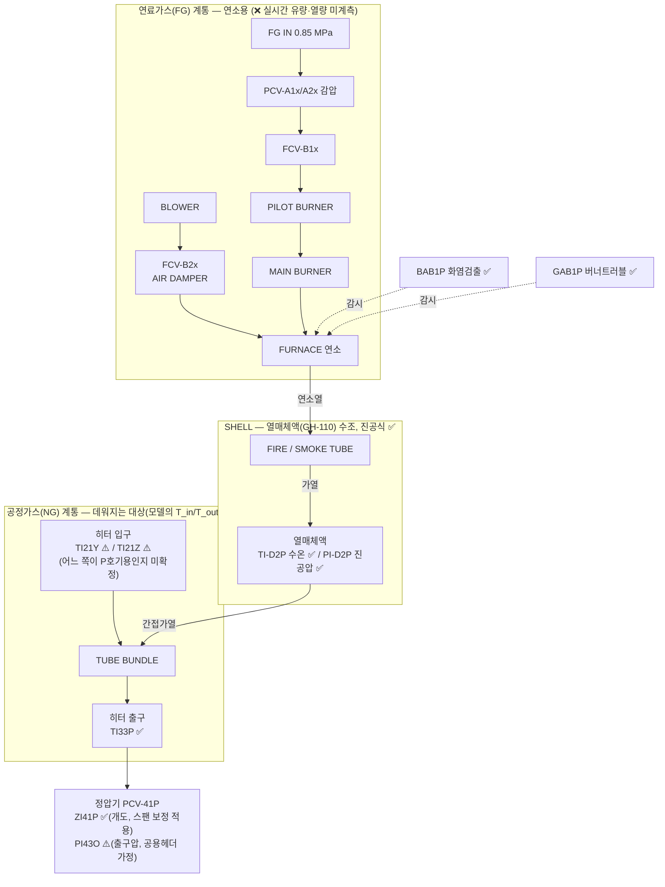

# HTR-31P 가스 흐름 다이어그램 및 태그 매핑 현황

> 목적: HTR-31P(가스히터 P호기) 고장예측 ODE(H1/H2, `data/docs/06_물리식_출처정리.md` §2)를 세우는 데 필요한
> "입력→출력 흐름"을 한 장으로 정리한다. ✅ 확정 / ⚠️ 불확실(가정 필요) / ❌ 미계측 을 명시해
> 어디까지 신뢰하고 어디부터 검증이 필요한지 한눈에 보이게 한다.
>
> 근거 문서: `data/docs/05_태그출처와_설비위치_매핑.md` §3(히터 내부 구조), `06_물리식_출처정리.md` §2(물리식),
> `04_고장이벤트_라벨분석.md` §5-1(KF-PINN 입력 구성안). 갱신: 2026-09-10.

## 0. 데이터 현황 — 있는 것 / 부족한 것

### 0-1. 있는 데이터

| 구분 | 내용 | 상태 |
|---|---|---|
| 연속 시계열 (Trend, 1분) | `PI21X TI21Y TI21Z TI33P TI-D2P PI-D2P` + `ZI41P PI43O RSF41P` — 9태그, 2011-10~2026-08, 결측 명시(reindex) | ✅ `prex/`에 반영, 사용 가능 |
| 이벤트/알람 로그 (DI/DO) | FAULT 10종 + STATUS 11종 + CONTROL 8종, 15년치 상승엣지 43,206건 | ✅ `prex/`에 반영. ⚠️ "진짜 고장" 판정(지속시간·반복횟수 필터)은 미적용 |
| 일/월 단위 계량 (Report) | `FI61O`(O/P/Q 계열 합산), `FI61A`(A/B/C 계열 합산) | ⚠️ 존재하나 1분 아님 + P 단독 분리 불가. 검증용 참고치로만 |
| 정기점검 결과 | `data/20260805_가스히터정압기 정기정검결과/.../가스히터/` — **H-31P 7건**(2011·2013·2015·2017·2019·2021·2024), `.../정압기/25년 PCV41P,42P 정기점검.pdf` | 📄 원본 확보. ❌ 아직 파싱·태그 연결 안 함 |
| 설계/사양 문서 | `HTR-31P 제작도서.pdf`(172MB, 영종 1차), `251016 영종 IO LIST.xlsx`(태그 정의 원본), PF/GROVE 정압기 카탈로그(PDF, T2/T3) | 📄 원본 확보. ❌ 아직 파싱 안 함 → `U·A`, 열용량, 전열면적 미확보 상태 지속 |
| 고장 경향성분석 보고서 | `24~25 공급설비 고장 경향성분석 결과/` 반기 보고서 4건(2024·2025) | 📄 원본 확보. 고장모드 정의 참고용, 시계열 라벨 아님 |
| 배관도(P&ID/CAD) | `.dwg` 16개(`P&ID` 폴더 6개 포함) | 📄 원본 확보. ❌ 이 환경에서 변환기 없어 못 엶 → §1의 배관위상 미확정의 근본 원인 |

### 0-2. 부족한 데이터 (심각도순)

| # | 부족한 것 | 왜 문제인가 | 지금 우회 방법 |
|---|---|---|---|
| 1 | **연료가스 유량/열량 (`Q_burner`)** | 태그 자체가 없음(연속계측 불가). H1식의 구동항 | `H31POH`(on/off) + 설계최대 52 Gcal/h로 근사, 또는 KF-PINN 잠재변수 처리 |
| 2 | **가스 질량유량 (`m_gas`) 1분단위** | `FI61x` 전량 NULL | 정압기 밸브식으로 역산(`gas_flow_proxy`) — 1차 근사치 |
| 3 | **히터↔정압기 배관 위상** | `PI43O`가 정말 P호기 출구압인지 미확정 | 계열 추정(O/P/Q 공용)으로 대체. P&ID 확인 시 해소 |
| 4 | **`TI21Y`/`TI21Z` 태그 정체** | 둘 중 뭐가 P호기 실제 입력인지 미확정 | 평균값 사용 |
| 5 | **`Cv`/밸브특성곡선** | 영종 P호기 자체 값이 아니라 남사 문서 값(T3 proxy) | `HTR-31P 제작도서`·정압기 카탈로그 파싱 시 해소 가능 (원본은 이미 있음, 미파싱) |
| 6 | **정비이력 ↔ 알람 대조** | 2015년 H-31P 알람 폭증(1,790건)이 진짜 고장인지 계기교체인지 미판정 | `15년 H-31P 정기점검.pdf` 원본은 있으나 미파싱 |

> 요약: **"데이터가 아예 없는" 항목은 사실 1번(`Q_burner`) 하나뿐**이다. 2~6번은 전부 원본 파일은
> 이미 `data/`에 있고, 아직 파싱·연결을 안 했을 뿐이다 — 즉 우선순위는 새 데이터 확보가 아니라
> **이미 있는 PDF/xlsx/.dwg를 읽어서 지금의 근사치를 대체하는 작업**이다.

## 1. 설비 간 흐름 (지역번호 1→2→3→4→6)

- 흐름 순서 자체(1→2→3→4→6)는 태그 명명규칙(설치지역번호)으로 확정됨 — ✅.
- **D 구간(정압기 P_out)**: `PI43P`라는 태그가 없고 `PI43O`(발전계열 공용 헤더)를 대신 쓴다. 실측 출구압(2.74MPa)이
  일치해 정황상 맞지만, **P&ID로 실제 배관 위상(히터4대↔정압기7라인 연결)을 확인한 적은 없음** — ⚠️.
- **E 구간**: 유량계(FI61x) 컬럼은 존재하나 Trend 전체(7,384,352행)에서 100% NULL — ❌.

## 2. HTR-31P 내부 구조 (연료가스 계통 + 공정가스 계통 + SHELL 열교환)

- **FG 계통**은 통째로 안전장치(알람)만 있고 연속 계측이 없다 — `PAHA1P`/`PAHHA1P`는 압력 고/고고 **알람(이진)**이지
  실시간 압력·유량 값이 아니다. 그래서 H1식의 구동항 `Q_burner(t)`는 설계 최대치(52 Gcal/h, 상수)만 알고
  **실시간 값은 없음** — ❌.
- **NG 계통 입구**가 이 다이어그램에서 유일하게 남은 애매한 지점이다: `TI21Y`/`TI21Z` 둘 다 "히터 입구온도"라고만
  적혀 있고 라인 배정(`H-31P` 같은)이 없다. 실측 상관계수 0.87(완전 이중화라면 ~1.0에 더 가까워야 함)로 미루어
  서로 다른 필터트레인 하류일 가능성이 있음 — ⚠️ (지금은 평균해서 씀, `prex/trend.py::estimate_gas_flow`).
- **NG 계통 출구/SHELL**은 전부 라인 배정이 확실한 태그(TI33P, TI-D2P, PI-D2P) — ✅.

## 3. 태그 → ODE 변수 매핑

| ODE 변수 | 의미 | 태그 | 신뢰도 | 비고 |
|---|---|---|---|---|
| `T_in` | 가스 입구온도 | `TI21Y`, `TI21Z` | ⚠️ | 둘 중 어느 쪽이 P호기 실제 입력인지 미확정. 지금은 평균 사용 |
| `T_out` | 가스 출구온도(관측) | `TI33P` | ✅ | 라인=H-31P 확정 |
| `T_bath` | 수조(열매체) 온도(상태) | `TI-D2P` | ✅ | 라인=H-31P 확정 |
| 수조 압력 | 진공압(P호기 전용 상태) | `PI-D2P` | ✅ | era별 스팬변경 → `PI-D2P_norm` 사용 권장 |
| `Q_burner(t)` | 버너 실시간 열출력 | — | ❌ | 실측 없음. 설계최대 52 Gcal/h만 상수로 존재. `H31POH`(가동상태)로 근사하거나 학습파라미터로 처리 |
| `m_gas` | 가스 질량유량 | (역산) `gas_flow_proxy` | ⚠️ | `FI61x` 전량 NULL → 정압기 밸브식(G1)으로 역산. Cv=T3 proxy, ZI41P 스팬 휴리스틱 보정 |
| `P_in`(밸브식) | 정압기 입구압 | `PI21X` | ✅ | |
| `P_out`(밸브식) | 정압기 출구압 | `PI43O` | ⚠️ | P 전용 태그 없음 — O/P/Q 공용헤더로 대체(가정) |
| `z`(밸브식) | 밸브 개도 | `ZI41P` | ⚠️ | 2023~2024 구간 스팬이 0~100→0~500로 바뀜 (휴리스틱으로 /5 보정) |

## 4. 지금 상태 요약 (체크리스트)

- ✅ **확정**: 설비간 순서(1→2→3→4→6), 히터 출구(TI33P), 수조 상태(TI-D2P/PI-D2P), 정압기 입구압(PI21X).
- ⚠️ **가정 필요 (구현은 했으나 검증 안 됨)**:
  - 히터 입구가 `TI21Y`/`TI21Z` 중 무엇인지 — IO LIST 원본 또는 P&ID로 확인 필요.
  - `PI43O`를 P호기 정압기 출구압으로 대체 — 히터4대↔정압기7라인 배관 위상을 P&ID로 확인 필요.
  - `gas_flow_proxy`의 `Cv`(=250), 밸브특성곡선 `f(z)`(선형 근사) — 영종 P호기 정압기 자체 도서로 교체 필요
    (지금은 남사 문서의 동일 모델 카탈로그 값, T3 proxy).
  - `ZI41P` 2023~2024 구간 스팬 보정(÷5) — 정확한 계기 교체일 미확인, 휴리스틱임.
- ❌ **미계측 (대안으로 우회 중)**: 연료가스 유량/열량(`Q_burner`), 계량설비 유량(`FI61x`).

## 5. 구현 위치

- `prex/config.py`: `FLOW_INPUT_TAGS`, `GAS_SG`, `PCV41P_CV`, `ZI41P_RESCALE_ABOVE`.
- `prex/trend.py::estimate_gas_flow()`: 위 밸브식으로 `gas_flow_proxy`/`ZI41P_frac`/`control_error_p` 컬럼 생성.
- 출력: `prex/output/trend_htr31p.parquet` (git 미포함, `python -m prex.pipeline`로 재생성).
