# 계열 M 원형 데이터 — 빙결 예측 학습 입력

계열 M(HTR-31A/B, 인천 도시가스 공급, 출구 약 0.8 MPa)의 빙결 예측 모델에 들어간 **원형 계측 태그 12개**를 정리한다.
원형은 가공하기 전 SCADA 값을 말한다. 바이패스 분율 β, 열수지 유량 m, KF·AE·EKF 정제 신호, 이력·계절 특징은 모두 이 12개에서 만든 **파생값**이라 여기서는 다루지 않는다.

- 원본: KPOS Trend CSV(아날로그, 1분)와 Alarm DI CSV(버너 점화, 상태가 바뀔 때만 기록)
- 전체 기록: 2011-10 ~ 2026-08. **학습에 쓴 구간은 2013-10-01부터다.** 출구 헤더 온도가 그 전까지 상수 0이라서 이전 구간은 뺐다.
- 그림은 하루 단위로 묶었다. 선은 일평균이고 옅은 띠는 그날 최저~최고다. 회색 음영은 학습에 쓰지 않은 구간이다.
- 그림 스크립트: `PYTHONPATH=. .venv/bin/python poster/raw_data_M.py`
- 학습 코드에서 쓰는 위치: `pinn/restricted/data.py` → `build_base("M")`

## 한눈에 보기

| # | 태그 | 의미 | 단위 | 종류 | 모델에서의 역할 | 도면 (도면 속 표기) |
|---|---|---|---|---|---|---|
| 1 | `TI61M` | 수요처 공급온도 (계량 출구) | ℃ | AI | **타깃**: 향후 6h 분 단위 최저 < 0 ℃ 이면 빙결. 현재값은 입력 | (5) — `TI-61M` |
| 2 | `PI61M` | 계량 출구 압력 | MPa | AI | 압력강하 ΔP = PI21X − PI61M (줄-톰슨) | (5) — `PI-61M`·`PT-61M` |
| 3 | `PI21X` | 주배관 입구 압력 | MPa | AI | 압력강하 ΔP | (1) — `PXR-21X` 루프 (`HS-21X`) |
| 4 | `TI21Y` | 히터 입구 공통헤더 온도 | ℃ | AI | 입력, 매설배관 지중온도 근사 | (1) — `TI-21Y`·`TXR-21Y` |
| 5 | `TSL_TSH_TSHH-31M` | 히터 출구 공통헤더 온도 (TIC-31D 의 PV) | ℃ | AI | 입력, 줄-톰슨 식의 출발 온도 | (4) — `TAH/TAHH-31M` · (6) — `TSL/TSHH-31M` |
| 6 | `TI33A` | 히터 A 출구온도 | ℃ | AI | 입력 | (4) — `TI-33A` |
| 7 | `TI33B` | 히터 B 출구온도 | ℃ | AI | 입력 | (4) — `TI-33B` |
| 8 | `TI-D2A` | 히터 A 수조(열매체) 온도 | ℃ | AI | 입력, 열수지 유량 계산 | (6) — `TE-D2A` |
| 9 | `TI-D2B` | 히터 B 수조(열매체) 온도 | ℃ | AI | 입력, 열수지 유량 계산 | (6) — `TE-D2B` |
| 10 | `ZI31D` | 바이패스 조절밸브 개도 | % | AI | 입력 | (4) — `ZI-31D`·`TIC-31D` |
| 11 | `H31AOH` | 히터 A 버너 점화 | 0/1 (그림은 일 ON 비율 %) | DI | 입력, 열수지 유량 계산 | 표기 없음 (DCS DI). 히터 본체 (4)·(6) |
| 12 | `H31BOH` | 히터 B 버너 점화 | 0/1 (그림은 일 ON 비율 %) | DI | 입력, 열수지 유량 계산 | 표기 없음 (DCS DI). 히터 본체 (4)·(6) |

### 도면 번호 → 파일

P&ID 원본은 `data/영종GS 현장 세부데이터/260410 영종GS 도면/P&ID/`에 있고, DXF·PNG 변환본은 같은 폴더의 `_converted/dxf`·`_converted/png`에 있다.

| 번호 | 파일 | 구간 | 빙결 예측에서 |
|---|---|---|---|
| (1) | `09-15-R-32-001_16_P&ID(1).dwg` | 주배관 입구 → 필터 → 입구 헤더 | 입구압·입구온도 위치만 확인 |
| (4) | `09-15-R-32-004_11_P&ID(4).dwg` | 입구 헤더 → 히터 A/B + 바이패스 → 출구 헤더 31M | **필수** |
| (5) | `09-15-R-32-005_16_P&ID(5).dwg` | 정압기 → 계량 → 수요처 | **필수** (타깃 `TI61M`) |
| (6) | `09-15-R-32-006_08_P&ID(6).dwg` | 히터 A/B 패키지 내부 (수조·버너) | 수조온도 볼 때만 |

- 도면 속 표기는 계기 버블에 적힌 이름이다. SCADA 태그명과 다를 수 있다. 예를 들어 헤더 온도는 SCADA에서는 `TSL_TSH_TSHH-31M` 하나지만, 도면에서는 같은 `TE-31M`의 경보·스위치 버블(`TAH/TAHH-31M` → (4), `TSL/TSHH-31M` → (6))로 두 장에 나뉘어 있다.
- 버너 점화 `H31AOH`·`H31BOH`는 DCS DI 신호라서 P&ID 버블이 없다.
- 표의 도면 위치는 변환 텍스트(`_converted/pid_text.json`) 검색으로 찾았다. 도면 이미지와 직접 대조하지는 않았다.

> 계열 M 에는 도면상 히터 C(HTR-31C)도 있다. 하지만 `TI33C` 가 15년 동안 사실상 0이라 관측값이 없어서 뺐다.

---

## 1. `TI61M` — 수요처 공급온도 (타깃)

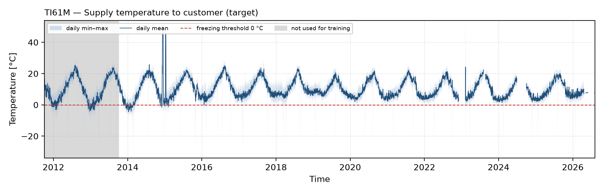

- **단위 ℃.** IO LIST 원문은 `C/G(IN-CHN) SUPPLY TEMP.`이다. 인천 도시가스로 나가는 온도다.
- 빙결 라벨은 향후 6시간 안의 **분 단위 최저값**이 0 ℃ 미만인지로 정한다. 그래서 그림의 띠 아래쪽은 1분 최저값을 쓴다(나머지 태그는 1시간 평균 기준이다).
- 측정 하한은 −30 ℃ 근처다. 분 단위 최저가 −29.5 ℃ 이하로 찍힌 1분짜리 급락은 센서 이상값으로 보고 타깃에서 제외했다(M 39시간).
- 매년 겨울에 0 ℃ 근처까지 내려간다. 2014-12 ~ 2015-01 무렵 위로 튄 값(최대 50 ℃)은 측정 상한에 걸린 값이다.

## 2. `PI61M` — 계량 출구 압력

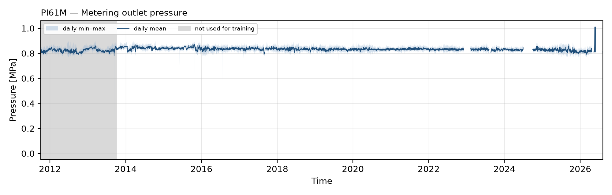

- **단위 MPa.** 정압기(RSF41A/B/C, 설정 0.72 ~ 0.84 MPa) 뒤쪽 압력이다. 평소 0.83 MPa 근처에서 안정적이다.
- 모델에서는 `ΔP = (PI21X − PI61M) × 10` [bar]로 바꿔 줄-톰슨 강하 `μ_JT·ΔP`에 쓴다.

## 3. `PI21X` — 주배관 입구 압력

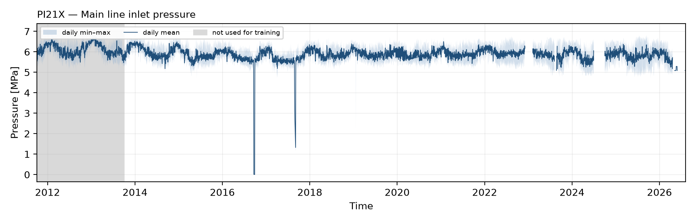

- **단위 MPa.** 계열 M·Z 공통 입구다(`MAIN LINE INLET PRESS`). 평소 5.9 MPa 근처(1 ~ 99%: 5.3 ~ 6.5)다.
- 감압 폭이 약 5 MPa(≈ 50 bar)라 줄-톰슨 강하는 약 25 ~ 28 ℃가 된다. 이 강하를 히터가 메워야 한다.

## 4. `TI21Y` — 히터 입구 공통헤더 온도

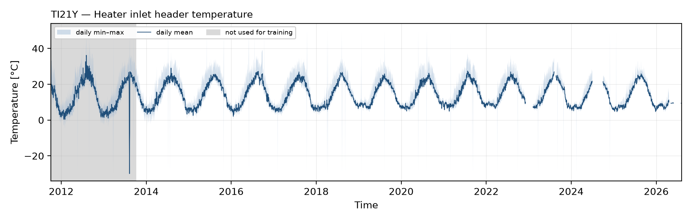

- **단위 ℃.** 필터 F-21A/B 출구 합류헤더(선 `350-NG-P7-211`)에 있다. P&ID로 계열 M 입구임을 확인했다(`Y`가 발전소 COMMON이라는 명명 규칙만 보면 Z로 오인하기 쉽다).
- 계절에 따라 약 3 ~ 26 ℃ 사이를 오간다. 매설배관 지중온도 근사 `T_g = a + b·T_in`의 입력으로도 쓴다.

## 5. `TSL_TSH_TSHH-31M` — 히터 출구 공통헤더 온도

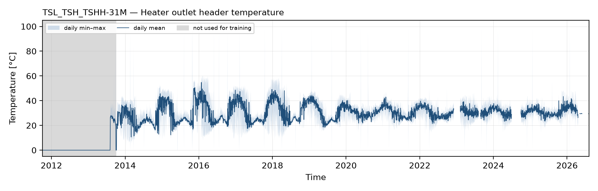

- **단위 ℃.** 히터 A/B 출구와 냉가스 바이패스가 합쳐진 뒤의 온도다. 온도조절기 TIC-31D의 PV이기도 하다.
- 이름은 스위치(TS)처럼 보이지만 하나의 `TE-31M` 아날로그 값이다(분해능 0.061 ℃).
- **2013-10 이전은 상수 0이다.** 학습 시작을 2013-10-01로 잡은 이유가 이것이다.

## 6·7. `TI33A` · `TI33B` — 히터 출구온도

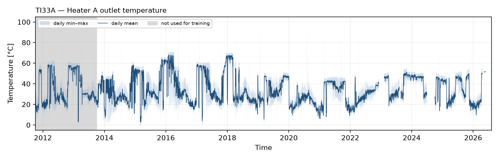
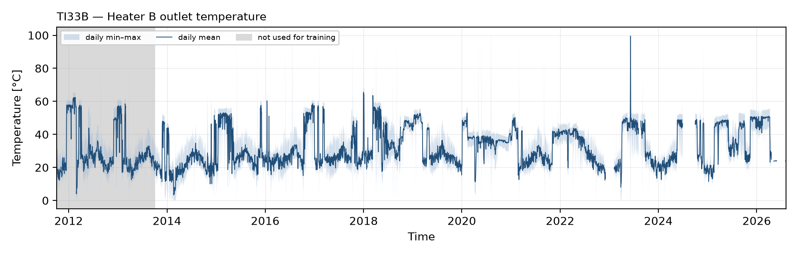

- **단위 ℃.** 각 히터 자기 출구로, 바이패스와 합류하기 전 온도다. 평소 30 ~ 35 ℃다.
- ⚠ 유량이 적으면 수조 속에서 정체되면서 입구온도 근처로 수렴한다. 그래서 이 값으로 만든 ε 은 유량과 부호가 반대로 나오고, 열교환 효율식(ε-NTU)은 모델에서 뺐다(docs 10·14).

## 8·9. `TI-D2A` · `TI-D2B` — 수조(열매체) 온도

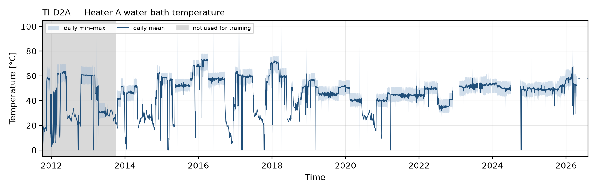
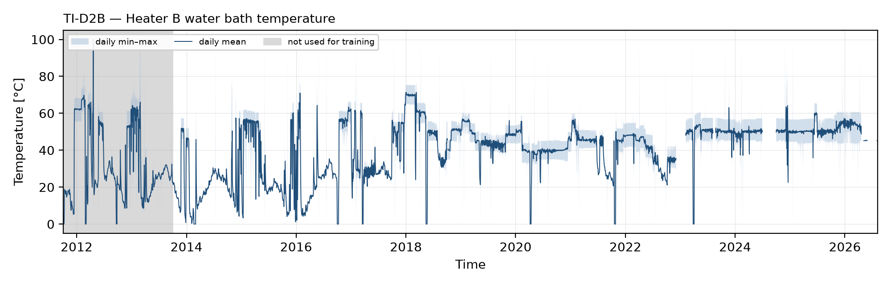

- **단위 ℃.** 수욕식 히터의 물 온도로, 분해능은 0.061 ℃다. 운전 중에는 40 ~ 70 ℃이고 정지·정비 중에는 상온으로 떨어진다.
- 버너 ON/OFF 동안의 수조 온도 변화율로 **수조 열수지 유량 m**을 역산한다(docs 12).

## 10. `ZI31D` — 바이패스 조절밸브 개도

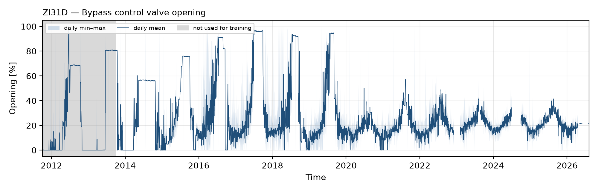

- **단위 %** (0 = 닫힘, 100 = 완전 열림). TIC-31D 출력으로, 냉가스 바이패스 양을 조절한다.
- 열수지로 푼 바이패스 분율 β 와 Spearman +0.92로 맞는다. 독립된 두 계측 경로가 서로 일치한다는 뜻이다.

## 11·12. `H31AOH` · `H31BOH` — 버너 점화 (DI)

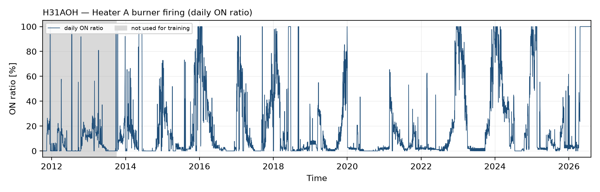
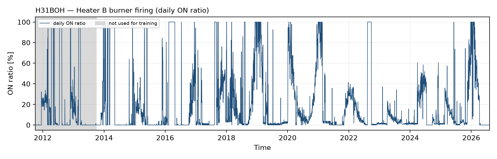

- **원값은 0/1**이다. 가동 여부가 아니라 버너 **점화 사이클**(ON 8 ~ 18분 / OFF 41 ~ 59분)을 기록한다. 그림은 하루 동안 ON이던 비율[%]로 바꿔 그렸다.
- 원본 DI 로그의 함정 세 가지(행 중복 93%, 시각 누락 47.5%, 비트팩 값)를 `prex_multi/trend.py`에서 처리한다. 그다음 상태 변화 시점 사이를 직전 상태로 채운다.
- 겨울에 ON 비율이 높아진다. 공급온도가 떨어지는 계절과 맞물린다.

---

## 원형 → 모델 입력 (참고)

| 파생 | 만드는 식 | 쓰는 원형 |
|---|---|---|
| ΔP [bar] | (PI21X − PI61M) × 10 | 2, 3 |
| β (바이패스 분율) | 합류점 열수지 | 4, 5, 6, 7 |
| m (계열 총유량, kg/s) | 수조 열수지 → 1/(1−β) 보정 | 6 ~ 9, 11, 12 |
| 이력 특징 | 3·12·24h 이동 평균·최저, 6h 추세 | 1, 5, 4 |
| 정제 신호 | KF · AE · EKF (`risk/refine.py`, `pinn/restricted/ekf.py`) | 1, 4, 5 외 |
